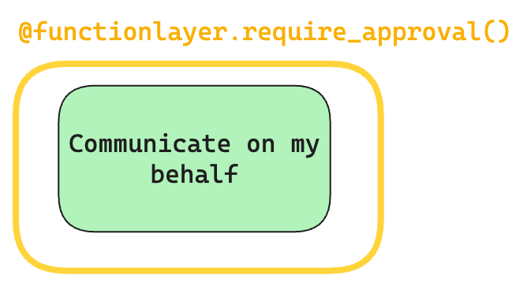

<div align="center">


</div>

**HumanLayer**: A python toolkit to enable AI agents to communicate with humans in tool-based and asynchronous workflows. By incorporating humans-in-the-loop, agentic tools can be given access to much more powerful and meaningful tool calls and tasks.

Bring your LLM (OpenAI, Llama, Claude, etc) and Framework (LangChain, CrewAI, etc) and start giving your AI agents safe access to the world.

<div align="center">

<h3>

[Homepage](https://www.humanlayer.dev/) | [Get Started](./docs/getting-started.md) | [Discord](https://discord.gg/KNATT2xK) | [Documentation](./docs) | [Examples](./examples)

</h3>

[](https://github.com/humanlayer/humanlayer)
[](https://opensource.org/licenses/Apache-2)

</div>

## Table of contents

- [Getting Started](#getting-started)
- [Why HumanLayer?](#why-humanlayer)
- [Key Features](#key-features)
- [Examples](#examples)
- [Roadmap](#roadmap)
- [Contributing](#contributing)
- [License](#license)

## Getting Started

To get started, check out [Getting Started](./docs/getting-started.md), watch the [Getting Started Video](https://www.loom.com/share/f27d4a254c4a40278d61d4814c7d698f), or jump straight into one of the [Examples](./examples/):

[](https://www.loom.com/share/f27d4a254c4a40278d61d4814c7d698f)

- 🦜⛓️ [LangChain](./examples/langchain/01-math_example.py)
- 🚣‍ [CrewAI](./examples/crewai/crewai_math.py)
- 🦾 [ControlFlow](./examples/controlflow/controlflow_math.py)
- 🧠 [Raw OpenAI Client](./examples/openai_client/math_example.py)

## Example

```shell
pip install humanlayer
```

```python
from humanlayer import HumanLayer
hl = HumanLayer()

@hl.require_approval()
def send_email(to: str, subject: str, body: str):
    """Send an email to the customer"""
    ...


# made up function, use whatever
# tool-calling framework you prefer
run_llm_task(
    prompt="""Send an email welcoming the customer to
    the platform and encouraging them to invite a team member.""",
    tools=[send_email],
    llm="gpt-4o"
)
```

<div align="center"></div>

Check out the [framework specific examples](./examples) or the [Getting Started Guide](./docs/getting-started.md) to get hands on.

#### Human as Tool

You can also use `hl.human_as_tool()` to bring a human into the loop for any reason. This can be useful for debugging, asking for advice, or just getting a human's opinion on something.

```python
# human_as_tool.py

from humanlayer import HumanLayer
hl = HumanLayer()
contact_a_human = hl.human_as_tool()

def send_email(to: str, subject: str, body: str):
    """Send an email to the customer"""
    ...

# made up method, use whatever
# framework you prefer
run_llm_task(
    prompt="""Send an email welcoming the customer to
    the platform and encouraging them to invite a team member.

    Contact a human for collaboration and feedback on your email
    draft
    """,
    tools=[send_email, contact_a_human],
    llm="gpt-4o"
)
```

See the [examples](./examples) for more advanced human as tool examples, and workflows that combine both concepts.

## Why HumanLayer?

Functions and tools are a key part of [Agentic Workflows](https://www.deeplearning.ai/the-batch/how-agents-can-improve-llm-performance). They enable LLMs to interact meaningfully with the outside world and automate broad scopes of impactful work. Correct and accurate function calling is essential for AI agents that do meaningful things like book appointments, interact with customers, manage billing information, write+execute code, and more.

[](https://louis-dupont.medium.com/transforming-software-interactions-with-tool-calling-and-llms-dc39185247e9)
_From https://louis-dupont.medium.com/transforming-software-interactions-with-tool-calling-and-llms-dc39185247e9_

**However**, the most useful functions we can give to an LLM are also the most risky. We can all imagine the value of an AI Database Administrator that constantly tunes and refactors our SQL database, but most teams wouldn't give an LLM access to run arbitrary SQL statements against a production database (heck, we mostly don't even let humans do that). That is:

<div align="center">
<h3><blockquote>Even with state-of-the-art agentic reasoning and prompt routing, LLMs are not sufficiently reliable to be given access to high-stakes functions without human oversight</blockquote></h3>
</div>

To better define what is meant by "high stakes", some examples:

- **Low Stakes**: Read Access to public data (e.g. search wikipedia, access public APIs and DataSets)
- **Low Stakes**: Communicate with agent author (e.g. an engineer might empower an agent to send them a private Slack message with updates on progress)
- **Medium Stakes**: Read Access to Private Data (e.g. read emails, access calendars, query a CRM)
- **Medium Stakes**: Communicate with strict rules (e.g. sending based on a specific sequence of hard-coded email templates)
- **High Stakes**: Communicate on my Behalf or on behalf of my Company (e.g. send emails, post to slack, publish social/blog content)
- **High Stakes**: Write Access to Private Data (e.g. update CRM records, modify feature toggles, update billing information)

<div align="center"></div>

The high stakes functions are the ones that are the most valuable and promise the most impact in automating away human workflows. The sooner teams can get Agents reliably and safely calling these tools, the sooner they can reap massive benefits.

HumanLayer provides a set of tools to _deterministically_ guarantee human oversight of high stakes function calls. Even if the LLM makes a mistake or hallucinates, HumanLayer is baked into the tool/function itself, guaranteeing a human in the loop.

<div align="center"></div>

<div align="center">
<h3><blockquote>
HumanLayer provides a set of tools to *deterministically* guarantee human oversight of high stakes function calls
</blockquote></h3>
</div>

## Key Features

- **Require Human Approval for Function Calls**: the `@hl.require_approval()` decorator blocks specifc function calls until a human has been consulted - upon denial, feedback will be passed to the LLM
- **Human as Tool**: generic `hl.human_as_tool()` allows for contacting a human for answers, advice, or feedback
- **OmniChannel Contact**: Contact humans and collect responses across Slack, Email, Discord, and more
- **Granular Routing**: Route approvals to specific teams or individuals
- **Bring your own LLM + Framework**: Because HumanLayer is implemented at tools layer, it supports any LLM and all major orchestration frameworks that support tool calling.

## Examples

You can test different real life examples of HumanLayer in the [examples folder](./examples/):

- 🦜⛓️ [LangChain Math](./examples/langchain/01-math_example.py)
- 🦜⛓️ [LangChain Human As Tool](./examples/langchain/03-human_as_tool.py)
- 🚣‍ [CrewAI Math](./examples/crewai/crewai_math.py)
- 🦾 [ControlFlow Math](./examples/controlflow/controlflow_math.py)
- 🧠 [Raw OpenAI Client](./examples/openai_client/math_example.py)

## Roadmap

| Feature                      | Status              |
| ---------------------------- | ------------------- |
| Require Approval             | ⚗️ Alpha            |
| Human as Tool                | ⚗️ Alpha            |
| CLI Approvals                | ⚗️ Alpha            |
| CLI Human as Tool            | 🗓️ Planned          |
| Slack Approvals              | ⚗️ Alpha            |
| Langchain Support            | ⚗️ Alpha            |
| Controlflow Support          | ⚗️ Alpha            |
| CrewAI Support               | ⚗️ Alpha            |
| Open Protocol for BYO server | 🗓️ Planned          |
| Composite Contact Channels   | 🚧 Work in progress |
| Discord Approvals            | 🗓️ Planned          |
| Email Approvals              | 🗓️ Planned          |
| LLamaIndex Support           | 🗓️ Planned          |
| Haystack Support             | 🗓️ Planned          |

## Contributing

HumanLayer is open-source and we welcome contributions in the form of issues, documentation, pull requests, and more. See [CONTRIBUTING.md](./CONTRIBUTING.md) for more details.

## License

The HumanLayer SDK in this repo is licensed under the Apache 2 License.
