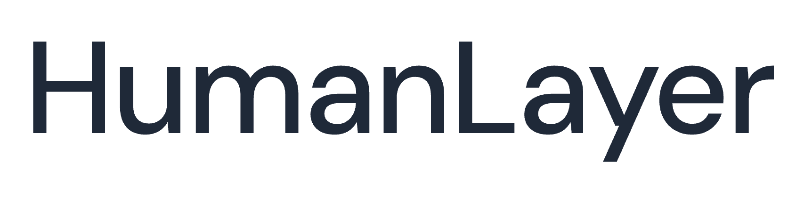
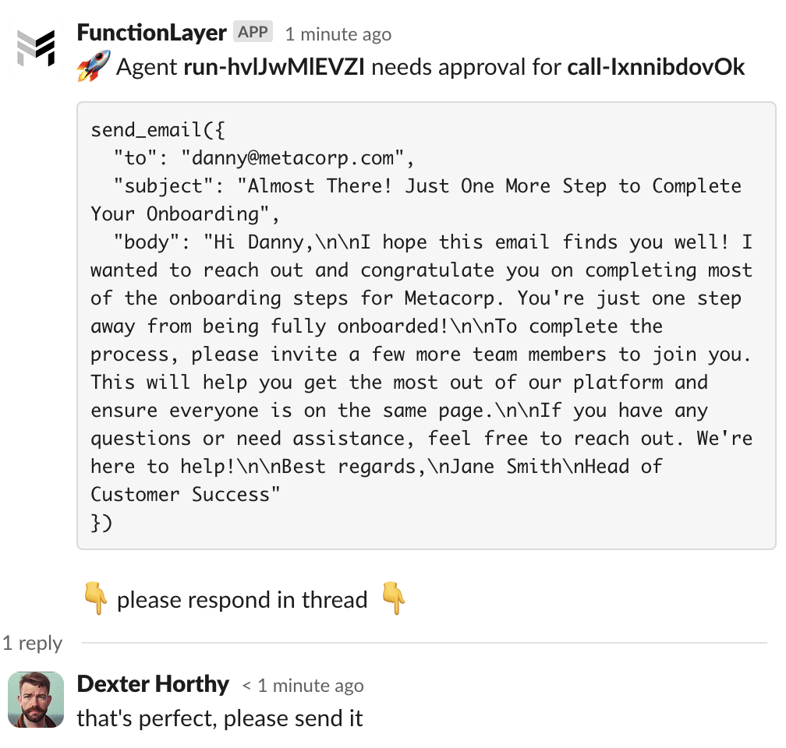
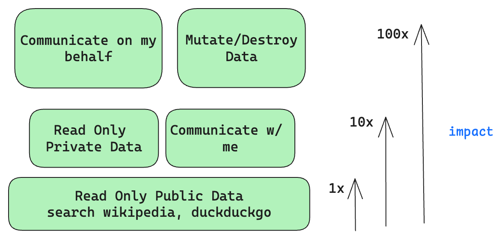
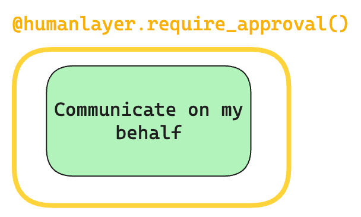
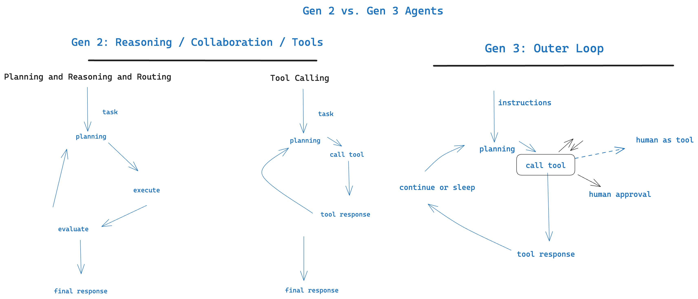

<div align="center">



</div>

**HumanLayer**: A python toolkit to enable AI agents to communicate with humans in tool-based and asynchronous workflows. By incorporating humans-in-the-loop, agentic tools can be given access to much more powerful and meaningful tool calls and tasks.

Bring your LLM (OpenAI, Llama, Claude, etc) and Framework (LangChain, CrewAI, etc) and start giving your AI agents safe access to the world.

<div align="center">

<h3>

[Homepage](https://www.humanlayer.dev/) | [Get Started](./docs/getting-started.md) | [Discord](https://discord.gg/AK6bWGFY7d) | [Documentation](./docs) | [Examples](./examples)

</h3>

[](https://github.com/humanlayer/humanlayer)
[](https://opensource.org/licenses/Apache-2)
[](https://pypi.org/project/humanlayer/)
[](https://www.npmjs.com/package/humanlayer)


</div>

## Table of contents

- [Getting Started](#getting-started)
- [Why HumanLayer?](#why-humanlayer)
- [Key Features](#key-features)
- [Examples](#examples)
- [Roadmap](#roadmap)
- [Contributing](#contributing)
- [License](#license)

## Getting Started

To get started, check out [Getting Started](./docs/getting-started.md), watch the [Getting Started Video](https://www.loom.com/share/7c65d48d18d1421a864a1591ff37e2bf), or jump straight into one of the [Examples](./examples/):

- 🦜⛓️ [LangChain](./examples/langchain/)
- 🚣‍ [CrewAI](./examples/crewai/)
- 🦾 [ControlFlow](./examples/controlflow/)
- 🧠 [Raw OpenAI Client](./examples/openai_client/)

<div align="center">
<a target="_blank" href="https://www.loom.com/share/7c65d48d18d1421a864a1591ff37e2bf"></a>
</div>

## Example

HumanLayer supports either Python or Typescript / JS.

```shell
pip install humanlayer
```

```python
from humanlayer import HumanLayer
hl = HumanLayer()

@hl.require_approval()
def send_email(to: str, subject: str, body: str):
    """Send an email to the customer"""
    ...


# made up function, use whatever
# tool-calling framework you prefer
run_llm_task(
    prompt="""Send an email welcoming the customer to
    the platform and encouraging them to invite a team member.""",
    tools=[send_email],
    llm="gpt-4o"
)
```

<div align="center"></div>

For Typescript, install with npm:

```
npm install humanlayer
```

More python and TS examples in the [framework specific examples](./examples) or the [Getting Started Guide](./docs/getting-started.md) to get hands on.

#### Human as Tool

You can also use `hl.human_as_tool()` to bring a human into the loop for any reason. This can be useful for debugging, asking for advice, or just getting a human's opinion on something.

```python
# human_as_tool.py

from humanlayer import HumanLayer
hl = HumanLayer()
contact_a_human = hl.human_as_tool()

def send_email(to: str, subject: str, body: str):
    """Send an email to the customer"""
    ...

# made up method, use whatever
# framework you prefer
run_llm_task(
    prompt="""Send an email welcoming the customer to
    the platform and encouraging them to invite a team member.

    Contact a human for collaboration and feedback on your email
    draft
    """,
    tools=[send_email, contact_a_human],
    llm="gpt-4o"
)
```

See the [examples](./examples) for more advanced human as tool examples, and workflows that combine both concepts.

## Why HumanLayer?

Functions and tools are a key part of [Agentic Workflows](https://www.deeplearning.ai/the-batch/how-agents-can-improve-llm-performance). They enable LLMs to interact meaningfully with the outside world and automate broad scopes of impactful work. Correct and accurate function calling is essential for AI agents that do meaningful things like book appointments, interact with customers, manage billing information, write+execute code, and more.

[](https://louis-dupont.medium.com/transforming-software-interactions-with-tool-calling-and-llms-dc39185247e9)
_From https://louis-dupont.medium.com/transforming-software-interactions-with-tool-calling-and-llms-dc39185247e9_

**However**, the most useful functions we can give to an LLM are also the most risky. We can all imagine the value of an AI Database Administrator that constantly tunes and refactors our SQL database, but most teams wouldn't give an LLM access to run arbitrary SQL statements against a production database (heck, we mostly don't even let humans do that). That is:

<div align="center">
<h3><blockquote>Even with state-of-the-art agentic reasoning and prompt routing, LLMs are not sufficiently reliable to be given access to high-stakes functions without human oversight</blockquote></h3>
</div>

To better define what is meant by "high stakes", some examples:

- **Low Stakes**: Read Access to public data (e.g. search wikipedia, access public APIs and DataSets)
- **Low Stakes**: Communicate with agent author (e.g. an engineer might empower an agent to send them a private Slack message with updates on progress)
- **Medium Stakes**: Read Access to Private Data (e.g. read emails, access calendars, query a CRM)
- **Medium Stakes**: Communicate with strict rules (e.g. sending based on a specific sequence of hard-coded email templates)
- **High Stakes**: Communicate on my Behalf or on behalf of my Company (e.g. send emails, post to slack, publish social/blog content)
- **High Stakes**: Write Access to Private Data (e.g. update CRM records, modify feature toggles, update billing information)

<div align="center"></div>

The high stakes functions are the ones that are the most valuable and promise the most impact in automating away human workflows. But they are also the ones where "90% accuracy" is not acceptable. Reliability is further impacted by today's LLMs' tendency to hallucinate or craft low-quality text that is clearly AI generated. The sooner teams can get Agents reliably and safely calling these tools with high-quality inputs, the sooner they can reap massive benefits.

HumanLayer provides a set of tools to _deterministically_ guarantee human oversight of high stakes function calls. Even if the LLM makes a mistake or hallucinates, HumanLayer is baked into the tool/function itself, guaranteeing a human in the loop.

<div align="center"></div>

<div align="center">
<h3><blockquote>
HumanLayer provides a set of tools to *deterministically* guarantee human oversight of high stakes function calls
</blockquote></h3>
</div>

### The Future: Autonomous Agents and the "Outer Loop"

_Read More: [OpenAI's RealTime API is a step towards outer-loop agents](https://theouterloop.substack.com/p/openais-realtime-api-is-a-step-towards)_

Between `require_approval` and `human_as_tool`, HumanLayer is built to empower the next generation of AI agents - Autonomous Agents, but it's just a piece of the puzzle. To clarify "next generation", we can summarize briefly the history of LLM applications.

- **Gen 1**: Chat - human-initiated question / response interface
- **Gen 2**: Agentic Assistants - frameworks drive prompt routing, tool calling, chain of thought, and context window management to get much more reliability and functionality. Most workflows are initiated by humans in single-shot "here's a task, go do it" or rolling chat interfaces.
- **Gen 3**: Autonomous Agents - no longer human initiated, agents will live in the "outer loop" driving toward their goals using various tools and functions. Human/Agent communication is Agent-initiated rather than human-initiated.



Gen 3 autonomous agents will need ways to consult humans for input on various tasks. In order for these agents to perform actual useful work, they'll need human oversight for sensitive operations.

These agents will require ways to contact one or more humans across various channels including chat, email, sms, and more.

While early versions of these agents may technically be "human initiated" in that they get kicked off on a regular schedule by e.g. a cron or similar, the best ones will be managing their own scheduling and costs. This will require toolkits for inspecting costs and something akin to `sleep_until`. They'll need to run in orchestration frameworks that can durably serialize and resume agent workflows across tool calls that might not return for hours or days. These frameworks will need to support context window management by a "manager LLM" and enable agents to fork sub-chains to handle specialized tasks and roles.

Example use cases for these outer loop agents include [the linkedin inbox assistant](./examples/langchain/04-human_as_tool_linkedin.py) and [the customer onboarding assistant](./examples/langchain/05-approvals_and_humans_composite.py), but that's really just scratching the surface.

## Key Features

- **Require Human Approval for Function Calls**: the `@hl.require_approval()` decorator blocks specific function calls until a human has been consulted - upon denial, feedback will be passed to the LLM
- **Human as Tool**: generic `hl.human_as_tool()` allows for contacting a human for answers, advice, or feedback
- **OmniChannel Contact**: Contact humans and collect responses across Slack, Email, Discord, and more
- **Granular Routing**: Route approvals to specific teams or individuals
- **Bring your own LLM + Framework**: Because HumanLayer is implemented at tools layer, it supports any LLM and all major orchestration frameworks that support tool calling.

## Examples

You can test different real life examples of HumanLayer in the [examples folder](./examples/):

- 🦜⛓️ [LangChain Math](./examples/langchain/01-math_example.py)
- 🦜⛓️ [LangChain Human As Tool](./examples/langchain/03-human_as_tool.py)
- 🚣‍ [CrewAI Math](./examples/crewai/crewai_math.py)
- 🦾 [ControlFlow Math](./examples/controlflow/controlflow_math.py)
- 🧠 [Raw OpenAI Client](./examples/openai_client/01-math_example.py)

## Roadmap

| Feature                                                                            | Status              |
| ---------------------------------------------------------------------------------- | ------------------- |
| Require Approval                                                                   | ⚙️ Beta             |
| Human as Tool                                                                      | ⚙️ Beta             |
| CLI Approvals                                                                      | ⚙️ Beta             |
| CLI Human as Tool                                                                  | ⚙️ Beta             |
| Slack Approvals                                                                    | ⚙️ Beta             |
| Langchain Support                                                                  | ⚙️ Beta             |
| CrewAI Support                                                                     | ⚙️ Beta             |
| [GripTape Support](./examples/griptape)                                            | ⚗️ Alpha            |
| [GripTape Builtin Tools Support](./examples/griptape/02-decorate-existing-tool.py) | 🗓️ Planned          |
| Controlflow Support                                                                | ⚗️ Alpha            |
| Custom Response options                                                            | ⚗️ Alpha            |
| Open Protocol for BYO server                                                       | 🗓️ Planned          |
| Composite Contact Channels                                                         | 🚧 Work in progress |
| Async / Webhook support                                                            | 🗓️ Planned          |
| SMS/RCS Approvals                                                                  | 🗓️ Planned          |
| Discord Approvals                                                                  | 🗓️ Planned          |
| Email Approvals                                                                    | 🗓️ Planned          |
| LlamaIndex Support                                                                 | 🗓️ Planned          |
| Haystack Support                                                                   | 🗓️ Planned          |

## Contributing

HumanLayer is open-source and we welcome contributions in the form of issues, documentation, pull requests, and more. See [CONTRIBUTING.md](./CONTRIBUTING.md) for more details.

## Fun Stuff

[](https://star-history.com/#humanlayer/humanlayer&Date)

Shouts out to [@erquhart](https://github.com/erquhart) for this one

<div align="center">

</div>

## License

The HumanLayer SDK in this repo is licensed under the Apache 2 License.

## QR Code


