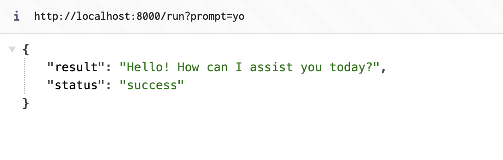

# HumanLayer Flask Example

This example demonstrates how to use HumanLayer with Flask in two ways:

1. Simple approvals with `app.py`
2. Webhook-based approvals with `app-webhooks.py`

## Table of Contents

- [Setup](#setup)
- [Simple Approvals (app.py)](#simple-approvals)
  - [Running the Application](#running-simple)
  - [Testing the Endpoints](#testing-simple)
  - [Example Responses](#responses-simple)
- [Webhook Approvals (app-webhooks.py)](#webhook-approvals)
  - [Setup Webhooks](#setup-webhooks)
  - [Running the Application](#running-webhooks)
  - [Testing the Endpoints](#testing-webhooks)
  - [Example Responses](#responses-webhooks)

## Setup

1. Create a virtual environment and activate it:

   ```bash
   python -m venv venv
   source venv/bin/activate  # On Windows: venv\Scripts\activate
   ```

2. Install dependencies:

   ```bash
   pip install -r requirements.txt
   ```

3. Copy `.env.example` to `.env` and fill in your API keys:
   ```bash
   cp .env.example .env
   # Add your keys to .env:
   # HUMANLAYER_API_KEY=your_key_here
   ```

## Simple Approvals

The `app.py` example shows basic HumanLayer integration where the API waits for approval before returning a response.

### Running Simple

Start the server:

```bash
python app.py
```

### Testing Simple

Test the agent with a very basic prompt:

```bash
curl "http://localhost:8000/run?prompt=yo"
```

```json
{
  "status": "success",
  "message": "how can I help you?"
}
```



You can send a prompt that uses math to trigger the approval logic

```bash
# Test the agent with a prompt
curl "http://localhost:8000/run?prompt=what+is+2+plus+2"
```

### Responses Simple

The endpoint will wait for approval and then return:

```json
{
  "status": "success",
  "result": "2 plus 2 equals 4"
}
```


## Webhook Approvals

The `app-webhooks.py` example demonstrates a more advanced pattern using webhooks for asynchronous approvals.

### Setup Webhooks

1. Get an ngrok.com account and claim your free static subdomain

2. Set up response webhooks in the HumanLayer dashboard:

   - Go to Settings > Webhooks
   - Add webhook: `https://your-subdomain.ngrok-free.app/webhook/inbound`
   - Save the webhook configuration

3. Start ngrok pointing to your Flask app:
   ```bash
   ngrok http 8000 --domain=your-subdomain.ngrok-free.app
   ```

### Running the app

Start the server in a separate terminal:

```bash
python app-webhooks.py
```

### Testing Webhooks

1. Make a request:

   ```bash
   curl "http://localhost:8000/run?prompt=calculate%202%20plus%202"
   ```

2. Note the function call ID in the response:

   ```json
   {
     "status": "pending",
     "call_id": "abc123"
   }
   ```

3. Check the status using the call_id in the url path

   ```bash
   curl "http://localhost:8000/run/abc123"
   ```

4. Approve the action in HumanLayer (via Slack or dashboard)

5. The webhook will receive the approval and update the status

6. Check the status again to see the result:
   ```bash
   curl "http://localhost:8000/run/abc123"
   ```

### Responses Webhooks

Initial request:

```json
{
  "status": "pending",
  "call_id": "abc123"
}
```

Checking status before approval:

```json
{
  "status": "pending",
  "message": "Waiting for approval, refresh to check status"
}
```

After approval:

```json
{
  "status": "success",
  "result": "2 plus 2 equals 4"
}
```

View all function calls:

```bash
curl "http://localhost:8000/function-calls"
```

Response:

```json
{
  "function_calls": [
    {
      "call_id": "abc123",
      "status": "approved",
      "result": "2 plus 2 equals 4"
    }
  ]
}
```
