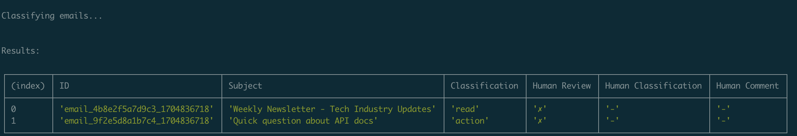
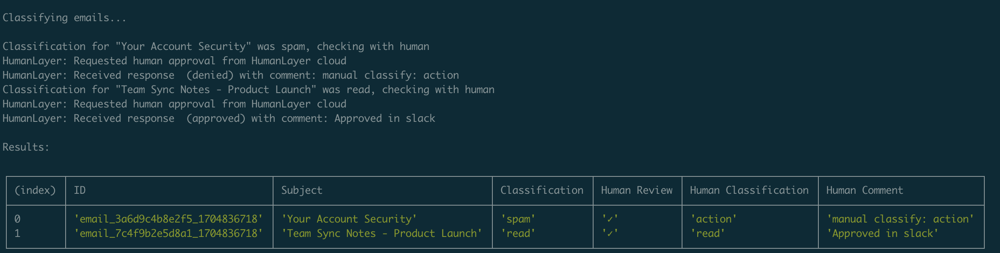
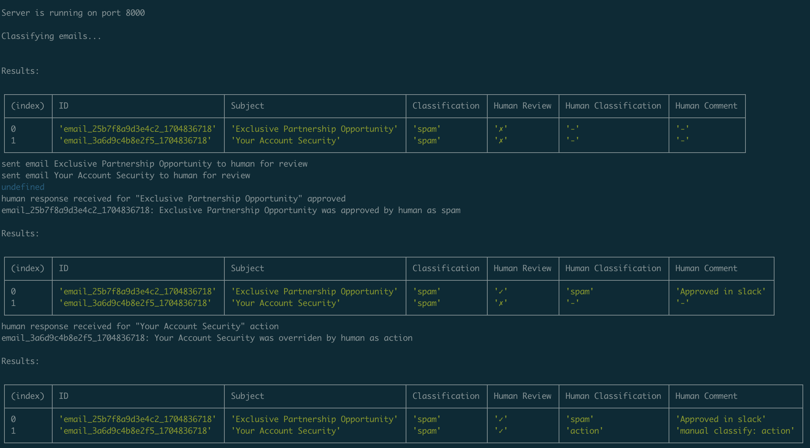

# Task Classifier Example

### Three versions

- [01-no-humans.ts](./01-no-humans.ts) - classify the emails with no human intervention
- [02-humans.ts](./02-human-review-sync.ts) - classify the emails, checking with a human before saving classifications, then print results
- [03-humans-async.ts](./03-humans-async.ts) - classify the emails, print them out, then start a webserver to listen for human overrides. When a human feedback is received, print the updated list.

### Running the examples

```
npm install
npm run no-humans
npm run human-review-sync
npm run human-review-async
```

For all three examples, you'll need to set `OPENAI_API_KEY` in your environment.

For the human-review examples, you'll need to set `HUMANLAYER_API_KEY` in your environment. You can get one at [app.humanlayer.dev](https://app.humanlayer.dev/).

For the `human-review-async` example, you will need to configure HumanLayer to send a [Response Webhook](https://humanlayer.dev/docs/core/response-webhooks) to your local server using ngrok or similar.

### 01-no-humans.ts

In this example, we just classify the emails and print the results of the LLM classification.



### 02-human-review-sync.ts

In this example, each email is sent synchronously to a human for review, and then all results are printed at the end.



### 03-human-review-async.ts

In this example, all LLM classifications are computed, and then they are all sent to a human for review. When a human review is completed, it will
be received by a webhook, and the results will be printed out.




