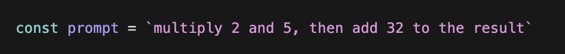
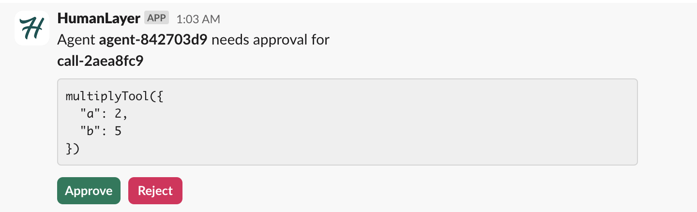
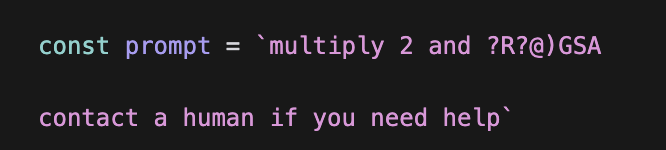
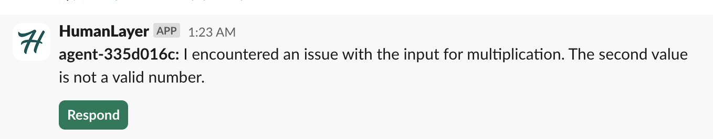

# HumanLayer + Vercel AI SDK example

## Overview

This example demonstrates how to use HumanLayer with the Vercel AI SDK in Typescript.

It makes use of the `humanlayer-ts-vercel-ai-sdk` package, which includes methods
specifically for wrapping/integrating w/ the Vercel AI SDK tools system.

There are two examples:

- `npm run math` will run a math problem, where `add` can be called without approval, but `multiply` requires approval.



for the multiply operation, approval will be requested



- `npm run human-as-tool` will run a prompt where the model should select the "contact a human" tool, which will fetch a human response via humanlayer



since the prompt is not clear, the model will ask for clarification



## Running the Example

#### Set up env

Get a HumanLayer API key from [HumanLayer](https://app.humanlayer.dev) and an OpenAI API key from [OpenAI](https://platform.openai.com)

```
cp dotenv.example .env
# configure API token(s)
HUMANLAYER_API_KEY=
OPENAI_API_KEY=
```

#### Running with NPM

```
npm install
npm run math
npm run human-as-tool
```
