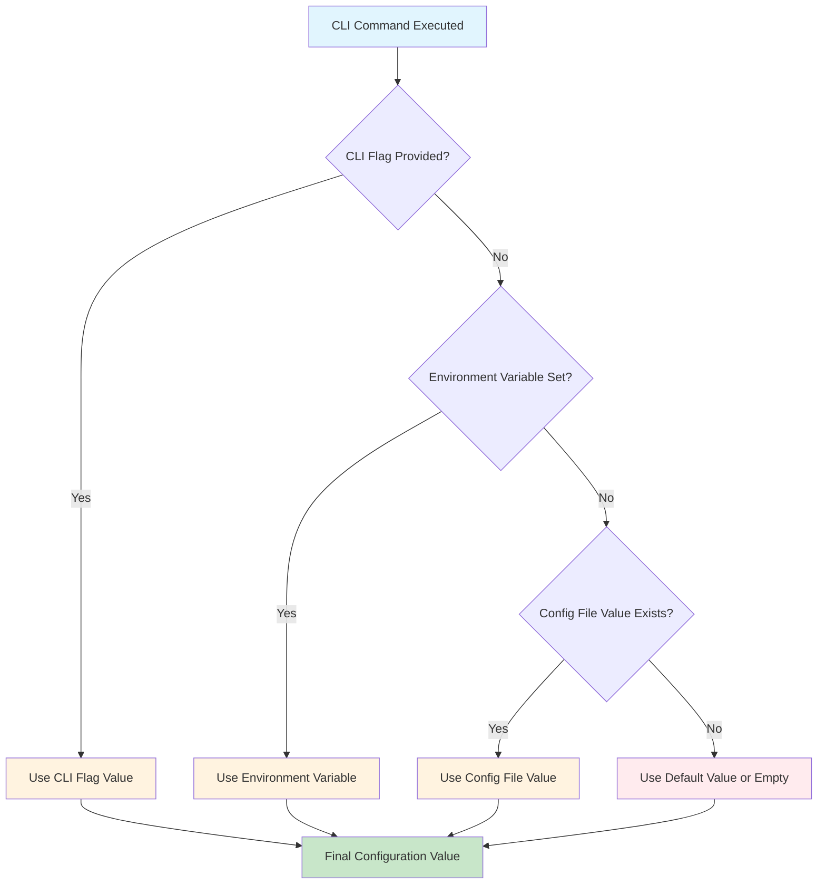
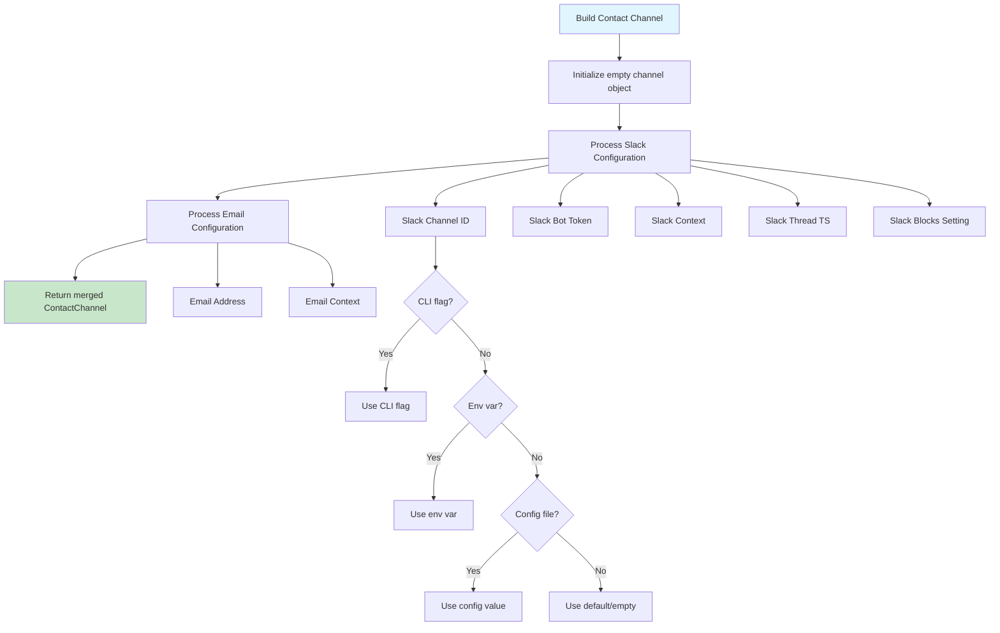
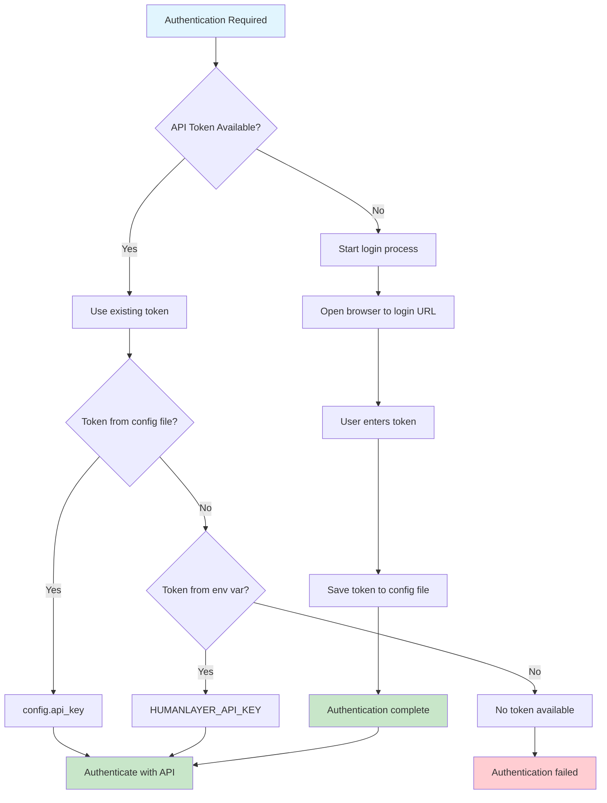

# HumanLayer CLI Configuration

This document describes how the HumanLayer CLI (`hlyr`) handles configuration, including the precedence of configuration sources and how values are resolved.

## Configuration Sources

The HumanLayer CLI supports multiple configuration sources with a clear precedence order:

1. **CLI Flags** (highest priority)
2. **Environment Variables**
3. **Configuration Files**
4. **Default Values** (lowest priority)

## Configuration Value Resolution Flow



## Configuration File Discovery

The CLI searches for configuration files in the following order:

```mermaid
flowchart TD
    A[Start Config Discovery] --> B{--config-file flag provided?}
    B -->|Yes| C[Load specified file]
    B -->|No| D[Check ./humanlayer.json]
    D -->|Exists| E[Load ./humanlayer.json]
    D -->|Not found| F[Check default config path]
    F -->|Exists| G[Load default config file]
    F -->|Not found| H[Use empty config {}]

    C --> I[Configuration Loaded]
    E --> I
    G --> I
    H --> I

    style A fill:#e1f5fe
    style I fill:#c8e6c9
```

### Default Configuration Path

The default configuration path follows XDG Base Directory specification:

- **Path**: `$XDG_CONFIG_HOME/humanlayer/humanlayer.json`
- **Fallback**: `$HOME/.config/humanlayer/humanlayer.json` (when `XDG_CONFIG_HOME` is not set)

## Contact Channel Configuration

Contact channels (Slack/Email) are built by merging values from all sources:



## Token Resolution and Authentication



## Environment Variables

The following environment variables are supported:

| Variable                     | Purpose                         | Example                      |
| ---------------------------- | ------------------------------- | ---------------------------- |
| `HUMANLAYER_API_KEY`         | API authentication token        | `hl_live_abc123...`          |
| `HUMANLAYER_API_BASE`        | API server base URL             | `https://api.humanlayer.dev` |
| `HUMANLAYER_APP_URL`         | Web app base URL                | `https://app.humanlayer.dev` |
| `HUMANLAYER_SLACK_CHANNEL`   | Slack channel/user ID           | `C1234567890`                |
| `HUMANLAYER_SLACK_BOT_TOKEN` | Slack bot token                 | `xoxb-...`                   |
| `HUMANLAYER_SLACK_CONTEXT`   | Slack channel context           | `engineering team`           |
| `HUMANLAYER_SLACK_THREAD_TS` | Slack thread timestamp          | `1234567890.123456`          |
| `HUMANLAYER_SLACK_BLOCKS`    | Enable Slack blocks UI          | `true`                       |
| `HUMANLAYER_EMAIL_ADDRESS`   | Email address for notifications | `user@example.com`           |
| `HUMANLAYER_EMAIL_CONTEXT`   | Email user context              | `project manager`            |
| `XDG_CONFIG_HOME`            | Config directory override       | `/custom/config/path`        |

## Configuration File Format

The configuration file is JSON with the following structure:

```json
{
  "api_key": "hl_live_abc123...",
  "api_base_url": "https://api.humanlayer.dev",
  "app_base_url": "https://app.humanlayer.dev",
  "channel": {
    "slack": {
      "channel_or_user_id": "C1234567890",
      "bot_token": "xoxb-...",
      "context_about_channel_or_user": "engineering team",
      "thread_ts": "1234567890.123456",
      "experimental_slack_blocks": true
    },
    "email": {
      "address": "user@example.com",
      "context_about_user": "project manager"
    }
  }
}
```

## CLI Commands and Configuration

### `config show`

Displays the resolved configuration from all sources:

```bash
npx humanlayer config show [--json] [--config-file path]
```

### `login`

Authenticates and saves API token to configuration:

```bash
npx humanlayer login [--api-base url] [--app-base url] [--config-file path]
```

## Configuration Precedence Examples

### Example 1: Slack Channel Resolution

Given:

- CLI flag: `--slack-channel C9999999999`
- Environment: `HUMANLAYER_SLACK_CHANNEL=C8888888888`
- Config file: `"channel_or_user_id": "C7777777777"`

**Result**: `C9999999999` (CLI flag wins)

### Example 2: API Token Resolution

Given:

- Environment: `HUMANLAYER_API_KEY=env_token_123`
- Config file: `"api_key": "file_token_456"`

**Result**: `env_token_123` (environment variable wins)

### Example 3: Mixed Source Resolution

Given:

- CLI: `--slack-channel C1111111111`
- Environment: `HUMANLAYER_SLACK_BOT_TOKEN=xoxb-env-token`
- Config file: `"context_about_channel_or_user": "dev team"`

**Result**:

```json
{
  "slack": {
    "channel_or_user_id": "C1111111111",
    "bot_token": "xoxb-env-token",
    "context_about_channel_or_user": "dev team"
  }
}
```

## Security Considerations

- **Token Storage**: API tokens are stored in configuration files with restricted permissions
- **Token Display**: Tokens are masked in `config show` output (shows only first 6 characters)
- **Environment Variables**: Sensitive environment variables are masked in debug output
- **File Permissions**: Configuration files should have appropriate read permissions (600 recommended)

## Troubleshooting

### Common Issues

1. **Config file not found**: Check file permissions and path
2. **Token authentication failed**: Verify token is valid and not expired
3. **Slack bot token invalid**: Ensure bot has proper permissions in workspace
4. **Email not configured**: Verify email address is properly formatted

### Debug Configuration

Use `config show` to verify your configuration is resolved correctly:

```bash
# Show human-readable configuration
npx humanlayer config show

# Show JSON output for programmatic use
npx humanlayer config show --json
```
