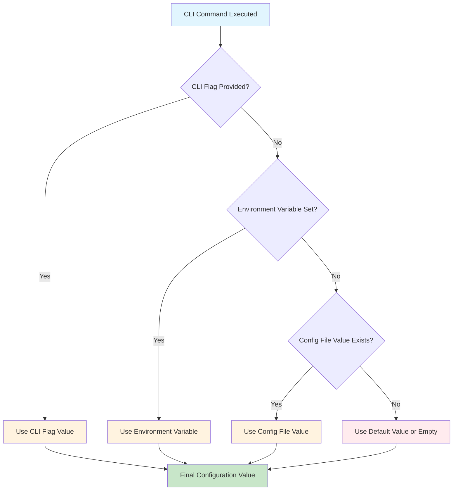
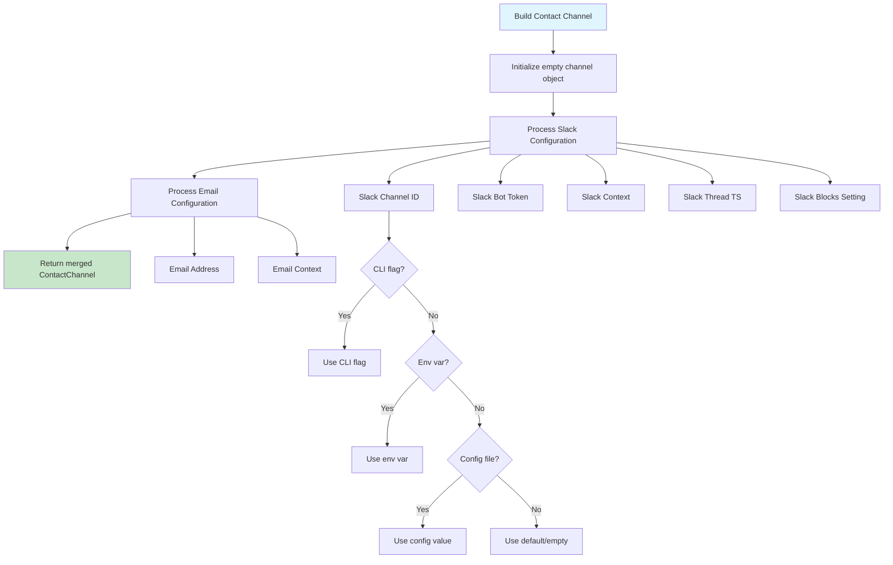
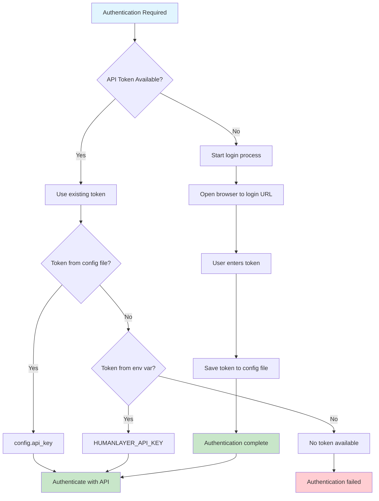

# HumanLayer CLI 設定

本文件說明 HumanLayer CLI (`hlyr`) 如何處理設定，包括設定來源的優先順序以及值的解析方式。

## 設定來源

HumanLayer CLI 支援多個設定來源，具有明確的優先順序：

1. **CLI 旗標**（最高優先）
2. **環境變數**
3. **設定檔**
4. **預設值**（最低優先）

## 設定值解析流程



## 設定檔探索

CLI 按以下順序搜尋設定檔：

```mermaid
flowchart TD
    A[Start Config Discovery] --> B{--config-file flag provided?}
    B -->|Yes| C[Load specified file]
    B -->|No| D[Check ./humanlayer.json]
    D -->|Exists| E[Load ./humanlayer.json]
    D -->|Not found| F[Check default config path]
    F -->|Exists| G[Load default config file]
    F -->|Not found| H[Use empty config {}]

    C --> I[Configuration Loaded]
    E --> I
    G --> I
    H --> I

    style A fill:#e1f5fe
    style I fill:#c8e6c9
```

### 預設設定路徑

預設設定路徑遵循 XDG Base Directory 規範：

- **路徑**：`$XDG_CONFIG_HOME/humanlayer/humanlayer.json`
- **備用路徑**：`$HOME/.config/humanlayer/humanlayer.json`（當未設定 `XDG_CONFIG_HOME` 時）

## 聯絡頻道設定

聯絡頻道（Slack/Email）透過合併所有來源的值來建立：



## 令牌解析與驗證



## 環境變數

支援以下環境變數：

| 變數                         | 用途                         | 範例                      |
| ---------------------------- | ------------------------------- | ---------------------------- |
| `HUMANLAYER_API_KEY`         | API 驗證令牌        | `hl_live_abc123...`          |
| `HUMANLAYER_API_BASE`        | API 伺服器基礎 URL             | `https://api.humanlayer.dev` |
| `HUMANLAYER_APP_URL`         | Web 應用程式基礎 URL                | `https://app.humanlayer.dev` |
| `HUMANLAYER_WWW_BASE_URL`    | WWW/行銷網站基礎 URL     | `https://www.humanlayer.dev` |
| `HUMANLAYER_SLACK_CHANNEL`   | Slack 頻道/使用者 ID           | `C1234567890`                |
| `HUMANLAYER_SLACK_BOT_TOKEN` | Slack 機器人令牌                 | `xoxb-...`                   |
| `HUMANLAYER_SLACK_CONTEXT`   | Slack 頻道上下文           | `engineering team`           |
| `HUMANLAYER_SLACK_THREAD_TS` | Slack 討論串時間戳記          | `1234567890.123456`          |
| `HUMANLAYER_SLACK_BLOCKS`    | 啟用 Slack blocks UI          | `true`                       |
| `HUMANLAYER_EMAIL_ADDRESS`   | 通知用的電子郵件地址 | `user@example.com`           |
| `HUMANLAYER_EMAIL_CONTEXT`   | 電子郵件使用者上下文              | `project manager`            |
| `XDG_CONFIG_HOME`            | 設定目錄覆寫       | `/custom/config/path`        |

## 設定檔格式

設定檔為 JSON 格式，具有以下結構：

```json
{
  "api_key": "hl_live_abc123...",
  "api_base_url": "https://api.humanlayer.dev",
  "app_base_url": "https://app.humanlayer.dev",
  "www_base_url": "https://www.humanlayer.dev",
  "channel": {
    "slack": {
      "channel_or_user_id": "C1234567890",
      "bot_token": "xoxb-...",
      "context_about_channel_or_user": "engineering team",
      "thread_ts": "1234567890.123456",
      "experimental_slack_blocks": true
    },
    "email": {
      "address": "user@example.com",
      "context_about_user": "project manager"
    }
  }
}
```

## CLI 指令與設定

### `config show`

顯示從所有來源解析的設定：

```bash
npx humanlayer config show [--json] [--config-file path]
```

### `login`

驗證並將 API 令牌儲存到設定：

```bash
npx humanlayer login [--api-base url] [--app-base url] [--config-file path]
```

## 設定優先順序範例

### 範例 1：Slack 頻道解析

給定：

- CLI 旗標：`--slack-channel C9999999999`
- 環境變數：`HUMANLAYER_SLACK_CHANNEL=C8888888888`
- 設定檔：`"channel_or_user_id": "C7777777777"`

**結果**：`C9999999999`（CLI 旗標優先）

### 範例 2：API 令牌解析

給定：

- 環境變數：`HUMANLAYER_API_KEY=env_token_123`
- 設定檔：`"api_key": "file_token_456"`

**結果**：`env_token_123`（環境變數優先）

### 範例 3：混合來源解析

給定：

- CLI：`--slack-channel C1111111111`
- 環境變數：`HUMANLAYER_SLACK_BOT_TOKEN=xoxb-env-token`
- 設定檔：`"context_about_channel_or_user": "dev team"`

**結果**：

```json
{
  "slack": {
    "channel_or_user_id": "C1111111111",
    "bot_token": "xoxb-env-token",
    "context_about_channel_or_user": "dev team"
  }
}
```

## 安全性考量

- **令牌儲存**：API 令牌儲存在具有限制權限的設定檔中
- **令牌顯示**：令牌在 `config show` 輸出中被遮罩（僅顯示前 6 個字元）
- **環境變數**：敏感的環境變數在除錯輸出中被遮罩
- **檔案權限**：設定檔應具有適當的讀取權限（建議 600）

## 疑難排解

### 常見問題

1. **找不到設定檔**：檢查檔案權限和路徑
2. **令牌驗證失敗**：驗證令牌是否有效且未過期
3. **Slack 機器人令牌無效**：確保機器人在工作區中具有適當的權限
4. **未設定電子郵件**：驗證電子郵件地址格式是否正確

### 除錯設定

使用 `config show` 驗證您的設定是否正確解析：

```bash
# Show human-readable configuration
npx humanlayer config show

# Show JSON output for programmatic use
npx humanlayer config show --json
```
