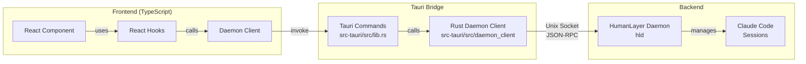
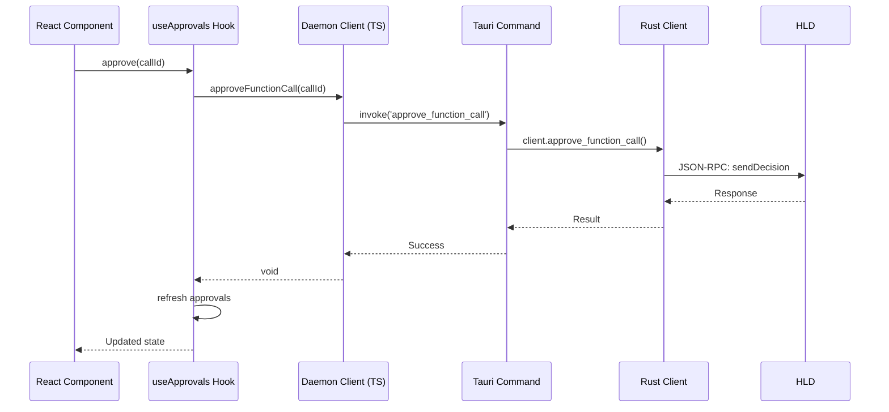

# 架構概覽

## 系統架構



## 資料流範例：核准函式呼叫



## 程式碼組織

### 前端 (src/)

```
src/
├── lib/
│   └── daemon/          # 低階 daemon 介面
│       ├── types.ts     # 協定型別定義
│       ├── client.ts    # DaemonClient 類別
│       ├── errors.ts    # 錯誤型別
│       └── index.ts     # 公開匯出
├── hooks/               # React hooks 層
│   ├── useApprovals.ts  # 審批管理
│   ├── useSessions.ts   # 會話管理
│   └── useConversation.ts
├── utils/               # UI 工具函式
│   ├── enrichment.ts    # 將審批與會話結合
│   └── formatting.ts    # 顯示格式化器
├── types/
│   └── ui.ts           # UI 特定型別
└── components/         # React 元件
```

### Tauri 橋接 (src-tauri/)

```
src-tauri/
├── src/
│   ├── lib.rs          # Tauri 指令處理器
│   └── daemon_client/  # Rust daemon 客戶端
│       ├── mod.rs      # 模組匯出
│       ├── types.rs    # Rust 型別定義
│       ├── client.rs   # 客戶端實作
│       ├── connection.rs
│       └── subscriptions.rs
```

## 關鍵設計原則

### 1. 層級分離

- **Daemon 客戶端**：純協定實作，無 UI 邏輯
- **Hooks**：React 狀態管理和資料豐富化
- **元件**：僅展示，所有邏輯使用 hooks

### 2. 型別安全

- 完整的 TypeScript 型別符合 Rust/Go 協定
- 常數使用列舉（SessionStatus、ApprovalType 等）
- 豐富化資料的獨立 UI 型別

### 3. 資料豐富化

- 原始 daemon 資料在 hooks 層豐富化
- 審批與會話上下文結合
- UI 友善的格式化在 TypeScript 中進行

### 4. 錯誤處理

- Daemon 錯誤在 hooks 中捕獲並格式化
- 使用者友善的訊息取代技術錯誤
- 元件接收簡單的錯誤字串

## 協定詳情

daemon 使用透過 Unix domain sockets 的 JSON-RPC 2.0。完整規格請參閱 [hld/PROTOCOL.md](../../hld/PROTOCOL.md)。

關鍵 RPC 方法：

- `launchSession` - 啟動新的 Claude Code 會話
- `listSessions` - 取得所有會話
- `fetchApprovals` - 取得待處理的審批
- `sendDecision` - 核准/拒絕/回應審批
- `getConversation` - 擷取會話對話歷史記錄
- `subscribe` - 即時事件更新
