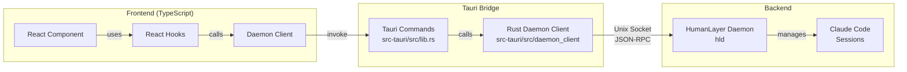
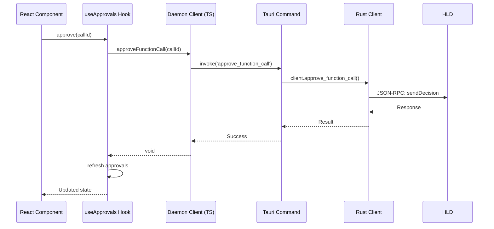

# Architecture Overview

## System Architecture



## Data Flow Example: Approving a Function Call



## Code Organization

### Frontend (src/)

```
src/
├── lib/
│   └── daemon/          # Low-level daemon interface
│       ├── types.ts     # Protocol type definitions
│       ├── client.ts    # DaemonClient class
│       ├── errors.ts    # Error types
│       └── index.ts     # Public exports
├── hooks/               # React hooks layer
│   ├── useApprovals.ts  # Approval management
│   ├── useSessions.ts   # Session management
│   └── useConversation.ts
├── utils/               # UI utilities
│   ├── enrichment.ts    # Join approvals with sessions
│   └── formatting.ts    # Display formatters
├── types/
│   └── ui.ts           # UI-specific types
└── components/         # React components
```

### Tauri Bridge (src-tauri/)

```
src-tauri/
├── src/
│   ├── lib.rs          # Tauri command handlers
│   └── daemon_client/  # Rust daemon client
│       ├── mod.rs      # Module exports
│       ├── types.rs    # Rust type definitions
│       ├── client.rs   # Client implementation
│       ├── connection.rs
│       └── subscriptions.rs
```

## Key Design Principles

### 1. Layer Separation

- **Daemon Client**: Pure protocol implementation, no UI logic
- **Hooks**: React state management and data enrichment
- **Components**: Presentation only, use hooks for all logic

### 2. Type Safety

- Full TypeScript types matching Rust/Go protocol
- Enums for constants (SessionStatus, ApprovalType, etc.)
- Separate UI types for enriched data

### 3. Data Enrichment

- Raw daemon data is enriched in the hooks layer
- Approvals are joined with session context
- UI-friendly formatting happens in TypeScript

### 4. Error Handling

- Daemon errors are caught and formatted in hooks
- User-friendly messages replace technical errors
- Components receive simple error strings

## Protocol Details

The daemon uses JSON-RPC 2.0 over Unix domain sockets. See [hld/PROTOCOL.md](../../hld/PROTOCOL.md) for the full specification.

Key RPC methods:

- `launchSession` - Start a new Claude Code session
- `listSessions` - Get all sessions
- `fetchApprovals` - Get pending approvals
- `sendDecision` - Approve/deny/respond to approvals
- `getConversation` - Fetch session conversation history
- `subscribe` - Real-time event updates
