# Approval Flow Diagrams

## Local Approval Flow

## Cloud Sync Approval Flow

## Session Settings Toggle Flow

```mermaid
sequenceDiagram
    participant User as User
    participant UI as WUI
    participant Daemon as Daemon
    participant Session as Session State

    User->>UI: Press Shift+Tab
    UI->>Daemon: POST /api/v1/sessions/{id}/settings<br/>{auto_accept_edits: true}
    Daemon->>Session: Update settings
    Daemon-->>UI: 200 OK
    UI->>User: Show "Auto-accepting edits" indicator

    Note over Daemon: Next Edit/Write tool call

    Daemon->>Daemon: Check session settings
    Note over Daemon: auto_accept_edits = true<br/>Skip approval creation
    Daemon-->>MCP: Immediate approval

    User->>UI: Press Shift+Tab again
    UI->>Daemon: POST /api/v1/sessions/{id}/settings<br/>{auto_accept_edits: false}
    Daemon-->>UI: 200 OK
    UI->>User: Remove indicator
```

## Streaming Context Flow

## Auto-Approval Rule Creation

## Why These Flows?

1. **Local Flow**: Minimal latency, direct communication
2. **Cloud Sync**: Preserves local decision-making while enabling remote access
3. **Settings Toggle**: Mimics Claude Code's shift+tab UX
4. **Streaming**: Handles large files without memory issues
5. **Rule Creation**: Progressive automation based on user behavior

Each flow is designed to be resilient, with fallbacks and error handling at every step.
