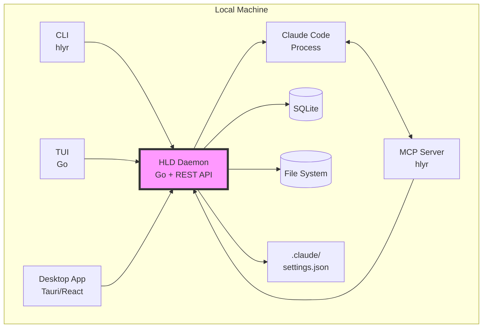
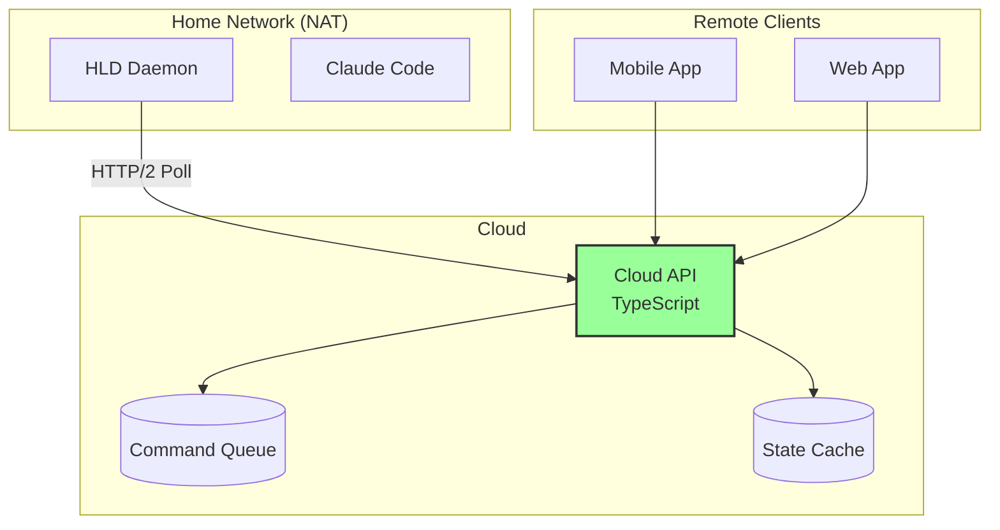
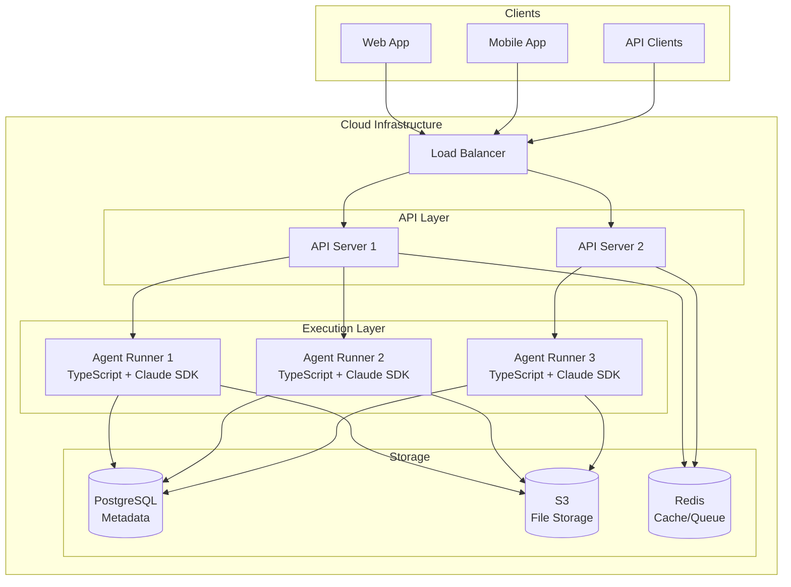

# Design Rationale & Future Vision

## Why These Technical Decisions?

### Why REST + OpenAPI Instead of Continuing JSON-RPC?

1. **Type Safety Across Languages**: OpenAPI generates TypeScript, Go, Rust, Python clients automatically
2. **Industry Standard**: Every developer knows REST; JSON-RPC is niche
3. **Better Tooling**: Swagger UI, Postman, code generation, validation
4. **Mobile/Web Ready**: REST works everywhere; Unix sockets don't
5. **Self-Documenting**: OpenAPI spec IS the documentation

### Why Server-Sent Events (SSE) Instead of WebSockets?

1. **Simplicity**: SSE is just HTTP; no protocol upgrade needed
2. **Unidirectional is Enough**: We only need daemon→client events
3. **Auto-Reconnect**: Built into the EventSource API
4. **Firewall Friendly**: Just HTTP GET requests
5. **OpenAPI Compatible**: Can be documented in the spec

### Why HTTP/2 Long Polling for Cloud Sync Instead of WebSockets?

1. **NAT Traversal**: Only outbound connections from daemon
2. **Protocol Consistency**: Stay in HTTP land
3. **Multiplexing**: HTTP/2 handles multiple streams efficiently
4. **Stateless-ish**: Each poll is independent; easier recovery
5. **No Protocol Split**: Avoid maintaining two different protocols

### Why Schema-Based Context and Responses?

1. **Start Simple**: String by default covers 80% of cases
2. **Future Proof**: Can add complex data without breaking API
3. **Self-Describing**: Clients can handle unknown schemas gracefully
4. **Type Safety**: Runtime validation with JSON Schema
5. **MCP Inspiration**: Similar pattern to MCP's tool definitions

### Why Daemon-First Architecture?

1. **Data Sovereignty**: Your code stays on your machine
2. **Low Latency**: No round trips to cloud for approvals
3. **Offline Capable**: Works without internet
4. **Privacy**: Sensitive code never leaves your laptop
5. **Cost**: No cloud infrastructure for basic usage

## Current Architecture



## Self-Hosted Architecture

```mermaid
graph TB
    subgraph "Local Network"
        subgraph "Laptop"
            Daemon[HLD Daemon<br/>:7777]
            Claude[Claude Code]
            FS[(File System)]
        end

        subgraph "Mobile"
            Mobile[Mobile App<br/>React Native]
        end

        subgraph "Other Devices"
            Tablet[Tablet]
            Desktop[Another Desktop]
        end
    end

    Mobile -->|WiFi| Daemon
    Tablet -->|WiFi| Daemon
    Desktop -->|WiFi| Daemon

    Daemon --> Claude
    Daemon --> FS
```

## Cloud Sync Architecture



## Future: Cloud-Native Architecture



## Evolution Path

### Phase 1: Local-First (Current)

- Single daemon per machine
- REST API on localhost:7777
- File system access
- SQLite storage

### Phase 2: Self-Hosted (Next)

- Same daemon, network accessible
- Mobile/tablet support
- Local network only
- No cloud dependency

### Phase 3: Cloud Sync (Soon)

- Daemon remains source of truth
- Cloud acts as relay/cache
- NAT traversal via polling
- Remote access anywhere

### Phase 4: Cloud-Native (Future)

- Cloud-hosted daemons
- Multi-tenant architecture
- Team workspaces
- Managed infrastructure

## Why This Enables Cloud-Hosted Daemons

The REST API abstraction means clients don't care where the daemon runs:

```typescript
// Local daemon
const api = new DaemonAPI('http://localhost:7777')

// Self-hosted daemon
const api = new DaemonAPI('http://192.168.1.100:7777')

// Cloud-synced daemon
const api = new DaemonAPI('https://api.humanlayer.dev/daemons/abc123')

// Cloud-native daemon
const api = new DaemonAPI('https://api.humanlayer.dev/teams/myteam')
```

The same API contract works everywhere. Implementation details (SQLite vs PostgreSQL, local files vs S3) are hidden behind the API.

## Team Features (Future)

When we move to cloud-hosted daemons, the API extends naturally:

```yaml
# Team management (future)
GET  /api/v1/teams/{teamId}/sessions
POST /api/v1/teams/{teamId}/policies
GET  /api/v1/teams/{teamId}/audit-log

# But core API remains the same
POST /api/v1/sessions          # Works identically
GET  /api/v1/approvals         # Same contract
POST /api/v1/approvals/{id}/decide  # Same schema
```

## Key Insight: API as Contract

The genius of this design is that whether you're running:

- Local daemon on your laptop
- Self-hosted daemon on your network
- Cloud-synced daemon behind NAT
- Fully cloud-hosted shared daemon

...the API contract remains identical. This enables gradual migration without breaking changes.

## Design Principles for the Future

1. **API Stability**: Core endpoints never change
2. **Progressive Enhancement**: Add features via new endpoints
3. **Backwards Compatible**: Old clients work with new daemons
4. **Location Agnostic**: Same code works local/remote/cloud
5. **Team Ready**: Multi-tenant from day one (even if unused)

This is why we chose REST + OpenAPI. It's not just about today's features - it's about building a foundation that scales from a developer's laptop to a enterprise team platform without changing the fundamental architecture.
