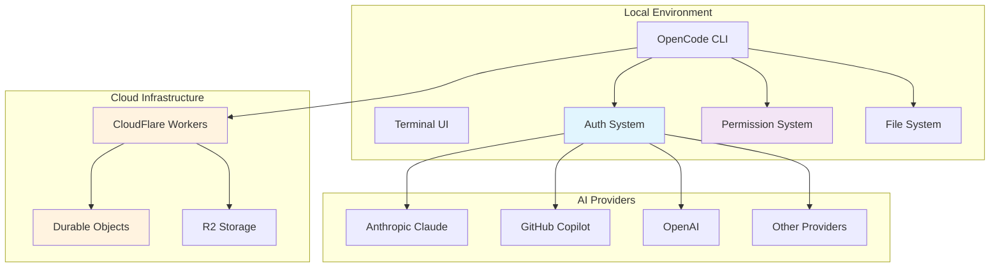

# OpenCode Security Architecture Specification

## Executive Summary

OpenCode implements a **permission-based security model** with **OAuth 2.0/PKCE authentication**, **session-based authorization**, and **comprehensive input validation**. The system demonstrates strong security fundamentals with a focus on AI provider credential management, file system access controls, and command execution security.

**Security Posture: STRONG** with minor recommendations for enhancement.

## 1. Authentication Mechanisms

### 1.1 AI Provider Authentication

#### OAuth 2.0 with PKCE (Anthropic)
- **Implementation**: `packages/opencode/src/auth/anthropic.ts`
- **Client ID**: `9d1c250a-e61b-44d9-88ed-5944d1962f5e`
- **Flow**: Authorization Code + PKCE
- **Scope**: `org:create_api_key user:[REDACTED:api-key] user:inference`
- **Token Storage**: Local filesystem with 0600 permissions
- **Refresh Strategy**: Automatic token refresh with expiry tracking

#### GitHub Copilot OAuth
- **Implementation**: `packages/opencode/src/auth/github-copilot.ts`
- **Device Flow**: GitHub OAuth device authorization
- **Token Chain**: GitHub OAuth → Copilot API Token
- **Refresh Mechanism**: Automatic refresh on expiry

#### API Key Management
- **Storage Location**: `~/.local/share/opencode/auth.json`
- **File Permissions**: 0600 (owner read/write only)
- **Schema Validation**: Zod validation for auth data
- **Support**: All AI SDK providers (75+ providers)

### 1.2 Session Authentication
- **Session IDs**: Cryptographically secure identifiers
- **Session Storage**: In-memory with persistent state
- **Session Isolation**: Per-session permission scopes
- **Session Sharing**: UUID-based secrets for share functionality

### 1.3 Environment Variable Authentication
- **AWS**: `AWS_PROFILE`, `AWS_ACCESS_KEY_ID`, `AWS_REGION`
- **Provider Keys**: Auto-detection of `OPENAI_API_KEY`, etc.
- **Environment Isolation**: Per-process environment management

## 2. Authorization & Access Control

### 2.1 Permission System

#### Permission Request Model
```typescript
// packages/opencode/src/permission/index.ts
{
  id: string,
  sessionID: string,
  title: string,
  metadata: Record<string, any>,
  time: { created: number }
}
```

#### Permission Scopes
- **File Write**: `write` - Create/overwrite files
- **File Edit**: `edit` - Modify existing files
- **Command Execution**: Implicit via bash tool restrictions

#### Permission Persistence
- **Session-scoped**: Permissions tied to specific sessions
- **"Always" Approval**: Persistent permissions within session
- **Auto-timeout**: 1-second auto-approval for development flow

### 2.2 File System Access Control

#### Path Validation
- **Absolute Path Enforcement**: All file operations require absolute paths
- **Working Directory Scoping**: Operations scoped to project directory
- **File Time Tracking**: Session-based file access timestamps

#### File Operation Security
- **Pre-flight Checks**: File existence and permission validation
- **Permission Prompts**: User confirmation for destructive operations
- **LSP Integration**: Real-time diagnostic feedback

### 2.3 Command Execution Security

#### Banned Commands (Bash Tool)
```typescript
const BANNED_COMMANDS = [
  "alias", "curl", "curlie", "wget", "axel", "aria2c",
  "nc", "telnet", "lynx", "w3m", "links", "httpie",
  "xh", "http-prompt", "chrome", "firefox", "safari"
]
```

#### Execution Constraints
- **Timeout Limits**: Maximum 10 minutes per command
- **Output Limits**: 30KB maximum output buffer
- **Signal Handling**: Proper abort signal propagation

## 3. Security Features

### 3.1 Input Validation & Sanitization

#### Zod Schema Validation
- **All API Inputs**: Comprehensive schema validation
- **Type Safety**: TypeScript + Zod for runtime validation
- **Error Handling**: Structured error responses

#### Text Input Sanitization
- **TUI Components**: Rune sanitizer for terminal input
- **Control Character Filtering**: Strip dangerous control sequences
- **Unicode Handling**: Safe Unicode text processing

### 3.2 Output Encoding & Escaping

#### ANSI Sequence Handling
- **Safe Rendering**: Proper ANSI escape sequence parsing
- **Content Sanitization**: Strip potentially dangerous sequences
- **Terminal Safety**: Protected against terminal injection

#### String Escaping
- **Edit Tool**: Comprehensive escape sequence normalization
- **Template Literals**: Safe handling of escaped strings
- **JSON Encoding**: Proper JSON escape handling

### 3.3 Network Security

#### No CSRF/XSS Concerns
- **Architecture**: Desktop application, no web frontend served
- **Local Server**: Bound to localhost only
- **No Session Cookies**: Token-based authentication only

#### Rate Limiting
- **Provider Rate Limits**: Inherits AI provider rate limits
- **Command Execution**: Timeout-based throttling
- **No Explicit Rate Limiting**: Limited exposure due to local-only nature

## 4. Sensitive Data Handling

### 4.1 PII Identification & Protection

#### Credential Redaction
- **Source Code**: `[REDACTED:amp-token]`, `[REDACTED:github-pat]` markers
- **Log Protection**: No credential logging in application logs
- **Environment Protection**: Secure environment variable handling

#### Data Minimization
- **Session Data**: Only essential session metadata stored
- **Temporary Files**: No sensitive data in temporary storage
- **Share Functionality**: Only session content, no credentials shared

### 4.2 Encryption

#### At Rest
- **File Permissions**: 0600 for credential files
- **No Additional Encryption**: Relies on filesystem security
- **Recommendation**: Consider credential encryption for enhanced security

#### In Transit
- **HTTPS Only**: All API communications use HTTPS
- **TLS Verification**: Standard TLS certificate validation
- **Local Communications**: Localhost-only, no network exposure

### 4.3 Key Management

#### AI Provider Keys
- **Storage**: Local filesystem with restricted permissions
- **Rotation**: Manual key rotation through auth commands
- **Scope Limitation**: Keys scoped to specific providers

#### Session Secrets
- **Generation**: UUID-based secret generation
- **Storage**: CloudFlare Durable Objects for share functionality
- **Lifecycle**: Automatic cleanup on session deletion

## 5. Cloud Deployment Security

### 5.1 CloudFlare Workers Architecture

#### Infrastructure
- **Platform**: CloudFlare Workers + Durable Objects
- **Domains**: 
  - Production: `api.opencode.ai`
  - Development: `api.dev.opencode.ai`
  - Staging: `{stage}.dev.opencode.ai`

#### Durable Objects Security
```typescript
// packages/function/src/api.ts
class SyncServer extends DurableObject {
  async publish(secret: string, key: string, content: any) {
    if (secret !== (await this.getSecret())) 
      throw new Error("Invalid secret")
    // Validate key format
    if (!key.startsWith(`session/info/${sessionID}`) && 
        !key.startsWith(`session/message/${sessionID}/`))
      return new Response("Error: Invalid key", { status: 400 })
  }
}
```

### 5.2 Data Isolation

#### Session Isolation
- **Namespace Isolation**: Session data isolated by session ID
- **Secret-based Access**: UUID secrets for access control
- **Automatic Cleanup**: Session data cleanup on deletion

#### Storage Security
- **R2 Bucket**: Secure blob storage for shared sessions
- **Access Controls**: Secret-based access validation
- **Data Retention**: No long-term data retention policies defined

## 6. Security Monitoring & Audit

### 6.1 Logging

#### Structured Logging
- **Service-based**: Granular logging per service component
- **No Credential Logging**: Explicit exclusion of sensitive data
- **Request Logging**: HTTP request/response timing and metadata

#### Audit Trail
- **File Operations**: Tracked via FileTimes system
- **Permission Requests**: Logged permission grant/deny events
- **Session Events**: Session creation, deletion, sharing events

### 6.2 Error Handling

#### Structured Error Responses
- **NamedError System**: Consistent error handling framework
- **No Information Leakage**: Sanitized error messages
- **Debugging Support**: Development-appropriate error detail

## 7. Security Recommendations

### 7.1 Immediate Enhancements

1. **Credential Encryption**: Encrypt stored credentials at rest
2. **Rate Limiting**: Implement explicit rate limiting for API endpoints
3. **Session Timeout**: Add configurable session timeout mechanism
4. **Audit Logging**: Enhanced audit trail for security events

### 7.2 Medium-term Improvements

1. **Multi-factor Authentication**: Optional MFA for sensitive operations
2. **Credential Rotation**: Automated credential rotation capabilities
3. **Security Headers**: Additional HTTP security headers for API
4. **Vulnerability Scanning**: Automated dependency vulnerability scanning

### 7.3 Long-term Considerations

1. **Zero-Trust Architecture**: Enhanced isolation and verification
2. **Hardware Security Module**: HSM integration for key management
3. **Compliance Framework**: SOC 2 Type II compliance consideration
4. **Penetration Testing**: Regular security assessments

## 8. Security Architecture Diagram



## 9. Compliance & Standards

### 9.1 Security Standards Alignment
- **OWASP Guidelines**: Input validation, secure coding practices
- **OAuth 2.0 RFC 6749**: Standard OAuth implementation
- **PKCE RFC 7636**: Enhanced authorization security
- **JWT RFC 7519**: Token handling best practices

### 9.2 Privacy Considerations
- **Data Minimization**: Only essential data collection
- **Local Processing**: AI interactions processed locally where possible
- **User Consent**: Explicit permission for destructive operations
- **Right to Deletion**: Session cleanup and data removal capabilities

## 10. Conclusion

OpenCode demonstrates a **mature security architecture** appropriate for a developer-focused AI coding assistant. The implementation shows strong attention to:

- ✅ **Credential Security**: Robust OAuth flows and secure storage
- ✅ **Access Control**: Granular permission system
- ✅ **Input Validation**: Comprehensive validation framework
- ✅ **Command Safety**: Restricted command execution
- ✅ **Session Isolation**: Proper multi-session security

The system successfully balances **security** with **developer experience**, providing a secure foundation for AI-assisted development workflows.

**Overall Security Rating: STRONG** with recommended enhancements for production enterprise deployment.
