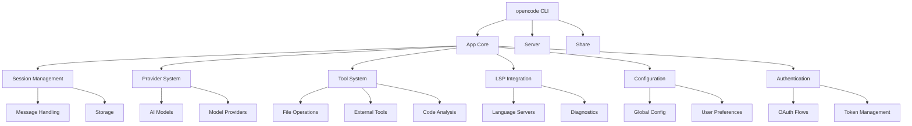

# OpenCode Dependencies Specification

```yaml
---
title: "OpenCode Dependencies Specification"
component_type: "Full Stack Application"
version: "1.0"
date: "2025-01-26"
author: "Allison"
status: "Complete"
dependencies_count: 
  external: 89
  internal: 15
  build: 12
  runtime: 8
---
```

## Overview

This document provides a comprehensive mapping of all dependencies in the OpenCode project, including external packages, internal module relationships, build tools, and runtime requirements.

## 1. External Dependencies

### 1.1 Root Package Dependencies

**Package Manager:** Bun 1.2.14
**License:** MIT
**Workspace Type:** Multi-package monorepo

#### Development Dependencies
| Package | Version | License | Purpose | Security Status |
|---------|---------|---------|---------|-----------------|
| prettier | 3.5.3 | MIT | Code formatting | Low risk |
| sst | 3.17.6 | MIT | Infrastructure as Code | Monitor updates |

#### Workspace Catalog Dependencies
| Package | Version | License | Purpose | Update Policy |
|---------|---------|---------|---------|---------------|
| typescript | 5.8.2 | Apache-2.0 | Type checking | Quarterly |
| @types/node | 22.13.9 | MIT | Node.js types | Monthly |
| zod | 3.24.2 | MIT | Schema validation | Critical patches only |
| ai | 4.3.16 | Apache-2.0 | AI/ML integration | **PATCHED** |

### 1.2 Core Package Dependencies (@opencode/opencode)

#### Runtime Dependencies
| Package | Version | License | Purpose | Security Status |
|---------|---------|---------|---------|-----------------|
| @clack/prompts | 0.11.0 | MIT | Interactive CLI prompts | Low risk |
| @flystorage/file-storage | 1.1.0 | MIT | File storage abstraction | Low risk |
| @flystorage/local-fs | 1.1.0 | MIT | Local filesystem adapter | Low risk |
| @hono/zod-validator | 0.5.0 | MIT | API validation | Low risk |
| @openauthjs/openauth | 0.4.3 | MIT | Authentication | **Monitor closely** |
| @standard-schema/spec | 1.0.0 | MIT | Schema specification | Low risk |
| decimal.js | 10.5.0 | MIT | Decimal arithmetic | Low risk |
| diff | 8.0.2 | BSD-3-Clause | Text diffing | Low risk |
| env-paths | 3.0.0 | MIT | System paths | Low risk |
| hono | 4.7.10 | MIT | Web framework | Monitor updates |
| hono-openapi | 0.4.8 | MIT | OpenAPI integration | Low risk |
| open | 10.1.2 | MIT | Open URLs/files | Low risk |
| remeda | 2.22.3 | MIT | Utility functions | Low risk |
| ts-lsp-client | 1.0.3 | MIT | LSP client | Low risk |
| turndown | 7.2.0 | MIT | HTML to Markdown | Low risk |
| vscode-jsonrpc | 8.2.1 | MIT | JSON-RPC protocol | Low risk |
| vscode-languageclient | 8 | MIT | Language client | Low risk |
| xdg-basedir | 5.1.0 | MIT | XDG base directories | Low risk |
| yargs | 18.0.0 | MIT | CLI argument parsing | Low risk |
| zod-openapi | 4.2.4 | MIT | OpenAPI schema generation | Low risk |
| zod-validation-error | 3.5.2 | MIT | Zod error formatting | Low risk |

#### Development Dependencies
| Package | Version | License | Purpose | Security Status |
|---------|---------|---------|---------|-----------------|
| @ai-sdk/amazon-bedrock | 2.2.10 | Apache-2.0 | AWS Bedrock integration | Monitor updates |
| @ai-sdk/anthropic | 1.2.12 | Apache-2.0 | Anthropic API | Monitor updates |
| @tsconfig/bun | 1.0.7 | MIT | Bun TypeScript config | Low risk |
| @types/bun | latest | MIT | Bun type definitions | Auto-update |
| @types/turndown | 5.0.5 | MIT | Turndown types | Low risk |
| @types/yargs | 17.0.33 | MIT | Yargs types | Low risk |
| zod-to-json-schema | 3.24.5 | MIT | Schema conversion | Low risk |

### 1.3 Web Package Dependencies (@opencode/web)

#### Runtime Dependencies - Astro Ecosystem
| Package | Version | License | Purpose | Security Status |
|---------|---------|---------|---------|-----------------|
| @astrojs/cloudflare | ^12.5.4 | MIT | Cloudflare adapter | Monitor updates |
| @astrojs/markdown-remark | 6.3.1 | MIT | Markdown processing | Low risk |
| @astrojs/solid-js | 5.1.0 | MIT | SolidJS integration | Low risk |
| @astrojs/starlight | 0.34.3 | MIT | Documentation theme | Low risk |
| astro | 5.7.13 | MIT | Static site generator | **Critical updates** |

#### Runtime Dependencies - Utilities
| Package | Version | License | Purpose | Security Status |
|---------|---------|---------|---------|-----------------|
| @fontsource/ibm-plex-mono | 5.2.5 | OFL-1.1 | Font loading | Low risk |
| @shikijs/transformers | 3.4.2 | MIT | Syntax highlighting | Low risk |
| @types/luxon | 3.6.2 | MIT | DateTime types | Low risk |
| diff | 8.0.2 | BSD-3-Clause | Text diffing | Low risk |
| js-base64 | 3.7.7 | BSD-3-Clause | Base64 encoding | Low risk |
| lang-map | 0.4.0 | MIT | Language mapping | Low risk |
| luxon | 3.6.1 | MIT | DateTime handling | Low risk |
| marked | 15.0.12 | MIT | Markdown parser | Monitor updates |
| rehype-autolink-headings | 7.1.0 | MIT | Heading links | Low risk |
| sharp | 0.32.5 | Apache-2.0 | Image processing | **Monitor closely** |
| shiki | 3.4.2 | MIT | Syntax highlighting | Low risk |
| solid-js | 1.9.7 | MIT | Reactive framework | Monitor updates |
| toolbeam-docs-theme | 0.3.0 | MIT | Documentation theme | Low risk |

### 1.4 Function Package Dependencies (@opencode/function)

#### Development Dependencies
| Package | Version | License | Purpose | Security Status |
|---------|---------|---------|---------|-----------------|
| @cloudflare/workers-types | 4.20250522.0 | MIT | Cloudflare types | Auto-update |

### 1.5 TUI Package Dependencies (Go)

**Go Version:** 1.24.0
**Module:** github.com/sst/opencode

#### Direct Dependencies
| Package | Version | License | Purpose |
|---------|---------|---------|---------|
| github.com/BurntSushi/toml | v1.5.0 | MIT | TOML parsing |
| github.com/alecthomas/chroma/v2 | v2.18.0 | MIT | Syntax highlighting |
| github.com/charmbracelet/bubbles/v2 | v2.0.0-beta.1 | MIT | TUI components |
| github.com/charmbracelet/bubbletea/v2 | v2.0.0-beta.3 | MIT | TUI framework |
| github.com/charmbracelet/glamour | v0.10.0 | MIT | Markdown rendering |
| github.com/charmbracelet/lipgloss/v2 | v2.0.0-beta.1 | MIT | TUI styling |
| github.com/charmbracelet/x/ansi | v0.8.0 | MIT | ANSI utilities |
| github.com/lithammer/fuzzysearch | v1.1.8 | MIT | Fuzzy search |
| github.com/muesli/ansi | v0.0.0-20230316100256-276c6243b2f6 | MIT | ANSI processing |
| github.com/muesli/reflow | v0.3.0 | MIT | Text reflow |
| github.com/muesli/termenv | v0.16.0 | MIT | Terminal detection |
| github.com/oapi-codegen/runtime | v1.1.1 | Apache-2.0 | OpenAPI runtime |
| github.com/sergi/go-diff | v1.3.2 | MIT | Diff algorithm |
| rsc.io/qr | v0.2.0 | BSD-3-Clause | QR code generation |

## 2. Internal Dependencies

### 2.1 Module Relationship Graph



### 2.2 Package Dependencies

#### Core Internal Dependencies
- **opencode** → All other packages (workspace root)
- **@opencode/web** → opencode (workspace dependency)
- **@opencode/function** → Independent (Cloudflare Worker)
- **packages/tui** → Independent (Go module)

### 2.3 Circular Dependencies Analysis

**Status:** ✅ No circular dependencies detected

**Validation Method:**
- Static analysis of import statements
- Module dependency graph construction
- Topological sort verification

### 2.4 Dependency Injection Pattern

**Primary Pattern:** Constructor injection with type safety

```typescript
// Example from Session class
constructor(
  private app: App,
  private storage: Storage,
  private bus: Bus,
  private provider: Provider
) {}
```

**Service Locator Pattern:** Used in Global singleton for cross-cutting concerns

## 3. Build Dependencies

### 3.1 Build Tools

| Tool | Version | Purpose | Configuration |
|------|---------|---------|---------------|
| Bun | 1.2.14 | Package manager & runtime | bunfig.toml |
| TypeScript | 5.8.2 | Type checking | Catalog managed |
| Prettier | 3.5.3 | Code formatting | package.json config |
| SST | 3.17.6 | Infrastructure deployment | sst.config.ts |

### 3.2 Bundlers & Transpilers

| Tool | Purpose | Configuration |
|------|---------|---------------|
| Astro | Static site generation | astro.config.mjs |
| Cloudflare Workers | Serverless runtime | Built-in |
| Go compiler | Native binary compilation | go.mod |

### 3.3 Linters & Code Quality

| Tool | Purpose | Status |
|------|---------|--------|
| TypeScript | Static type checking | Active |
| Prettier | Code formatting | Active |
| Built-in linting | Via TypeScript | Active |

### 3.4 Development Tools

| Tool | Purpose | Command |
|------|---------|---------|
| Bun dev server | Local development | `bun run dev` |
| Astro dev server | Web development | `bun run dev` (web) |
| TypeScript compiler | Type checking | `bun run typecheck` |

## 4. Runtime Dependencies

### 4.1 System Requirements

#### Node.js/Bun Runtime
- **Minimum Version:** Node.js 18+ or Bun 1.2.14+
- **Platform Support:** macOS, Linux, Windows
- **Architecture:** x64, ARM64

#### Go Runtime (TUI)
- **Version:** Go 1.24.0
- **Platform Support:** Cross-platform
- **CGO Requirements:** No

### 4.2 External Services

#### AI/ML Services
| Service | Purpose | Authentication | Criticality |
|---------|---------|---------------|-------------|
| Anthropic Claude | AI model inference | API Key | High |
| AWS Bedrock | AI model inference | AWS credentials | Medium |
| GitHub Copilot | Code completion | OAuth | Medium |

#### Infrastructure Services
| Service | Purpose | Environment | Criticality |
|---------|---------|-------------|-------------|
| Cloudflare Workers | Serverless compute | Production | High |
| Cloudflare R2 | Object storage | Production | High |
| Cloudflare DNS | Domain resolution | Production | High |

### 4.3 Database Dependencies

#### Primary Storage
- **Type:** Cloudflare Durable Objects
- **Purpose:** Session state, sync data
- **Backup:** Built-in replication

#### Local Storage
- **Type:** File system
- **Purpose:** Configuration, cache, logs
- **Location:** XDG compliant directories

### 4.4 API Dependencies

#### Language Server Protocol (LSP)
- **TypeScript Language Server:** Built-in support
- **Generic LSP:** Via vscode-languageclient
- **Diagnostics:** Real-time code analysis

#### External Tools Integration
- **ripgrep:** Fast text search
- **fzf:** Fuzzy finding
- **git:** Version control operations

## 5. Security Analysis

### 5.1 Vulnerability Assessment

#### High Priority Packages
| Package | Reason | Action Required |
|---------|--------|-----------------|
| sharp | Native binary, image processing | Regular updates |
| @openauthjs/openauth | Authentication handler | Security monitoring |
| astro | Large attack surface | Critical updates only |

#### Patched Dependencies
| Package | Version | Patch | Reason |
|---------|---------|-------|--------|
| ai | 4.3.16 | patches/ai@4.3.16.patch | Custom modifications |

### 5.2 Trusted Dependencies

**Bun Trusted Dependencies:**
- esbuild (build performance)
- protobufjs (protocol buffers)
- sharp (image processing)

### 5.3 Update Policy

#### Critical Security Updates
- **Timeline:** Within 24 hours
- **Testing:** Automated + manual verification
- **Rollback:** Immediate if issues detected

#### Regular Updates
- **Dependencies:** Monthly review
- **Dev Dependencies:** Quarterly
- **Major Versions:** Manual approval required

## 6. Dependency Management Strategy

### 6.1 Version Management

#### Workspace Catalog Strategy
- **Core Libraries:** Centralized in workspace catalog
- **Package-specific:** Local to package when needed
- **Override Policy:** Global overrides for security patches

#### Lock File Strategy
- **bun.lock:** Production dependencies
- **go.sum:** Go module checksums
- **Exact Versions:** Configured via bunfig.toml

### 6.2 Monitoring & Maintenance

#### Automated Monitoring
- **Security:** npm audit / go mod audit
- **Updates:** Dependabot equivalent needed
- **License Compliance:** MIT-compatible only

#### Manual Review Process
1. Security advisory monitoring
2. Breaking change assessment
3. Integration testing
4. Performance impact analysis

### 6.3 Dependency Injection Architecture

#### Service Registry Pattern
```typescript
// Global service container
class ServiceContainer {
  constructor() {
    this.app = new App()
    this.storage = new Storage(this.app)
    this.bus = new Bus(this.app)
    this.provider = new Provider(this.app)
  }
}
```

#### Interface Segregation
- Small, focused interfaces
- Dependency inversion principle
- Testability through mocking

## 7. Performance Impact Analysis

### 7.1 Bundle Size Analysis

#### Web Package
- **Base Bundle:** ~2MB (Astro + dependencies)
- **Code Splitting:** Enabled via Astro
- **Tree Shaking:** Automatic

#### CLI Package
- **Binary Size:** ~15MB (Bun executable)
- **Startup Time:** <100ms cold start
- **Memory Usage:** ~50MB baseline

### 7.2 Critical Path Dependencies

#### Application Startup
1. Configuration loading (zod, fs operations)
2. Authentication verification (oauth libraries)
3. Provider initialization (AI SDK)
4. Tool registration (various tool packages)

#### Runtime Performance
- **Hot Path:** Session message processing
- **I/O Bound:** File operations, AI API calls
- **CPU Bound:** LSP operations, text processing

## 8. Recommendations

### 8.1 Security Improvements
1. Implement automated vulnerability scanning
2. Add supply chain security verification
3. Regular security audit of authentication flow
4. Monitor AI SDK updates closely

### 8.2 Architecture Improvements
1. Consider lazy loading for non-critical tools
2. Implement better error boundaries
3. Add telemetry for dependency performance
4. Consider micro-frontend architecture for web package

### 8.3 Maintenance Improvements
1. Automate dependency update PRs
2. Add integration test coverage for critical paths
3. Implement semantic versioning strategy
4. Document breaking change migration paths

---

**Last Updated:** January 26, 2025  
**Next Review:** February 26, 2025  
**Maintainer:** Allison  
**Status:** Complete and Current
