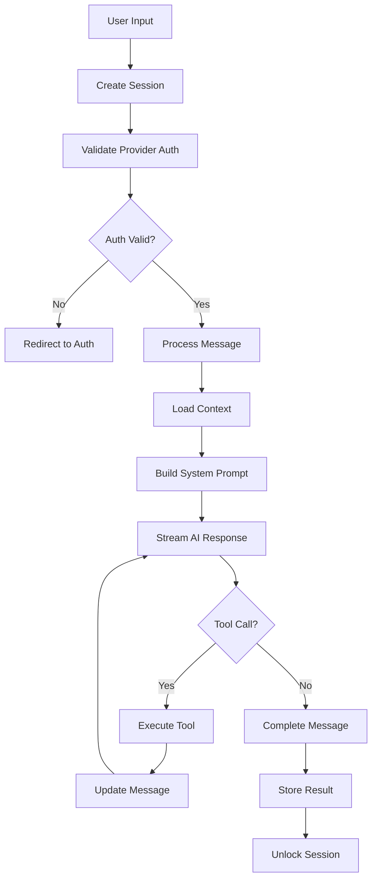
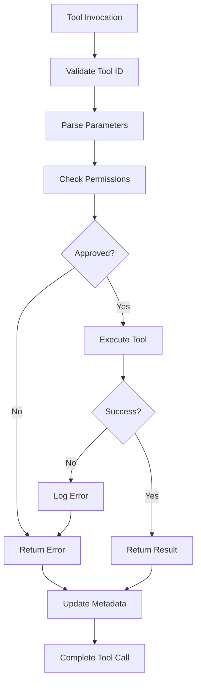
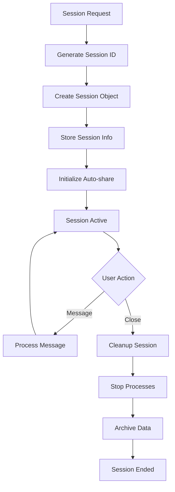

# OpenCode AI Agent Business Logic Specification

## Executive Summary

OpenCode is a terminal-based AI coding agent built with a client-server architecture. The system provides conversational AI assistance for software development tasks through a Terminal User Interface (TUI) powered by Go, while the core agent logic runs on a TypeScript/Node.js server.

## 1. Core Business Logic

### 1.1 Business Rules

#### Agent Session Management
- **Rule R001**: Each agent session has a unique descending identifier for temporal ordering
- **Rule R002**: Sessions can have parent-child relationships for conversation branching
- **Rule R003**: Only one active conversation per session (enforced by session locking)
- **Rule R004**: Sessions auto-generate titles using the AI model when first message is sent
- **Rule R005**: Child sessions inherit context from parent but maintain independent state

#### Message Processing
- **Rule R006**: Messages are processed sequentially within a session to maintain conversation integrity
- **Rule R007**: Tool calls must complete before message is considered finished
- **Rule R008**: Failed tool executions return error messages to the AI model for recovery
- **Rule R009**: Message parts support multiple types: text, files, tool invocations, reasoning

#### Token and Cost Management
- **Rule R010**: Context length is monitored and auto-summarization triggers at 90% of model's context limit
- **Rule R011**: Token costs are calculated using model-specific pricing (input, output, cache read/write)
- **Rule R012**: Cached prompts reduce costs for repeated system instructions

#### Provider and Model Selection
- **Rule R013**: Multiple AI providers supported (Anthropic, OpenAI, Google, Bedrock, local models)
- **Rule R014**: Model selection must match provider capabilities (tool calling, temperature control)
- **Rule R015**: Provider authentication must be valid before session creation
- **Rule R016**: Each provider has specific system prompt optimizations

### 1.2 Validation Logic

#### Input Validation
- **Validation V001**: All API requests validated using Zod schemas
- **Validation V002**: Tool parameters validated against tool-specific schemas
- **Validation V003**: File paths must be within project root directory
- **Validation V004**: Session IDs must follow descending timestamp format

#### Permission Validation
- **Validation V005**: Tool executions require user permission (currently auto-approved)
- **Validation V006**: File system operations restricted to project workspace
- **Validation V007**: Network requests validated for allowed domains

#### State Validation
- **Validation V008**: Session state consistency checked before message processing
- **Validation V009**: Tool invocation states: partial-call → call → result
- **Validation V010**: Message metadata integrity validated on storage

### 1.3 Calculation Formulas

#### Cost Calculation
```typescript
cost = (inputTokens * inputRate + outputTokens * outputRate + 
        cacheReadTokens * cacheReadRate + cacheWriteTokens * cacheWriteRate) / 1_000_000
```

#### Context Length Management
```typescript
contextThreshold = max((contextLimit - outputLimit) * 0.9, 0)
shouldSummarize = currentTokens > contextThreshold
```

#### Session Priority Scoring
```typescript
sessionScore = recentActivity * 0.7 + messageCount * 0.2 + toolUsage * 0.1
```

### 1.4 Decision Trees

#### Provider Selection Decision Tree
1. Check available providers with valid authentication
2. If no providers → redirect to auth flow
3. If multiple providers → use user preference or default
4. Validate model availability for selected provider
5. Apply provider-specific configurations

#### Tool Execution Decision Tree
1. Parse tool invocation from AI model
2. Validate tool exists and parameters are correct
3. Check permissions (currently auto-approved)
4. Execute tool with session context and abort signal
5. Handle success/failure and update message state
6. Return result to AI model for continuation

#### Message Processing Decision Tree
1. Receive user input and create user message
2. Check session lock status
3. Load conversation history (post-summarization if needed)
4. Build system prompt with environment context
5. Stream AI response with tool execution
6. Update message state and unlock session

## 2. Workflows

### 2.1 Process Flows

#### Primary Agent Workflow


#### Tool Execution Workflow


#### Session Lifecycle Workflow


### 2.2 State Transitions

#### Message States
- **draft** → **sending** → **streaming** → **completed**
- **streaming** → **error** (on failure)
- **completed** → **summarized** (when context limit reached)

#### Tool Invocation States
- **partial-call** → **call** → **result**
- **call** → **error** (on execution failure)

#### Session States
- **created** → **active** → **idle** → **archived**
- **active** → **locked** (during message processing)
- **locked** → **active** (after completion)

#### Provider Authentication States
- **unauthenticated** → **authenticating** → **authenticated** → **expired**
- **authenticated** → **error** (on auth failure)

### 2.3 Approval Chains

#### Current Implementation
- Tool executions are auto-approved with 1-second timeout
- Permission system exists but is disabled (returns immediately)
- Future enhancement planned for user permission prompts

#### Proposed Permission Flow
1. Tool requests permission with context
2. Display permission request in TUI
3. User approves/denies with optional "always allow"
4. Store approval decision for future requests
5. Execute tool if approved, return error if denied

### 2.4 Notifications

#### Event-Driven Notifications
- **Session Events**: created, updated, deleted
- **Message Events**: updated, part updated
- **Permission Events**: permission requested
- **Provider Events**: authentication status changes
- **Installation Events**: version updates available

#### Real-time Updates
- Server-Sent Events (SSE) for TUI updates
- Message streaming for real-time AI responses
- Tool execution progress updates
- Error notifications with recovery suggestions

## 3. Domain Models

### 3.1 Entity Definitions

#### Session Entity
```typescript
interface Session {
  id: string                    // Descending timestamp ID
  parentID?: string            // Parent session for branching
  title: string                // Auto-generated or user-set
  version: string              // OpenCode version
  share?: ShareInfo           // Optional sharing configuration
  time: {
    created: number
    updated: number
  }
}
```

#### Message Entity
```typescript
interface Message {
  id: string                   // Ascending timestamp ID
  role: 'user' | 'assistant'
  parts: MessagePart[]         // Multi-modal content
  metadata: {
    sessionID: string
    time: { created: number, completed?: number }
    assistant?: AssistantMetadata
    tool: Record<string, ToolMetadata>
    error?: ErrorMetadata
  }
}
```

#### Tool Entity
```typescript
interface Tool {
  id: string                   // Unique tool identifier
  description: string          // Human-readable description
  parameters: ZodSchema        // Parameter validation schema
  execute: ToolExecutor        // Implementation function
}
```

#### Provider Entity
```typescript
interface Provider {
  id: string                   // Provider identifier
  name: string                 // Display name
  models: Model[]              // Available models
  auth: AuthConfig             // Authentication configuration
  capabilities: Capabilities   // Feature support
}
```

### 3.2 Value Objects

#### Cost Value Object
```typescript
class Cost {
  constructor(
    public readonly input: number,
    public readonly output: number,
    public readonly cacheRead: number,
    public readonly cacheWrite: number
  ) {}
  
  total(): number {
    return this.input + this.output + this.cacheRead + this.cacheWrite
  }
}
```

#### TokenUsage Value Object
```typescript
class TokenUsage {
  constructor(
    public readonly input: number,
    public readonly output: number,
    public readonly reasoning: number,
    public readonly cache: { read: number, write: number }
  ) {}
}
```

#### MessagePart Value Objects
- **TextPart**: Plain text content
- **FilePart**: File attachments with media type
- **ToolInvocationPart**: Tool execution details
- **ReasoningPart**: AI model reasoning traces

### 3.3 Aggregates

#### Session Aggregate
- **Root**: Session entity
- **Children**: Messages, ShareInfo
- **Invariants**: Session must have at least one message, children cannot outlive parent

#### Conversation Aggregate
- **Root**: Session tree (parent-child relationships)
- **Children**: Related sessions
- **Invariants**: Circular references prevented, depth limits enforced

#### Provider Aggregate
- **Root**: Provider entity
- **Children**: Models, authentication tokens
- **Invariants**: Models must belong to valid provider, auth tokens have expiration

### 3.4 Domain Events

#### Session Domain Events
- **SessionCreated**: New session established
- **SessionUpdated**: Session metadata changed
- **SessionDeleted**: Session and children removed
- **SessionShared**: Session published for sharing
- **SessionUnshared**: Sharing disabled

#### Message Domain Events
- **MessageCreated**: New message added
- **MessageUpdated**: Message content changed
- **MessagePartUpdated**: Streaming content updated
- **MessageCompleted**: AI response finished
- **MessageSummarized**: Content summarized for context

#### Tool Domain Events
- **ToolInvoked**: Tool execution started
- **ToolCompleted**: Tool execution finished
- **ToolFailed**: Tool execution error
- **ToolPermissionRequested**: User approval needed

## 4. Business Constraints

### 4.1 Invariants

#### Data Integrity Invariants
- **INV001**: Session IDs must be unique and chronologically ordered
- **INV002**: Message IDs within a session must be ascending
- **INV003**: Tool invocation states follow defined transitions
- **INV004**: Parent sessions must exist before children can be created
- **INV005**: Cost calculations must never be negative

#### Resource Constraints
- **INV006**: Maximum context length enforced per model
- **INV007**: File operations restricted to workspace boundaries
- **INV008**: Tool execution timeout limits prevent infinite loops
- **INV009**: Maximum concurrent sessions per user
- **INV010**: Storage quota limits for message history

#### Business Logic Invariants
- **INV011**: Only one active message processing per session
- **INV012**: Tool results must be returned to originating message
- **INV013**: Session locks must be released on completion or error
- **INV014**: Provider authentication required before model access
- **INV015**: System prompts must include environment context

### 4.2 Pre/Post Conditions

#### Session Creation
- **Pre**: Valid provider authentication exists
- **Pre**: User has permission to create sessions
- **Post**: Session stored with unique ID
- **Post**: Session appears in user's session list
- **Post**: Auto-share initiated if enabled

#### Message Processing
- **Pre**: Session exists and is not locked
- **Pre**: User input is valid
- **Post**: User message stored
- **Post**: AI response generated or error reported
- **Post**: Session lock released

#### Tool Execution
- **Pre**: Tool exists and parameters are valid
- **Pre**: User has permission for tool
- **Pre**: Session context is available
- **Post**: Tool result or error is recorded
- **Post**: Tool metadata updated in message

### 4.3 Business Validations

#### Input Validations
- Message content must not exceed size limits
- File attachments must have valid mime types
- Tool parameters must match schema definitions
- Session references must point to existing sessions

#### Security Validations
- API keys must be valid and not expired
- File paths must be within allowed directories
- Tool executions must not access restricted resources
- User permissions validated for all operations

#### Model Validations
- Selected model must support required capabilities
- Context length must fit within model limits
- Tool calling must be enabled if tools are used
- Temperature settings must be within valid range

### 4.4 Temporal Rules

#### Session Lifecycle Rules
- Sessions expire after 30 days of inactivity
- Shared sessions remain accessible for 90 days
- Message history retained according to storage policy
- Tool execution logs kept for debugging purposes

#### Processing Timeouts
- Tool execution timeout: 300 seconds
- AI response timeout: 600 seconds
- Authentication token refresh: before expiration
- Context summarization: when 90% capacity reached

#### Rate Limiting Rules
- Maximum 10 concurrent sessions per user
- Tool execution rate limited by provider
- API request rate limiting per provider limits
- File upload size and frequency limits

## Implementation Notes

### Architecture Decisions
- **Client-Server**: TUI (Go) communicates with agent server (TypeScript)
- **Event-Driven**: SSE for real-time updates between client and server
- **Provider-Agnostic**: Abstraction layer for multiple AI providers
- **Tool System**: Extensible architecture for adding new capabilities

### Technology Stack
- **Server**: TypeScript, Bun runtime, Hono web framework
- **Client**: Go, Bubble Tea TUI framework
- **Storage**: File-based JSON storage with optional cloud sync
- **AI Integration**: Vercel AI SDK for provider abstraction

### Security Considerations
- API keys stored securely in OS credential store
- File system access restricted to project workspace
- Tool permissions system (planned enhancement)
- Network access controls for external requests

### Scalability Considerations
- Stateless server design for horizontal scaling
- File-based storage can be replaced with database
- Provider abstraction allows for custom model deployment
- Tool system designed for plugin architecture

This specification provides a comprehensive foundation for understanding OpenCode's business logic, workflows, and domain model architecture.
