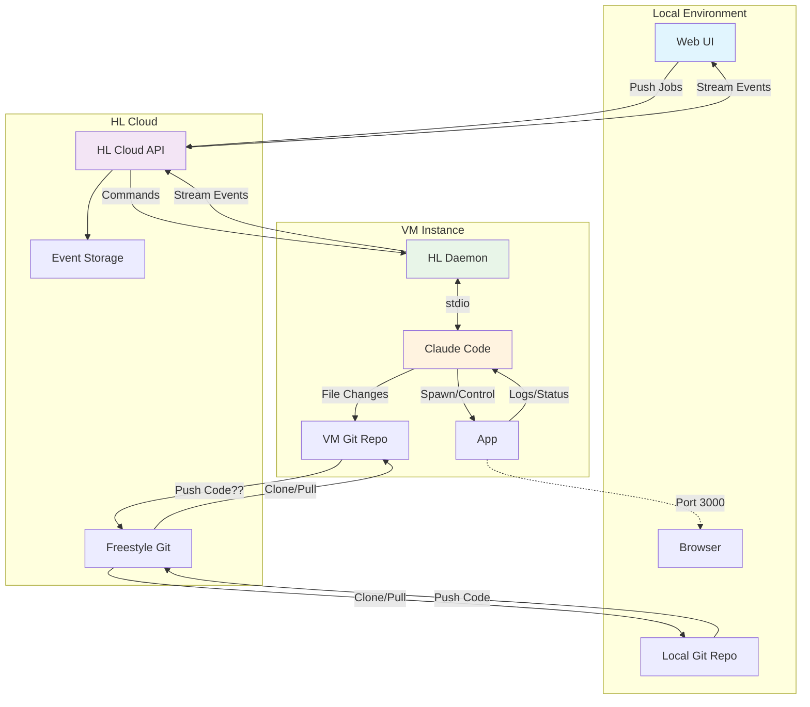
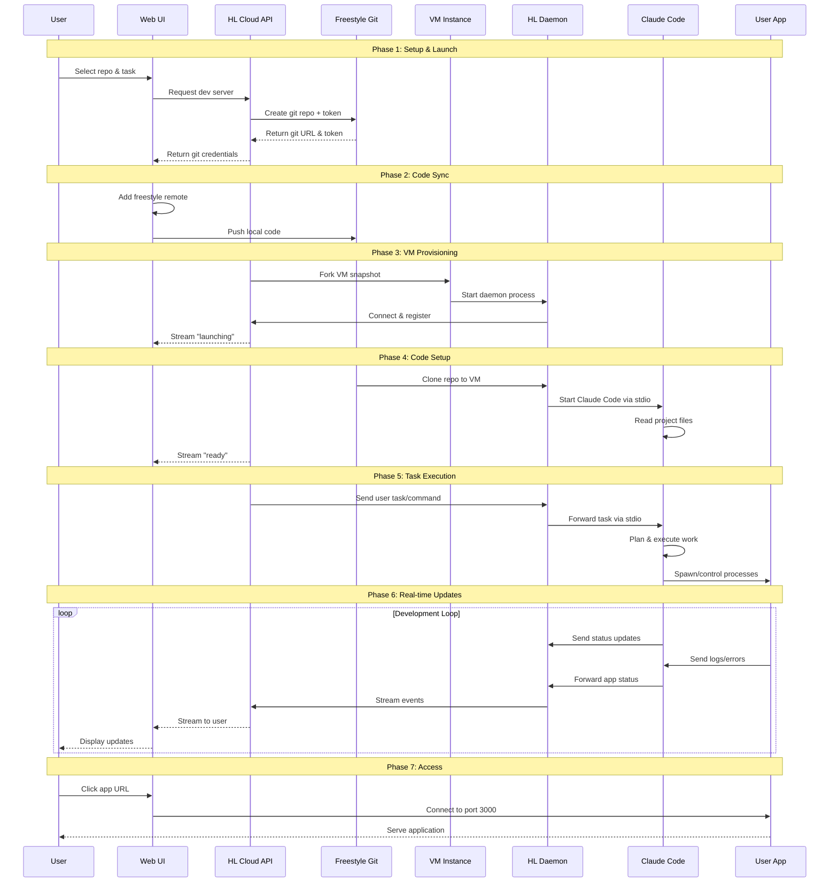

# Freestyle Cloud Development Environment Build Plan

## Overview

Build a cloud-based development environment that allows users to launch VM instances with pre-configured development tools, sync their local git repos, and interact with remote development servers through a web interface.

## Phase 1: Foundation (High Priority)

### 1.1 VM Snapshot Infrastructure

- Create base VM snapshot with:
  - Claude Code pre-installed with all dependencies
  - HL daemon pre-configured and ready to start
  - Connection to HL Cloud API on daemon startup
  - System daemon configuration for service management

### 1.2 Web UI Core

- Local git repository management
  - Store user's preferred git repos locally
  - Repo selection interface
- Launch workflow UI
  - Repo picker
  - Command/task input
  - Launch controls

### 1.3 HL Cloud API Core

- Freestyle git repo creation endpoint
  - Generate temporary git URLs for pushing
  - Return push tokens for authentication
- Dev Server provisioning API
  - Fork VM snapshot on demand
  - Return connection details (URL, SSH, web-terminal)

## Phase 2: Integration (High Priority)

### 2.1 Git Workflow

- Local git upstream management
  - Add freestyle remote to local repos
  - Push to freestyle using provided tokens
  - Handle authentication and errors

### 2.2 VM Lifecycle Management

- VM daemon startup sequence
  - Auto-connect to HL Cloud on boot
  - Register VM instance with cloud API
- Dev server initialization
  - Receive and execute launch commands from cloud API
  - Start requested development processes

### 2.3 Real-time Communication

- Event streaming system (WebSocket/SSE)
  - WUI ← HL Cloud: VM status updates ("launching", "ready", "started", "error")
  - HL Cloud ← VM: Development server events and logs
  - Event storage and replay for reconnections

## Phase 3: Enhancement (Medium Priority)

### 3.1 Advanced VM Features

- Bidirectional event streaming
- VM daemon message handling for complex commands
- Process management and monitoring

### 3.2 Development Server Management

- Service discovery and health checks
- Log aggregation and streaming
- Error handling and recovery

## Phase 4: Future Considerations (Low Priority)

### 4.1 Port Management

- Multi-port support beyond default 3000
- Port detection and dynamic proxying
- User-configurable port mappings

### 4.2 Tool Integration

- Evaluate filesystem MCP vs built-in tools
- Agent selection (Claude Code, Codex, OpenCode, etc.)
- SSE MCP server for local-to-cloud editing

### 4.3 Advanced Features

- VM snapshot versioning and updates
- Whitelabel git hosting (git.humanlayer.dev)
- Signal-based daemon connection refresh

## Technical Architecture

## Sequence Flow

## Success Criteria

- Users can select local repos and launch cloud dev environments
- Real-time streaming of development server status and logs
- Seamless git synchronization between local and cloud environments
- Stable VM lifecycle management with proper error handling
