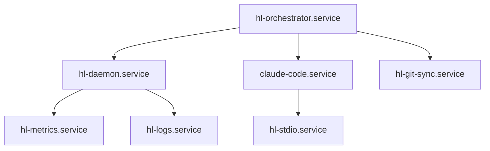

# VM Lifecycle Management Specification

## Overview

This specification defines the complete lifecycle management system for HumanLayer Freestyle VMs, including instance creation, service orchestration, monitoring, and teardown procedures.

## 1. VM Instance Lifecycle

### 1.1 Instance Creation and Initialization

#### 1.1.1 Base Image Provisioning

```yaml
# vm-creation.yaml
instance_spec:
  base_image: 'hl-freestyle-base:latest'
  instance_type: 't3.medium'
  storage:
    root_volume: 20GB
    data_volume: 50GB
  network:
    vpc_id: '${HL_VPC_ID}'
    subnet_id: '${HL_SUBNET_ID}'
    security_groups: ['sg-hl-freestyle']
```

#### 1.1.2 Initialization Sequence

1. **Pre-boot Configuration**

   - Cloud-init script execution
   - Network interface configuration
   - SSH key deployment
   - User account creation

2. **Boot Process**

   - SystemD target activation
   - File system mounting
   - Network service startup
   - Time synchronization

3. **Post-boot Setup**
   - HL daemon installation
   - Claude Code preparation
   - Development environment setup
   - Health check verification

#### 1.1.3 Cloud-Init Configuration

```yaml
# cloud-config.yaml
#cloud-config
users:
  - name: hluser
    sudo: ALL=(ALL) NOPASSWD:ALL
    ssh_authorized_keys:
      - ${SSH_PUBLIC_KEY}

packages:
  - docker.io
  - git
  - nodejs
  - npm
  - python3
  - python3-pip

runcmd:
  - systemctl enable docker
  - systemctl start docker
  - usermod -aG docker hluser
  - curl -fsSL https://api.humanlayer.dev/install.sh | bash
  - systemctl enable hl-daemon
  - systemctl start hl-daemon
```

### 1.2 Startup Sequence and Service Orchestration

#### 1.2.1 SystemD Service Dependencies

```ini
# /etc/systemd/system/hl-orchestrator.service
[Unit]
Description=HumanLayer Freestyle Orchestrator
After=network.target docker.service
Requires=network.target docker.service
Before=hl-daemon.service claude-code.service

[Service]
Type=oneshot
RemainAfterExit=yes
ExecStart=/usr/local/bin/hl-orchestrator start
ExecStop=/usr/local/bin/hl-orchestrator stop
TimeoutStartSec=300
TimeoutStopSec=120

[Install]
WantedBy=multi-user.target
```

#### 1.2.2 Startup Sequence

1. **Phase 1: Infrastructure Services**

   - Network configuration
   - Docker daemon
   - Logging infrastructure
   - Monitoring agents

2. **Phase 2: Core Services**

   - HL daemon
   - Git repository setup
   - Development server preparation

3. **Phase 3: Application Services**

   - Claude Code initialization
   - STDIO channel setup
   - API connection establishment

4. **Phase 4: Health Verification**
   - Service health checks
   - Integration tests
   - Readiness confirmation

### 1.3 Runtime Management and Monitoring

#### 1.3.1 Process Supervision

```ini
# /etc/systemd/system/hl-daemon.service
[Unit]
Description=HumanLayer Daemon
After=network.target hl-orchestrator.service
Requires=hl-orchestrator.service

[Service]
Type=notify
User=hluser
Group=hluser
ExecStart=/usr/local/bin/hl-daemon --config /etc/hl/daemon.conf
ExecReload=/bin/kill -HUP $MAINPID
Restart=on-failure
RestartSec=10
TimeoutStopSec=30
KillMode=mixed
KillSignal=SIGTERM

# Resource limits
LimitNOFILE=65536
LimitNPROC=4096
MemoryMax=2G
CPUQuota=200%

[Install]
WantedBy=multi-user.target
```

#### 1.3.2 Health Monitoring

```bash
#!/bin/bash
# /usr/local/bin/hl-health-check

check_service_health() {
    local service=$1
    local endpoint=$2

    if ! systemctl is-active --quiet "$service"; then
        echo "CRITICAL: $service is not running"
        return 2
    fi

    if [[ -n "$endpoint" ]]; then
        if ! curl -sf "$endpoint" > /dev/null; then
            echo "WARNING: $service endpoint not responding"
            return 1
        fi
    fi

    echo "OK: $service is healthy"
    return 0
}

# Check all services
check_service_health "hl-daemon" "http://localhost:8080/health"
check_service_health "claude-code" "http://localhost:3000/health"
check_service_health "docker" ""
```

### 1.4 Graceful Shutdown and Cleanup

#### 1.4.1 Shutdown Sequence

1. **Pre-shutdown Hooks**

   - Save application state
   - Flush pending operations
   - Notify dependent services

2. **Service Termination**

   - Stop application services
   - Stop infrastructure services
   - Unmount filesystems

3. **Cleanup Operations**
   - Remove temporary files
   - Archive logs
   - Update instance state

#### 1.4.2 Shutdown Script

```bash
#!/bin/bash
# /usr/local/bin/hl-shutdown

set -e

log() {
    echo "[$(date '+%Y-%m-%d %H:%M:%S')] $*" | tee -a /var/log/hl-shutdown.log
}

log "Starting graceful shutdown sequence"

# Phase 1: Application shutdown
log "Stopping application services"
systemctl stop claude-code.service || true
systemctl stop hl-daemon.service || true

# Phase 2: Infrastructure cleanup
log "Cleaning up infrastructure"
docker system prune -af || true
rm -rf /tmp/hl-* || true

# Phase 3: State archival
log "Archiving state"
tar -czf "/var/backups/hl-state-$(date +%s).tar.gz" \
    /var/lib/hl/ \
    /var/log/hl/ \
    /etc/hl/ || true

log "Shutdown sequence completed"
```

## 2. Service Management

### 2.1 SystemD Service Coordination

#### 2.1.1 Service Hierarchy



#### 2.1.2 Service Templates

```ini
# /etc/systemd/system/hl-service@.service
[Unit]
Description=HumanLayer Service (%i)
After=hl-orchestrator.service
Requires=hl-orchestrator.service

[Service]
Type=exec
User=hluser
Group=hluser
Environment=HL_SERVICE_NAME=%i
EnvironmentFile=/etc/hl/services/%i.env
ExecStart=/usr/local/bin/hl-service-runner %i
ExecReload=/bin/kill -HUP $MAINPID
Restart=on-failure
RestartSec=5
TimeoutStopSec=30

[Install]
WantedBy=multi-user.target
```

### 2.2 Health Monitoring and Recovery

#### 2.2.1 Health Check Framework

```python
# /usr/local/lib/hl/health_monitor.py
import asyncio
import logging
from typing import Dict, List, Optional
from dataclasses import dataclass
from enum import Enum

class HealthStatus(Enum):
    HEALTHY = "healthy"
    DEGRADED = "degraded"
    UNHEALTHY = "unhealthy"
    UNKNOWN = "unknown"

@dataclass
class HealthCheck:
    name: str
    check_function: callable
    interval: int
    timeout: int
    retry_count: int = 3

class HealthMonitor:
    def __init__(self):
        self.checks: List[HealthCheck] = []
        self.status: Dict[str, HealthStatus] = {}

    async def add_check(self, check: HealthCheck):
        self.checks.append(check)

    async def run_check(self, check: HealthCheck) -> HealthStatus:
        for attempt in range(check.retry_count):
            try:
                result = await asyncio.wait_for(
                    check.check_function(),
                    timeout=check.timeout
                )
                return HealthStatus.HEALTHY if result else HealthStatus.UNHEALTHY
            except asyncio.TimeoutError:
                logging.warning(f"Health check {check.name} timed out (attempt {attempt + 1})")
            except Exception as e:
                logging.error(f"Health check {check.name} failed: {e}")

        return HealthStatus.UNHEALTHY

    async def monitor_loop(self):
        while True:
            for check in self.checks:
                status = await self.run_check(check)
                self.status[check.name] = status

                if status == HealthStatus.UNHEALTHY:
                    await self.trigger_recovery(check.name)

            await asyncio.sleep(10)  # Global check interval

    async def trigger_recovery(self, service_name: str):
        logging.warning(f"Triggering recovery for {service_name}")
        # Implement recovery logic
        pass
```

#### 2.2.2 Recovery Procedures

```bash
#!/bin/bash
# /usr/local/bin/hl-recover-service

SERVICE_NAME=$1
RECOVERY_TYPE=${2:-"restart"}

case $RECOVERY_TYPE in
    "restart")
        systemctl restart "$SERVICE_NAME"
        ;;
    "reset")
        systemctl stop "$SERVICE_NAME"
        rm -rf "/var/lib/hl/$SERVICE_NAME"
        systemctl start "$SERVICE_NAME"
        ;;
    "rebuild")
        systemctl stop "$SERVICE_NAME"
        /usr/local/bin/hl-rebuild-service "$SERVICE_NAME"
        systemctl start "$SERVICE_NAME"
        ;;
    *)
        echo "Unknown recovery type: $RECOVERY_TYPE"
        exit 1
        ;;
esac
```

### 2.3 Resource Management and Limits

#### 2.3.1 SystemD Resource Controls

```ini
# /etc/systemd/system/hl-daemon.service.d/resources.conf
[Service]
# Memory limits
MemoryMax=2G
MemorySwapMax=1G
MemoryAccounting=yes

# CPU limits
CPUQuota=200%
CPUAccounting=yes

# I/O limits
IOReadBandwidthMax=/dev/sda 100M
IOWriteBandwidthMax=/dev/sda 50M
IOAccounting=yes

# File descriptor limits
LimitNOFILE=65536
LimitNPROC=4096

# Network limits
IPAccounting=yes
```

#### 2.3.2 Resource Monitoring

```python
# /usr/local/lib/hl/resource_monitor.py
import psutil
import time
from typing import Dict, Any

class ResourceMonitor:
    def __init__(self):
        self.thresholds = {
            'cpu_percent': 80.0,
            'memory_percent': 85.0,
            'disk_percent': 90.0,
            'load_average': 4.0
        }

    def get_system_metrics(self) -> Dict[str, Any]:
        return {
            'cpu_percent': psutil.cpu_percent(interval=1),
            'memory_percent': psutil.virtual_memory().percent,
            'disk_percent': psutil.disk_usage('/').percent,
            'load_average': psutil.getloadavg()[0],
            'network_io': psutil.net_io_counters()._asdict(),
            'disk_io': psutil.disk_io_counters()._asdict()
        }

    def check_thresholds(self, metrics: Dict[str, Any]) -> Dict[str, bool]:
        alerts = {}
        for metric, threshold in self.thresholds.items():
            if metric in metrics:
                alerts[metric] = metrics[metric] > threshold
        return alerts
```

## 3. Integration Points

### 3.1 HL Cloud API Connection Establishment

#### 3.1.1 API Client Configuration

```python
# /etc/hl/api_client.py
import asyncio
import aiohttp
import json
from typing import Optional, Dict, Any

class HLAPIClient:
    def __init__(self, base_url: str, api_key: str):
        self.base_url = base_url
        self.api_key = api_key
        self.session: Optional[aiohttp.ClientSession] = None

    async def __aenter__(self):
        self.session = aiohttp.ClientSession(
            headers={'Authorization': f'Bearer {self.api_key}'},
            timeout=aiohttp.ClientTimeout(total=30)
        )
        return self

    async def __aexit__(self, exc_type, exc_val, exc_tb):
        if self.session:
            await self.session.close()

    async def register_instance(self, instance_id: str, metadata: Dict[str, Any]) -> bool:
        async with self.session.post(
            f"{self.base_url}/instances",
            json={"instance_id": instance_id, "metadata": metadata}
        ) as resp:
            return resp.status == 201

    async def heartbeat(self, instance_id: str, status: Dict[str, Any]) -> bool:
        async with self.session.put(
            f"{self.base_url}/instances/{instance_id}/heartbeat",
            json=status
        ) as resp:
            return resp.status == 200
```

#### 3.1.2 Connection Management

```bash
#!/bin/bash
# /usr/local/bin/hl-api-connect

API_ENDPOINT=${HL_API_ENDPOINT:-"https://api.humanlayer.dev"}
INSTANCE_ID=$(curl -s http://169.254.169.254/latest/meta-data/instance-id)
CONFIG_FILE="/etc/hl/api.conf"

# Test connection
curl -sf "$API_ENDPOINT/health" || {
    echo "ERROR: Cannot reach HL API at $API_ENDPOINT"
    exit 1
}

# Register instance
curl -X POST "$API_ENDPOINT/instances" \
    -H "Authorization: Bearer $HL_API_KEY" \
    -H "Content-Type: application/json" \
    -d "{
        \"instance_id\": \"$INSTANCE_ID\",
        \"metadata\": {
            \"region\": \"$(curl -s http://169.254.169.254/latest/meta-data/placement/region)\",
            \"launch_time\": \"$(date -Iseconds)\"
        }
    }" || {
    echo "ERROR: Failed to register instance"
    exit 1
}

echo "Successfully connected to HL API"
```

### 3.2 Claude Code Startup and STDIO Initialization

#### 3.2.1 Claude Code Service

```ini
# /etc/systemd/system/claude-code.service
[Unit]
Description=Claude Code Editor
After=hl-daemon.service
Requires=hl-daemon.service

[Service]
Type=exec
User=hluser
Group=hluser
WorkingDirectory=/home/hluser/workspace
Environment=NODE_ENV=production
Environment=HL_WORKSPACE=/home/hluser/workspace
ExecStart=/usr/local/bin/claude-code-server --port 3000 --stdio-socket /var/run/hl/stdio.sock
ExecReload=/bin/kill -HUP $MAINPID
Restart=on-failure
RestartSec=5
TimeoutStopSec=30

[Install]
WantedBy=multi-user.target
```

#### 3.2.2 STDIO Channel Setup

```python
# /usr/local/lib/hl/stdio_manager.py
import asyncio
import socket
import logging
from pathlib import Path

class STDIOManager:
    def __init__(self, socket_path: str = "/var/run/hl/stdio.sock"):
        self.socket_path = Path(socket_path)
        self.server = None
        self.clients = set()

    async def start_server(self):
        self.socket_path.parent.mkdir(exist_ok=True)
        if self.socket_path.exists():
            self.socket_path.unlink()

        self.server = await asyncio.start_unix_server(
            self.handle_client,
            path=str(self.socket_path)
        )

        # Set permissions
        self.socket_path.chmod(0o666)

        logging.info(f"STDIO server started at {self.socket_path}")

    async def handle_client(self, reader, writer):
        self.clients.add(writer)
        try:
            while True:
                data = await reader.read(1024)
                if not data:
                    break

                # Broadcast to all connected clients
                for client in self.clients.copy():
                    try:
                        client.write(data)
                        await client.drain()
                    except Exception:
                        self.clients.discard(client)

        except Exception as e:
            logging.error(f"STDIO client error: {e}")
        finally:
            self.clients.discard(writer)
            writer.close()
```

### 3.3 Git Repository Setup and Synchronization

#### 3.3.1 Git Sync Service

```bash
#!/bin/bash
# /usr/local/bin/hl-git-sync

REPO_URL=${HL_REPO_URL}
WORKSPACE_DIR=${HL_WORKSPACE:-"/home/hluser/workspace"}
SYNC_INTERVAL=${HL_SYNC_INTERVAL:-60}

setup_repository() {
    if [[ ! -d "$WORKSPACE_DIR/.git" ]]; then
        git clone "$REPO_URL" "$WORKSPACE_DIR"
    fi

    cd "$WORKSPACE_DIR"
    git config user.name "HumanLayer VM"
    git config user.email "vm@humanlayer.dev"
    git config pull.rebase true
}

sync_repository() {
    cd "$WORKSPACE_DIR"

    # Stash any local changes
    git stash push -m "Auto-stash before sync $(date)"

    # Pull latest changes
    git pull origin main

    # Pop stash if it exists
    if git stash list | grep -q "Auto-stash before sync"; then
        git stash pop
    fi
}

# Main sync loop
setup_repository

while true; do
    sync_repository
    sleep "$SYNC_INTERVAL"
done
```

### 3.4 Development Server Initialization

#### 3.4.1 Development Environment Setup

```yaml
# /etc/hl/dev-server.yaml
development:
  servers:
    - name: 'web-dev'
      port: 3000
      command: 'npm run dev'
      directory: '/home/hluser/workspace/web'
      environment:
        NODE_ENV: 'development'

    - name: 'api-dev'
      port: 8000
      command: 'python -m uvicorn main:app --reload'
      directory: '/home/hluser/workspace/api'
      environment:
        PYTHONPATH: '/home/hluser/workspace/api'

  proxy:
    enabled: true
    port: 8080
    routes:
      '/api/*': 'http://localhost:8000'
      '/*': 'http://localhost:3000'
```

## 4. Monitoring and Observability

### 4.1 Metrics Collection and Reporting

#### 4.1.1 Prometheus Configuration

```yaml
# /etc/prometheus/prometheus.yml
global:
  scrape_interval: 15s
  evaluation_interval: 15s

scrape_configs:
  - job_name: 'hl-daemon'
    static_configs:
      - targets: ['localhost:8080']
    scrape_interval: 5s
    metrics_path: /metrics

  - job_name: 'node-exporter'
    static_configs:
      - targets: ['localhost:9100']

  - job_name: 'claude-code'
    static_configs:
      - targets: ['localhost:3000']
    metrics_path: /metrics
```

#### 4.1.2 Custom Metrics

```python
# /usr/local/lib/hl/metrics.py
from prometheus_client import Counter, Histogram, Gauge, start_http_server
import time

# Application metrics
request_count = Counter('hl_requests_total', 'Total requests', ['method', 'endpoint'])
request_duration = Histogram('hl_request_duration_seconds', 'Request duration')
active_connections = Gauge('hl_active_connections', 'Active connections')
service_health = Gauge('hl_service_health', 'Service health status', ['service'])

class MetricsCollector:
    def __init__(self, port=8081):
        self.port = port

    def start(self):
        start_http_server(self.port)

    def record_request(self, method: str, endpoint: str, duration: float):
        request_count.labels(method=method, endpoint=endpoint).inc()
        request_duration.observe(duration)

    def update_service_health(self, service: str, healthy: bool):
        service_health.labels(service=service).set(1 if healthy else 0)
```

### 4.2 Log Aggregation and Analysis

#### 4.2.1 Structured Logging Configuration

```json
{
  "version": 1,
  "formatters": {
    "json": {
      "class": "pythonjsonlogger.jsonlogger.JsonFormatter",
      "format": "%(asctime)s %(name)s %(levelname)s %(message)s"
    }
  },
  "handlers": {
    "file": {
      "class": "logging.handlers.RotatingFileHandler",
      "filename": "/var/log/hl/daemon.log",
      "maxBytes": 10485760,
      "backupCount": 5,
      "formatter": "json"
    },
    "syslog": {
      "class": "logging.handlers.SysLogHandler",
      "address": "/dev/log",
      "formatter": "json"
    }
  },
  "root": {
    "level": "INFO",
    "handlers": ["file", "syslog"]
  }
}
```

#### 4.2.2 Log Analysis

```bash
#!/bin/bash
# /usr/local/bin/hl-log-analyzer

LOG_FILE="/var/log/hl/daemon.log"
ANALYSIS_PERIOD=${1:-"1h"}

# Extract error patterns
echo "=== ERROR ANALYSIS ==="
jq -r 'select(.levelname == "ERROR") | .message' "$LOG_FILE" | \
    sort | uniq -c | sort -nr | head -10

# Performance analysis
echo "=== PERFORMANCE ANALYSIS ==="
jq -r 'select(.message | contains("request_duration")) | .duration' "$LOG_FILE" | \
    awk '{sum+=$1; n++} END {if(n>0) print "Avg:", sum/n; else print "No data"}'

# Service health summary
echo "=== SERVICE HEALTH ==="
jq -r 'select(.message | contains("health_check")) | .service + ": " + .status' "$LOG_FILE" | \
    sort | uniq -c
```

### 4.3 Alert Configuration and Escalation

#### 4.3.1 Alert Rules

```yaml
# /etc/prometheus/alert_rules.yml
groups:
  - name: hl-alerts
    rules:
      - alert: HighCPUUsage
        expr: rate(cpu_usage_seconds_total[5m]) > 0.8
        for: 5m
        labels:
          severity: warning
        annotations:
          summary: 'High CPU usage detected'
          description: 'CPU usage is above 80% for 5 minutes'

      - alert: ServiceDown
        expr: hl_service_health == 0
        for: 1m
        labels:
          severity: critical
        annotations:
          summary: 'Service {{ $labels.service }} is down'
          description: 'Service {{ $labels.service }} has been down for 1 minute'

      - alert: HighMemoryUsage
        expr: (memory_used_bytes / memory_total_bytes) > 0.85
        for: 5m
        labels:
          severity: warning
        annotations:
          summary: 'High memory usage detected'
          description: 'Memory usage is above 85% for 5 minutes'
```

#### 4.3.2 Notification Configuration

```yaml
# /etc/alertmanager/alertmanager.yml
global:
  smtp_smarthost: 'localhost:587'
  smtp_from: 'alerts@humanlayer.dev'

route:
  group_by: ['alertname']
  group_wait: 10s
  group_interval: 10s
  repeat_interval: 1h
  receiver: 'web.hook'

receivers:
  - name: 'web.hook'
    webhook_configs:
      - url: 'http://localhost:8080/alerts'
        send_resolved: true
```

## 5. Error Handling and Recovery

### 5.1 Failure Detection and Diagnosis

#### 5.1.1 Automated Failure Detection

```python
# /usr/local/lib/hl/failure_detector.py
import asyncio
import logging
from typing import Dict, List, Callable
from dataclasses import dataclass
from enum import Enum

class FailureType(Enum):
    SERVICE_CRASH = "service_crash"
    NETWORK_FAILURE = "network_failure"
    RESOURCE_EXHAUSTION = "resource_exhaustion"
    CONFIGURATION_ERROR = "configuration_error"

@dataclass
class FailurePattern:
    name: str
    detection_function: Callable
    failure_type: FailureType
    severity: str

class FailureDetector:
    def __init__(self):
        self.patterns: List[FailurePattern] = []
        self.failure_handlers: Dict[FailureType, Callable] = {}

    def register_pattern(self, pattern: FailurePattern):
        self.patterns.append(pattern)

    def register_handler(self, failure_type: FailureType, handler: Callable):
        self.failure_handlers[failure_type] = handler

    async def detect_service_crash(self) -> bool:
        # Check if critical services are running
        critical_services = ['hl-daemon', 'claude-code']
        for service in critical_services:
            result = await asyncio.create_subprocess_exec(
                'systemctl', 'is-active', service,
                stdout=asyncio.subprocess.PIPE,
                stderr=asyncio.subprocess.PIPE
            )
            if result.returncode != 0:
                return True
        return False

    async def detect_network_failure(self) -> bool:
        # Test connectivity to HL API
        try:
            result = await asyncio.create_subprocess_exec(
                'curl', '-sf', 'https://api.humanlayer.dev/health',
                stdout=asyncio.subprocess.PIPE,
                stderr=asyncio.subprocess.PIPE
            )
            return result.returncode != 0
        except Exception:
            return True

    async def monitor_loop(self):
        while True:
            for pattern in self.patterns:
                try:
                    if await pattern.detection_function():
                        logging.warning(f"Detected failure: {pattern.name}")
                        if pattern.failure_type in self.failure_handlers:
                            await self.failure_handlers[pattern.failure_type]()
                except Exception as e:
                    logging.error(f"Error in failure detection: {e}")

            await asyncio.sleep(30)
```

### 5.2 Automated Recovery Procedures

#### 5.2.1 Service Recovery

```bash
#!/bin/bash
# /usr/local/bin/hl-auto-recovery

RECOVERY_LOG="/var/log/hl/recovery.log"
MAX_RETRIES=3

log_recovery() {
    echo "[$(date '+%Y-%m-%d %H:%M:%S')] $*" >> "$RECOVERY_LOG"
}

recover_service() {
    local service=$1
    local retry_count=0

    while [[ $retry_count -lt $MAX_RETRIES ]]; do
        log_recovery "Attempting to recover $service (attempt $((retry_count + 1)))"

        # Stop service
        systemctl stop "$service"
        sleep 5

        # Clear any locks or stale files
        rm -f "/var/run/hl/$service.pid"
        rm -f "/var/lock/hl/$service.lock"

        # Start service
        if systemctl start "$service"; then
            sleep 10
            if systemctl is-active --quiet "$service"; then
                log_recovery "Successfully recovered $service"
                return 0
            fi
        fi

        retry_count=$((retry_count + 1))
        sleep $((retry_count * 10))
    done

    log_recovery "Failed to recover $service after $MAX_RETRIES attempts"
    return 1
}

# Check and recover critical services
for service in hl-daemon claude-code; do
    if ! systemctl is-active --quiet "$service"; then
        recover_service "$service"
    fi
done
```

### 5.3 Manual Intervention Procedures

#### 5.3.1 Emergency Procedures

```bash
#!/bin/bash
# /usr/local/bin/hl-emergency-response

EMERGENCY_TYPE=$1

case $EMERGENCY_TYPE in
    "total_failure")
        echo "=== TOTAL SYSTEM FAILURE RECOVERY ==="
        # Stop all services
        systemctl stop hl-daemon claude-code hl-git-sync

        # Reset state
        rm -rf /var/lib/hl/state/*
        rm -rf /tmp/hl-*

        # Restart infrastructure
        systemctl restart docker
        systemctl restart hl-orchestrator

        # Restart services
        systemctl start hl-daemon
        systemctl start claude-code
        systemctl start hl-git-sync
        ;;

    "data_corruption")
        echo "=== DATA CORRUPTION RECOVERY ==="
        # Stop services
        systemctl stop hl-daemon claude-code

        # Restore from backup
        if [[ -f /var/backups/hl-state-latest.tar.gz ]]; then
            tar -xzf /var/backups/hl-state-latest.tar.gz -C /
        fi

        # Restart services
        systemctl start hl-daemon
        systemctl start claude-code
        ;;

    "network_isolation")
        echo "=== NETWORK ISOLATION RECOVERY ==="
        # Reset network configuration
        systemctl restart networking

        # Restart VPN if configured
        if systemctl is-enabled --quiet openvpn; then
            systemctl restart openvpn
        fi

        # Reconnect to HL API
        /usr/local/bin/hl-api-connect
        ;;

    *)
        echo "Unknown emergency type: $EMERGENCY_TYPE"
        echo "Available types: total_failure, data_corruption, network_isolation"
        exit 1
        ;;
esac
```

### 5.4 Disaster Recovery and Backup

#### 5.4.1 Backup Strategy

```bash
#!/bin/bash
# /usr/local/bin/hl-backup

BACKUP_DIR="/var/backups/hl"
RETENTION_DAYS=7
S3_BUCKET=${HL_BACKUP_BUCKET}

create_backup() {
    local timestamp=$(date +%Y%m%d_%H%M%S)
    local backup_name="hl-backup-$timestamp"

    mkdir -p "$BACKUP_DIR"

    # Create backup archive
    tar -czf "$BACKUP_DIR/$backup_name.tar.gz" \
        --exclude='/var/lib/hl/cache/*' \
        --exclude='/var/lib/hl/tmp/*' \
        /var/lib/hl/ \
        /etc/hl/ \
        /home/hluser/workspace/ \
        /var/log/hl/

    # Upload to S3 if configured
    if [[ -n "$S3_BUCKET" ]]; then
        aws s3 cp "$BACKUP_DIR/$backup_name.tar.gz" \
            "s3://$S3_BUCKET/backups/$backup_name.tar.gz"
    fi

    # Clean old backups
    find "$BACKUP_DIR" -name "hl-backup-*.tar.gz" -mtime +$RETENTION_DAYS -delete
}

# Create backup
create_backup

# Update latest symlink
ln -sf "$BACKUP_DIR/hl-backup-$(date +%Y%m%d_%H%M%S).tar.gz" \
    "$BACKUP_DIR/hl-state-latest.tar.gz"
```

#### 5.4.2 Disaster Recovery Plan

```yaml
# /etc/hl/disaster_recovery.yml
disaster_recovery:
  scenarios:
    - name: 'Complete VM Loss'
      priority: 'critical'
      rto: '30 minutes'
      rpo: '15 minutes'
      steps:
        - 'Launch new VM from base image'
        - 'Restore from S3 backup'
        - 'Reconfigure network settings'
        - 'Restart all services'
        - 'Verify functionality'

    - name: 'Data Corruption'
      priority: 'high'
      rto: '15 minutes'
      rpo: '5 minutes'
      steps:
        - 'Stop affected services'
        - 'Restore from local backup'
        - 'Verify data integrity'
        - 'Restart services'

    - name: 'Service Degradation'
      priority: 'medium'
      rto: '5 minutes'
      rpo: '0 minutes'
      steps:
        - 'Identify affected services'
        - 'Restart services'
        - 'Monitor for recovery'
        - 'Escalate if needed'
```

## 6. Security and Compliance

### 6.1 Access Control and Authentication

#### 6.1.1 SSH Configuration

```bash
# /etc/ssh/sshd_config
Port 22
Protocol 2
PermitRootLogin no
PasswordAuthentication no
PubkeyAuthentication yes
AuthorizedKeysFile .ssh/authorized_keys
AllowUsers hluser
MaxAuthTries 3
ClientAliveInterval 300
ClientAliveCountMax 2
UsePAM yes
```

#### 6.1.2 Sudo Configuration

```bash
# /etc/sudoers.d/hluser
hluser ALL=(ALL) NOPASSWD: /usr/local/bin/hl-*
hluser ALL=(ALL) NOPASSWD: /bin/systemctl restart hl-*
hluser ALL=(ALL) NOPASSWD: /bin/systemctl start hl-*
hluser ALL=(ALL) NOPASSWD: /bin/systemctl stop hl-*
hluser ALL=(ALL) NOPASSWD: /bin/systemctl status hl-*
```

### 6.2 Network Security and Isolation

#### 6.2.1 Security Groups

```yaml
# security-groups.yml
security_groups:
  - name: 'hl-freestyle-sg'
    rules:
      inbound:
        - protocol: 'tcp'
          port: 22
          source: '0.0.0.0/0'
          description: 'SSH access'
        - protocol: 'tcp'
          port: 8080
          source: '10.0.0.0/8'
          description: 'HL API access'
        - protocol: 'tcp'
          port: 3000
          source: '10.0.0.0/8'
          description: 'Claude Code access'
      outbound:
        - protocol: 'all'
          destination: '0.0.0.0/0'
          description: 'All outbound traffic'
```

#### 6.2.2 Firewall Configuration

```bash
#!/bin/bash
# /usr/local/bin/hl-firewall-setup

# Reset firewall
ufw --force reset

# Default policies
ufw default deny incoming
ufw default allow outgoing

# SSH access
ufw allow ssh

# HL services
ufw allow from 10.0.0.0/8 to any port 8080
ufw allow from 10.0.0.0/8 to any port 3000

# Monitoring
ufw allow from 10.0.0.0/8 to any port 9100

# Enable firewall
ufw --force enable
```

### 6.3 Data Encryption and Protection

#### 6.3.1 Encryption at Rest

```bash
#!/bin/bash
# /usr/local/bin/hl-encrypt-data

ENCRYPTION_KEY_FILE="/etc/hl/encryption.key"
DATA_DIR="/var/lib/hl/data"

# Generate encryption key if not exists
if [[ ! -f "$ENCRYPTION_KEY_FILE" ]]; then
    openssl rand -base64 32 > "$ENCRYPTION_KEY_FILE"
    chmod 600 "$ENCRYPTION_KEY_FILE"
fi

# Encrypt sensitive data
encrypt_file() {
    local file=$1
    local encrypted_file="${file}.enc"

    openssl aes-256-cbc -salt -in "$file" -out "$encrypted_file" \
        -pass file:"$ENCRYPTION_KEY_FILE"

    # Secure delete original
    shred -vfz -n 3 "$file"
    mv "$encrypted_file" "$file"
}

# Encrypt all sensitive files
find "$DATA_DIR" -name "*.secret" -exec encrypt_file {} \;
```

#### 6.3.2 Encryption in Transit

```yaml
# /etc/hl/tls.yml
tls:
  certificate: '/etc/ssl/certs/hl-server.crt'
  private_key: '/etc/ssl/private/hl-server.key'
  ca_certificate: '/etc/ssl/certs/hl-ca.crt'

  cipher_suites:
    - 'TLS_ECDHE_RSA_WITH_AES_256_GCM_SHA384'
    - 'TLS_ECDHE_RSA_WITH_AES_128_GCM_SHA256'

  min_version: 'TLSv1.2'
  max_version: 'TLSv1.3'
```

### 6.4 Audit Logging and Compliance

#### 6.4.1 Audit Configuration

```bash
# /etc/audit/rules.d/hl-audit.rules
# File system monitoring
-w /etc/hl/ -p wa -k hl-config
-w /var/lib/hl/ -p wa -k hl-data
-w /usr/local/bin/hl- -p x -k hl-executables

# Process monitoring
-a always,exit -F arch=b64 -S execve -F path=/usr/local/bin/hl-* -k hl-processes

# Network monitoring
-a always,exit -F arch=b64 -S socket -F success=1 -k network-access

# Privilege escalation
-w /etc/sudoers -p wa -k privilege-escalation
-w /etc/sudoers.d/ -p wa -k privilege-escalation
```

#### 6.4.2 Compliance Reporting

```python
# /usr/local/lib/hl/compliance_reporter.py
import json
import datetime
from typing import Dict, List, Any

class ComplianceReporter:
    def __init__(self):
        self.report_data = {
            'timestamp': datetime.datetime.utcnow().isoformat(),
            'instance_id': self.get_instance_id(),
            'compliance_checks': []
        }

    def add_check(self, check_name: str, status: str, details: Dict[str, Any]):
        self.report_data['compliance_checks'].append({
            'name': check_name,
            'status': status,
            'details': details,
            'timestamp': datetime.datetime.utcnow().isoformat()
        })

    def check_encryption_at_rest(self) -> Dict[str, Any]:
        # Verify encryption configuration
        try:
            with open('/etc/hl/encryption.key', 'r') as f:
                key_exists = bool(f.read().strip())
            return {
                'status': 'PASS' if key_exists else 'FAIL',
                'details': {'encryption_key_configured': key_exists}
            }
        except Exception as e:
            return {
                'status': 'FAIL',
                'details': {'error': str(e)}
            }

    def check_access_controls(self) -> Dict[str, Any]:
        # Verify SSH and sudo configuration
        checks = {}

        # Check SSH config
        try:
            with open('/etc/ssh/sshd_config', 'r') as f:
                ssh_config = f.read()
                checks['password_auth_disabled'] = 'PasswordAuthentication no' in ssh_config
                checks['root_login_disabled'] = 'PermitRootLogin no' in ssh_config
        except Exception as e:
            checks['ssh_config_error'] = str(e)

        status = 'PASS' if all(checks.values()) else 'FAIL'
        return {'status': status, 'details': checks}

    def generate_report(self) -> str:
        # Run all compliance checks
        self.add_check('encryption_at_rest', **self.check_encryption_at_rest())
        self.add_check('access_controls', **self.check_access_controls())

        return json.dumps(self.report_data, indent=2)
```

## Implementation Timeline

### Phase 1: Core Infrastructure (Week 1-2)

- VM base image preparation
- SystemD service configuration
- Basic monitoring setup
- SSH and security hardening

### Phase 2: Service Integration (Week 3-4)

- HL daemon integration
- Claude Code setup
- Git synchronization
- STDIO channel implementation

### Phase 3: Monitoring and Observability (Week 5-6)

- Metrics collection
- Log aggregation
- Alert configuration
- Dashboard creation

### Phase 4: Security and Compliance (Week 7-8)

- Encryption implementation
- Audit logging
- Compliance reporting
- Security testing

### Phase 5: Testing and Optimization (Week 9-10)

- Load testing
- Failure testing
- Performance optimization
- Documentation completion

## Configuration Management

All configuration files should be version controlled and deployed using infrastructure as code principles. Use tools like Ansible, Terraform, or similar for consistent deployment across environments.

## Validation and Testing

Regular validation of the lifecycle management system through:

- Automated health checks
- Disaster recovery drills
- Security assessments
- Performance benchmarking
- Compliance audits

This specification provides a comprehensive framework for VM lifecycle management while maintaining security, reliability, and observability standards.
