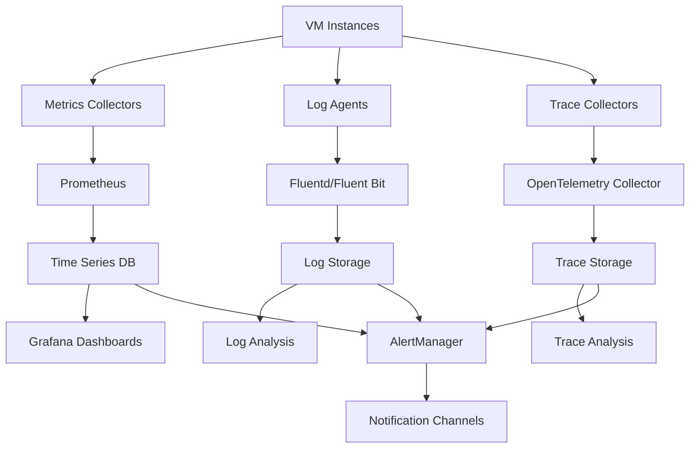

# VM Monitoring and Observability Specification

## Overview

This specification defines a comprehensive monitoring and observability solution for VM infrastructure, providing real-time visibility into system health, performance metrics, and operational insights.

## 1. Monitoring Architecture

### 1.1 Core Components

```
┌─────────────────┐    ┌─────────────────┐    ┌─────────────────┐
│   Data Sources  │    │   Collection    │    │   Storage &     │
│                 │    │   Layer         │    │   Processing    │
│  • System       │───▶│                 │───▶│                 │
│  • Application  │    │  • Prometheus   │    │  • InfluxDB     │
│  • Logs         │    │  • Fluentd      │    │  • Elasticsearch│
│  • Traces       │    │  • OpenTelemetry│    │  • Jaeger       │
└─────────────────┘    └─────────────────┘    └─────────────────┘
                                               │
                                               ▼
                       ┌─────────────────┐    ┌─────────────────┐
                       │   Analytics &   │    │   Alerting &    │
                       │   Dashboards    │    │   Notifications │
                       │                 │    │                 │
                       │  • Grafana      │    │  • AlertManager │
                       │  • Kibana       │    │  • PagerDuty    │
                       │  • Custom UI    │    │  • Slack/Teams  │
                       └─────────────────┘    └─────────────────┘
```

### 1.2 Collection Agents

```yaml
# Node Exporter Configuration
node_exporter:
  enabled: true
  port: 9100
  collectors:
    - cpu
    - meminfo
    - diskstats
    - netdev
    - filesystem
    - loadavg
    - systemd
  scrape_interval: 15s

# Process Exporter
process_exporter:
  enabled: true
  port: 9256
  process_names:
    - name: '{{.Comm}}'
      cmdline:
        - '.+'

# Custom Application Metrics
app_metrics:
  endpoint: '/metrics'
  port: 8080
  format: 'prometheus'
```

### 1.3 Data Flow Pipeline



## 2. System Metrics

### 2.1 Infrastructure Metrics

```yaml
# CPU Metrics
cpu_metrics:
  - cpu_usage_percent
  - cpu_load_average_1m
  - cpu_load_average_5m
  - cpu_load_average_15m
  - cpu_context_switches
  - cpu_interrupts
  - cpu_steal_time

# Memory Metrics
memory_metrics:
  - memory_total_bytes
  - memory_available_bytes
  - memory_used_percent
  - memory_cached_bytes
  - memory_buffers_bytes
  - swap_used_bytes
  - swap_total_bytes

# Disk Metrics
disk_metrics:
  - disk_usage_percent
  - disk_free_bytes
  - disk_total_bytes
  - disk_io_read_bytes
  - disk_io_write_bytes
  - disk_io_operations
  - inode_usage_percent

# Network Metrics
network_metrics:
  - network_receive_bytes
  - network_transmit_bytes
  - network_receive_packets
  - network_transmit_packets
  - network_errors
  - network_dropped_packets
  - tcp_connections_active
  - tcp_connections_time_wait
```

### 2.2 Application Metrics

```yaml
# HTTP Service Metrics
http_service_metrics:
  - http_requests_total
  - http_request_duration_seconds
  - http_request_size_bytes
  - http_response_size_bytes
  - http_requests_in_flight

# Database Metrics
database_metrics:
  - db_connections_active
  - db_connections_idle
  - db_query_duration_seconds
  - db_queries_total
  - db_errors_total
  - db_deadlocks_total

# Business Metrics
business_metrics:
  - user_sessions_active
  - transactions_processed
  - api_calls_per_minute
  - error_rate_percent
  - feature_usage_counts
```

### 2.3 Custom Metrics Configuration

```python
# Python Custom Metrics Example
from prometheus_client import Counter, Histogram, Gauge, start_http_server

# Business Metrics
user_registrations = Counter('user_registrations_total', 'Total user registrations')
request_duration = Histogram('request_processing_seconds', 'Request processing time')
active_users = Gauge('active_users_current', 'Current active users')

# Usage Example
def process_request():
    with request_duration.time():
        # Process request
        pass

def register_user():
    user_registrations.inc()
    active_users.inc()

# Start metrics server
start_http_server(8000)
```

## 3. Logging Strategy

### 3.1 Structured Logging Standards

```json
{
  "timestamp": "2024-01-15T10:30:00.123Z",
  "level": "INFO",
  "service": "user-service",
  "version": "1.2.3",
  "trace_id": "abc123def456",
  "span_id": "789ghi012",
  "user_id": "user123",
  "request_id": "req456",
  "message": "User login successful",
  "context": {
    "method": "POST",
    "endpoint": "/api/v1/login",
    "ip_address": "192.168.1.100",
    "user_agent": "Mozilla/5.0...",
    "response_time_ms": 150
  },
  "labels": {
    "environment": "production",
    "region": "us-east-1",
    "instance_id": "i-1234567890abcdef0"
  }
}
```

### 3.2 Log Levels and Categories

```yaml
log_levels:
  TRACE: 'Detailed trace information'
  DEBUG: 'Debug information for troubleshooting'
  INFO: 'General operational messages'
  WARN: 'Warning conditions that should be noted'
  ERROR: 'Error conditions that need attention'
  FATAL: 'Critical errors that cause application termination'

log_categories:
  access: 'HTTP access logs'
  audit: 'Security and compliance audit logs'
  application: 'Application-specific logs'
  system: 'System and infrastructure logs'
  security: 'Security-related events'
  performance: 'Performance monitoring logs'
```

### 3.3 Log Retention Policies

```yaml
retention_policies:
  hot_storage:
    duration: '7d'
    storage_class: 'ssd'
    search_enabled: true

  warm_storage:
    duration: '30d'
    storage_class: 'standard'
    search_enabled: true
    compression: true

  cold_storage:
    duration: '365d'
    storage_class: 'archive'
    search_enabled: false
    compression: true

  compliance_storage:
    duration: '2555d' # 7 years
    storage_class: 'glacier'
    immutable: true
    encryption: true
```

### 3.4 Centralized Log Configuration

```yaml
# Fluentd Configuration
fluentd:
  input:
    - type: tail
      path: /var/log/app/*.log
      pos_file: /var/log/fluentd/app.log.pos
      format: json
      tag: app.logs

    - type: systemd
      tag: systemd.logs
      filters:
        - _SYSTEMD_UNIT=nginx.service
        - _SYSTEMD_UNIT=app.service

  filter:
    - type: record_transformer
      record:
        hostname: '#{Socket.gethostname}'
        environment: '${ENV}'

  output:
    - type: elasticsearch
      host: elasticsearch-cluster
      port: 9200
      index_name: logs
      type_name: _doc

    - type: s3
      s3_bucket: logs-archive
      s3_region: us-east-1
      path: logs/%Y/%m/%d/
```

## 4. Alerting and Notifications

### 4.1 Alert Thresholds

```yaml
# System Alerts
system_alerts:
  cpu_high:
    condition: 'cpu_usage_percent > 80'
    duration: '5m'
    severity: 'warning'

  cpu_critical:
    condition: 'cpu_usage_percent > 95'
    duration: '2m'
    severity: 'critical'

  memory_high:
    condition: 'memory_used_percent > 85'
    duration: '5m'
    severity: 'warning'

  disk_full:
    condition: 'disk_usage_percent > 90'
    duration: '1m'
    severity: 'critical'

  service_down:
    condition: 'up == 0'
    duration: '1m'
    severity: 'critical'

# Application Alerts
application_alerts:
  high_error_rate:
    condition: "rate(http_requests_total{status=~'5..'}[5m]) > 0.05"
    duration: '2m'
    severity: 'warning'

  slow_response:
    condition: 'histogram_quantile(0.95, http_request_duration_seconds) > 2'
    duration: '5m'
    severity: 'warning'

  database_connections:
    condition: 'db_connections_active / db_connections_max > 0.8'
    duration: '5m'
    severity: 'warning'
```

### 4.2 Escalation Procedures

```yaml
escalation_matrix:
  severity_levels:
    info:
      notification_delay: '0m'
      escalation_delay: 'never'
      channels: ['slack']

    warning:
      notification_delay: '0m'
      escalation_delay: '30m'
      channels: ['slack', 'email']
      escalation_channels: ['pagerduty']

    critical:
      notification_delay: '0m'
      escalation_delay: '15m'
      channels: ['slack', 'email', 'pagerduty', 'sms']
      escalation_channels: ['phone']

  on_call_schedule:
    primary:
      - engineer: 'alice@company.com'
        days: ['monday', 'tuesday', 'wednesday']
      - engineer: 'bob@company.com'
        days: ['thursday', 'friday', 'saturday', 'sunday']

    secondary:
      - engineer: 'charlie@company.com'
        escalation_delay: '30m'
```

### 4.3 Runbook Templates

```markdown
# Alert Runbook Template

## Alert: High CPU Usage

### Description

CPU usage has exceeded 80% for more than 5 minutes.

### Immediate Actions

1. Check current CPU usage: `top -n 1`
2. Identify top processes: `ps aux --sort=-%cpu | head -10`
3. Check system load: `uptime`

### Investigation Steps

1. Review recent deployments
2. Check for memory leaks
3. Analyze traffic patterns
4. Review scheduled jobs

### Resolution Steps

1. Scale horizontally if possible
2. Restart problematic services
3. Kill runaway processes
4. Implement CPU limits

### Prevention

- Monitor deployment impact
- Implement auto-scaling
- Regular performance testing
- Resource limit enforcement

### References

- [CPU Troubleshooting Guide](link)
- [Scaling Procedures](link)
- [Performance Baseline](link)
```

## 5. Dashboards and Visualization

### 5.1 Infrastructure Dashboard

```json
{
  "dashboard": {
    "title": "Infrastructure Overview",
    "panels": [
      {
        "title": "CPU Usage",
        "type": "graph",
        "targets": [
          {
            "expr": "100 - (avg(rate(node_cpu_seconds_total{mode=\"idle\"}[5m])) * 100)",
            "legendFormat": "CPU Usage %"
          }
        ],
        "thresholds": [
          { "value": 80, "color": "yellow" },
          { "value": 95, "color": "red" }
        ]
      },
      {
        "title": "Memory Usage",
        "type": "graph",
        "targets": [
          {
            "expr": "(1 - (node_memory_MemAvailable_bytes / node_memory_MemTotal_bytes)) * 100",
            "legendFormat": "Memory Usage %"
          }
        ]
      },
      {
        "title": "Disk Usage",
        "type": "table",
        "targets": [
          {
            "expr": "100 - ((node_filesystem_avail_bytes * 100) / node_filesystem_size_bytes)",
            "format": "table"
          }
        ]
      }
    ]
  }
}
```

### 5.2 Application Performance Dashboard

```json
{
  "dashboard": {
    "title": "Application Performance",
    "panels": [
      {
        "title": "Request Rate",
        "type": "graph",
        "targets": [
          {
            "expr": "sum(rate(http_requests_total[5m]))",
            "legendFormat": "Requests/sec"
          }
        ]
      },
      {
        "title": "Response Time",
        "type": "graph",
        "targets": [
          {
            "expr": "histogram_quantile(0.95, sum(rate(http_request_duration_seconds_bucket[5m])) by (le))",
            "legendFormat": "95th percentile"
          },
          {
            "expr": "histogram_quantile(0.50, sum(rate(http_request_duration_seconds_bucket[5m])) by (le))",
            "legendFormat": "50th percentile"
          }
        ]
      },
      {
        "title": "Error Rate",
        "type": "stat",
        "targets": [
          {
            "expr": "sum(rate(http_requests_total{status=~\"5..\"}[5m])) / sum(rate(http_requests_total[5m])) * 100",
            "legendFormat": "Error Rate %"
          }
        ],
        "thresholds": [
          { "value": 1, "color": "yellow" },
          { "value": 5, "color": "red" }
        ]
      }
    ]
  }
}
```

### 5.3 SLA/SLO Tracking

```yaml
sla_definitions:
  api_availability:
    target: 99.9
    measurement: 'availability_percent'
    time_window: '30d'

  response_time:
    target: 500 # milliseconds
    percentile: 95
    measurement: 'response_time_ms'
    time_window: '30d'

  error_rate:
    target: 1 # percent
    measurement: 'error_rate_percent'
    time_window: '30d'

error_budget:
  calculation: '(100 - sla_target) * time_window'
  tracking: 'real_time'
  alerts:
    - threshold: 50 # 50% of error budget consumed
      severity: 'warning'
    - threshold: 90 # 90% of error budget consumed
      severity: 'critical'
```

## 6. Troubleshooting and Debugging

### 6.1 Log Correlation

```yaml
correlation_strategies:
  trace_based:
    identifier: 'trace_id'
    scope: 'distributed_request'
    tools: ['jaeger', 'zipkin']

  request_based:
    identifier: 'request_id'
    scope: 'single_service'
    tools: ['elasticsearch', 'kibana']

  user_based:
    identifier: 'user_id'
    scope: 'user_journey'
    tools: ['custom_analytics']

  time_based:
    identifier: 'timestamp'
    scope: 'temporal_correlation'
    window: '±5m'
```

### 6.2 Performance Analysis Tools

```bash
# CPU Analysis
top -p $(pgrep -d',' process_name)
htop
iostat -x 1
sar -u 1

# Memory Analysis
free -h
vmstat 1
pmap -x PID
valgrind --tool=massif ./application

# Disk I/O Analysis
iotop
iostat -x 1
lsof +D /path/to/directory

# Network Analysis
netstat -tulpn
ss -tulpn
tcpdump -i eth0
iftop

# Application Profiling
# Python
python -m cProfile -o profile.stats application.py
# Go
go tool pprof http://localhost:6060/debug/pprof/profile
# Java
jstack PID
jstat -gc PID 1s
```

### 6.3 Root Cause Analysis Framework

```yaml
rca_process:
  immediate_response:
    - assess_impact
    - implement_mitigation
    - communicate_status

  investigation:
    - collect_evidence
    - analyze_timeline
    - identify_contributing_factors
    - determine_root_cause

  resolution:
    - implement_permanent_fix
    - validate_solution
    - update_documentation

  prevention:
    - improve_monitoring
    - update_procedures
    - conduct_training
    - implement_safeguards

investigation_tools:
  log_analysis:
    - elasticsearch_queries
    - log_aggregation
    - pattern_matching

  metric_analysis:
    - time_series_correlation
    - anomaly_detection
    - threshold_analysis

  trace_analysis:
    - distributed_tracing
    - service_dependency_mapping
    - performance_bottleneck_identification
```

### 6.4 Debugging Checklists

```markdown
# System Performance Checklist

## CPU Issues

- [ ] Check CPU utilization per core
- [ ] Identify top CPU-consuming processes
- [ ] Review recent code deployments
- [ ] Check for infinite loops or inefficient algorithms
- [ ] Verify CPU scaling policies
- [ ] Review scheduled jobs and cron tasks

## Memory Issues

- [ ] Check memory usage and swap utilization
- [ ] Identify memory leaks in applications
- [ ] Review garbage collection metrics
- [ ] Check for large object allocations
- [ ] Verify memory limits and quotas
- [ ] Review recent memory-intensive operations

## Disk Issues

- [ ] Check disk space and inode usage
- [ ] Monitor disk I/O patterns
- [ ] Identify large files and directories
- [ ] Review log rotation policies
- [ ] Check for disk errors in system logs
- [ ] Verify backup and cleanup procedures

## Network Issues

- [ ] Check network connectivity and latency
- [ ] Monitor bandwidth utilization
- [ ] Review firewall and security group rules
- [ ] Check DNS resolution
- [ ] Verify load balancer configuration
- [ ] Test API endpoints and dependencies
```

## Implementation Checklist

### Phase 1: Infrastructure Setup

- [ ] Deploy monitoring stack (Prometheus, Grafana, Elasticsearch)
- [ ] Configure metrics collection agents
- [ ] Set up log aggregation pipeline
- [ ] Implement basic alerting rules

### Phase 2: Application Integration

- [ ] Instrument application code with metrics
- [ ] Implement structured logging
- [ ] Configure distributed tracing
- [ ] Create application-specific dashboards

### Phase 3: Operations Enablement

- [ ] Create runbooks and procedures
- [ ] Set up notification channels
- [ ] Train operations team
- [ ] Implement SLA/SLO tracking

### Phase 4: Optimization

- [ ] Fine-tune alert thresholds
- [ ] Optimize dashboard performance
- [ ] Implement automated remediation
- [ ] Establish regular review processes

## Security Considerations

- Secure monitoring endpoints with authentication
- Encrypt data in transit and at rest
- Implement role-based access control
- Regular security audits of monitoring infrastructure
- Sanitize sensitive data in logs and metrics
- Secure API keys and credentials

## Compliance Requirements

- Data retention policies aligned with regulations
- Audit trail for monitoring configuration changes
- Access logging for compliance dashboards
- Data anonymization for privacy protection
- Regular compliance assessments

## Maintenance Procedures

- Regular backup of monitoring configuration
- Capacity planning for monitoring infrastructure
- Performance optimization of queries and dashboards
- Regular review and update of alert thresholds
- Documentation updates and training materials
