# CLEANROOM VM Networking and Security Specification

## Executive Summary

This document defines the comprehensive networking and security architecture for CLEANROOM virtual machine infrastructure, ensuring isolation, scalability, and security compliance for development workloads.

## 1. Network Architecture

### 1.1 VPC and Subnet Design

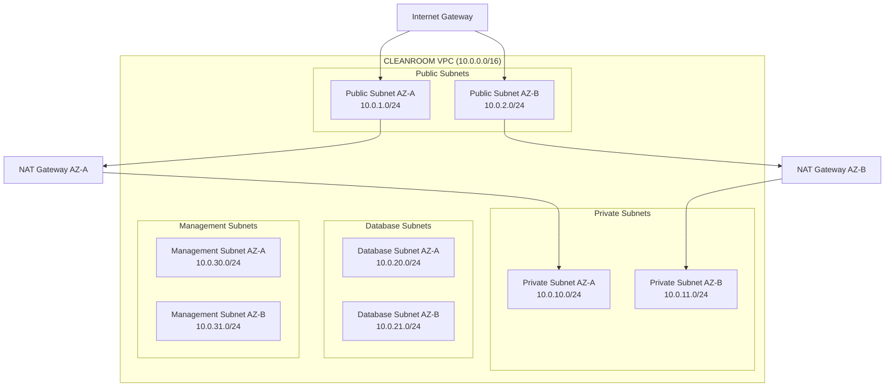

#### VPC Configuration

- **CIDR Block**: 10.0.0.0/16 (65,536 IP addresses)
- **Multi-AZ Deployment**: Minimum 2 availability zones
- **DNS Resolution**: Enabled
- **DNS Hostnames**: Enabled

#### Subnet Allocation Strategy

- **Public Subnets**: Load balancers, bastion hosts, NAT gateways
- **Private Subnets**: Application VMs, containers, compute resources
- **Database Subnets**: RDS instances, Redis clusters, data stores
- **Management Subnets**: Monitoring, logging, administrative tools

### 1.2 Security Groups and Firewall Rules

#### Security Group Architecture

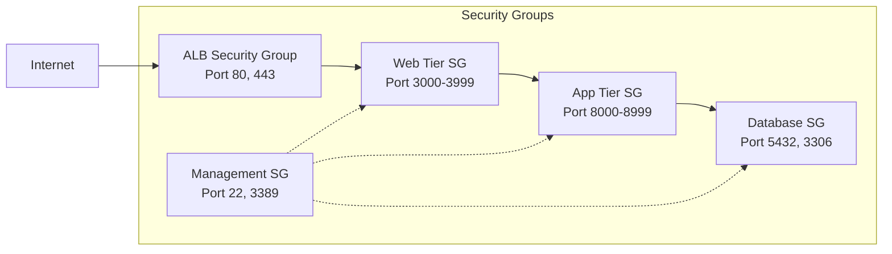

#### Security Group Rules

**ALB Security Group (sg-alb)**

```yaml
ingress:
  - port: 80
    protocol: TCP
    source: 0.0.0.0/0
    description: 'HTTP from Internet'
  - port: 443
    protocol: TCP
    source: 0.0.0.0/0
    description: 'HTTPS from Internet'
egress:
  - port: 3000-3999
    protocol: TCP
    destination: sg-web
    description: 'Development servers'
```

**Web Tier Security Group (sg-web)**

```yaml
ingress:
  - port: 3000-3999
    protocol: TCP
    source: sg-alb
    description: 'From load balancer'
  - port: 22
    protocol: TCP
    source: sg-mgmt
    description: 'SSH from bastion'
egress:
  - port: 8000-8999
    protocol: TCP
    destination: sg-app
    description: 'To application tier'
  - port: 443
    protocol: TCP
    destination: 0.0.0.0/0
    description: 'HTTPS outbound'
```

**Application Tier Security Group (sg-app)**

```yaml
ingress:
  - port: 8000-8999
    protocol: TCP
    source: sg-web
    description: 'From web tier'
  - port: 22
    protocol: TCP
    source: sg-mgmt
    description: 'SSH from bastion'
egress:
  - port: 5432
    protocol: TCP
    destination: sg-db
    description: 'PostgreSQL'
  - port: 3306
    protocol: TCP
    destination: sg-db
    description: 'MySQL'
  - port: 443
    protocol: TCP
    destination: 0.0.0.0/0
    description: 'HTTPS outbound'
```

**Database Security Group (sg-db)**

```yaml
ingress:
  - port: 5432
    protocol: TCP
    source: sg-app
    description: 'PostgreSQL from app tier'
  - port: 3306
    protocol: TCP
    source: sg-app
    description: 'MySQL from app tier'
  - port: 22
    protocol: TCP
    source: sg-mgmt
    description: 'SSH from bastion'
egress: [] # No outbound rules
```

### 1.3 Load Balancing and Traffic Routing

#### Load Balancer Architecture

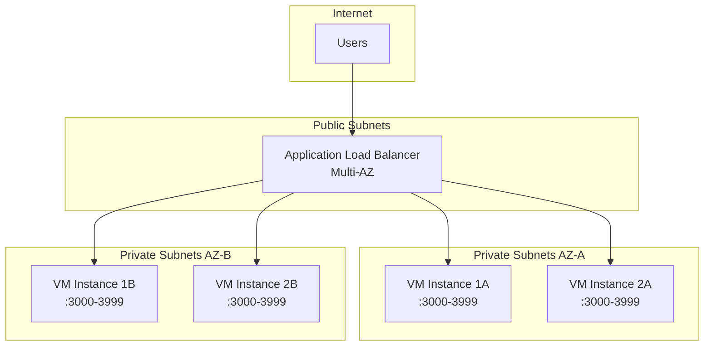

#### Target Group Configuration

```yaml
target_groups:
  development_servers:
    protocol: HTTP
    port: 3000
    health_check:
      path: /health
      interval: 30
      timeout: 5
      healthy_threshold: 2
      unhealthy_threshold: 3
    stickiness:
      enabled: true
      duration: 86400 # 24 hours
    deregistration_delay: 30
```

#### Routing Rules

```yaml
listener_rules:
  - priority: 100
    conditions:
      - field: path-pattern
        values: ['/api/*']
    actions:
      - type: forward
        target_group: api_servers

  - priority: 200
    conditions:
      - field: host-header
        values: ['dev-*.cleanroom.local']
    actions:
      - type: forward
        target_group: development_servers

  - priority: 300
    conditions:
      - field: path-pattern
        values: ['/static/*']
    actions:
      - type: forward
        target_group: static_content
```

### 1.4 DNS Configuration and Service Discovery

#### DNS Architecture

```yaml
dns_zones:
  private:
    domain: cleanroom.local
    vpc_association: vpc-cleanroom
    records:
      - name: '*.dev'
        type: A
        alias: alb-internal
      - name: 'db'
        type: CNAME
        value: rds-cluster.region.rds.amazonaws.com
      - name: 'cache'
        type: CNAME
        value: redis-cluster.region.cache.amazonaws.com

  public:
    domain: cleanroom.io
    records:
      - name: 'api'
        type: A
        alias: alb-public
      - name: 'www'
        type: A
        alias: cloudfront-distribution
```

#### Service Discovery

```yaml
service_discovery:
  namespace: cleanroom.local
  services:
    - name: web-server
      port: 3000
      health_check: /health
    - name: api-server
      port: 8000
      health_check: /api/health
    - name: websocket-server
      port: 3001
      health_check: /ws/health
```

## 2. Security Framework

### 2.1 Network Isolation and Segmentation

#### Zero Trust Network Model

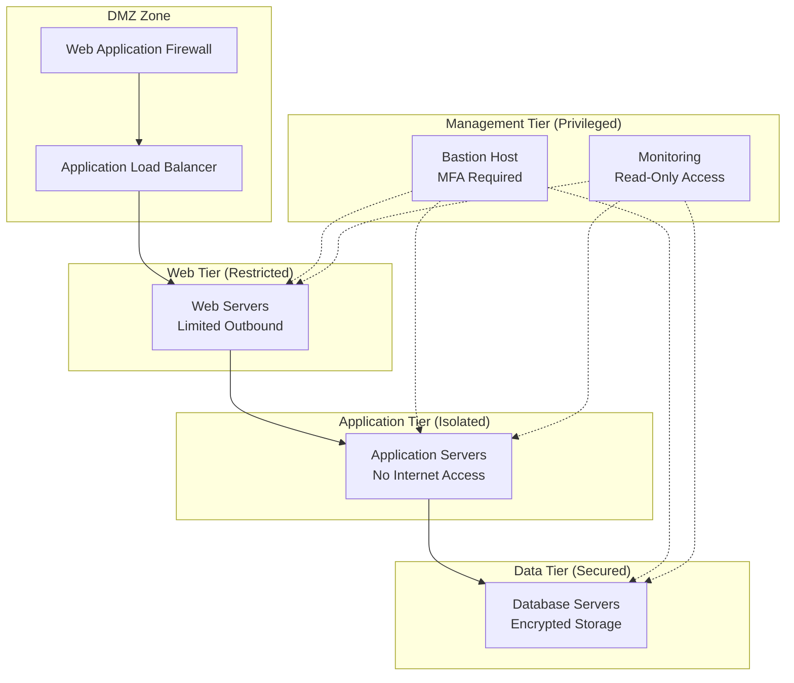

#### Network Segmentation Rules

```yaml
segmentation_policies:
  web_tier:
    ingress:
      - source: alb
        ports: [3000-3999]
        protocol: tcp
    egress:
      - destination: app_tier
        ports: [8000-8999]
        protocol: tcp
      - destination: internet
        ports: [80, 443]
        protocol: tcp

  app_tier:
    ingress:
      - source: web_tier
        ports: [8000-8999]
        protocol: tcp
    egress:
      - destination: data_tier
        ports: [5432, 3306, 6379]
        protocol: tcp

  data_tier:
    ingress:
      - source: app_tier
        ports: [5432, 3306, 6379]
        protocol: tcp
    egress: [] # No outbound access
```

### 2.2 Access Control and Authentication

#### Identity and Access Management

```yaml
iam_policies:
  vm_instance_role:
    permissions:
      - cloudwatch:PutMetricData
      - logs:CreateLogStream
      - logs:PutLogEvents
      - ssm:GetParameter
      - ssm:GetParameters
      - ssm:GetParametersByPath

  developer_role:
    permissions:
      - ec2:DescribeInstances
      - ec2:StartInstances
      - ec2:StopInstances
      - ssm:StartSession
      - logs:DescribeLogGroups
      - logs:DescribeLogStreams

  admin_role:
    permissions:
      - ec2:*
      - vpc:*
      - iam:PassRole
      - cloudformation:*
```

#### Multi-Factor Authentication

```yaml
mfa_policies:
  bastion_access:
    required: true
    methods: [totp, hardware_key]
    session_duration: 3600 # 1 hour

  admin_console:
    required: true
    methods: [totp, sms, hardware_key]
    session_duration: 7200 # 2 hours

  api_access:
    required: false # Service-to-service
    token_expiry: 900 # 15 minutes
```

### 2.3 Encryption in Transit and at Rest

#### TLS Configuration

```yaml
tls_policies:
  minimum_version: 'TLSv1.2'
  preferred_version: 'TLSv1.3'
  cipher_suites:
    - TLS_AES_256_GCM_SHA384
    - TLS_CHACHA20_POLY1305_SHA256
    - TLS_AES_128_GCM_SHA256
    - ECDHE-RSA-AES256-GCM-SHA384
    - ECDHE-RSA-AES128-GCM-SHA256

  certificate_validation:
    verify_peer: true
    verify_hostname: true
    ca_bundle: /etc/ssl/certs/ca-certificates.crt
```

#### Encryption at Rest

```yaml
encryption_at_rest:
  ebs_volumes:
    encryption: true
    kms_key: alias/cleanroom-ebs

  rds_instances:
    encryption: true
    kms_key: alias/cleanroom-rds

  s3_buckets:
    encryption: AES256
    kms_key: alias/cleanroom-s3

  parameter_store:
    encryption: true
    kms_key: alias/cleanroom-params
```

### 2.4 Certificate Management and PKI

#### Certificate Authority Structure

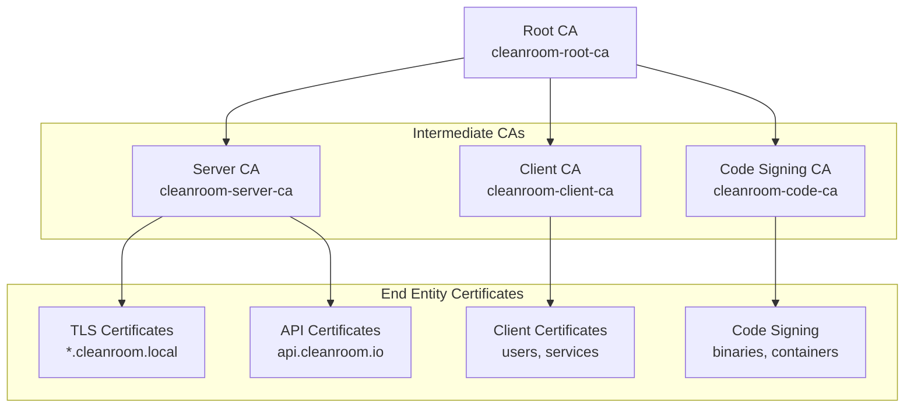

#### Certificate Lifecycle Management

```yaml
certificate_management:
  root_ca:
    validity: 10 years
    key_size: 4096
    algorithm: RSA
    storage: hsm

  intermediate_ca:
    validity: 5 years
    key_size: 4096
    algorithm: RSA
    storage: hsm

  server_certificates:
    validity: 1 year
    key_size: 2048
    algorithm: RSA
    san_domains:
      - '*.cleanroom.local'
      - '*.dev.cleanroom.local'
      - 'api.cleanroom.io'

  auto_renewal:
    enabled: true
    renewal_threshold: 30 days
    notification: admin@cleanroom.io
```

## 3. Port Management

### 3.1 Development Server Port Allocation

#### Port Range Strategy

```yaml
port_allocation:
  development:
    range: '3000-3999'
    allocation_strategy: 'dynamic'
    reservation_timeout: 3600 # 1 hour

  api_services:
    range: '8000-8999'
    allocation_strategy: 'static'

  databases:
    postgresql: 5432
    mysql: 3306
    redis: 6379
    mongodb: 27017

  monitoring:
    prometheus: 9090
    grafana: 3000
    jaeger: 16686

  system:
    ssh: 22
    http: 80
    https: 443
    dns: 53
```

#### Port Allocation Service

```yaml
port_service:
  endpoint: 'http://port-manager.cleanroom.local:8080'

  api_endpoints:
    allocate: 'POST /api/v1/ports/allocate'
    release: 'DELETE /api/v1/ports/{port}'
    list: 'GET /api/v1/ports'
    health: 'GET /health'

  allocation_request:
    required_fields:
      - vm_id
      - service_name
      - port_range
    optional_fields:
      - preferred_port
      - duration

  response_format:
    allocated_port: integer
    expires_at: timestamp
    reservation_id: string
```

### 3.2 Dynamic Port Discovery and Mapping

#### Service Registration

```yaml
service_registry:
  backend: consul
  endpoint: 'consul.cleanroom.local:8500'

  registration:
    ttl: 30 # seconds
    health_check_interval: 10

  service_definition:
    name: string
    port: integer
    tags: [string]
    meta:
      vm_id: string
      version: string
      environment: string

  discovery_methods:
    - dns: 'service.consul'
    - http_api: 'consul.cleanroom.local:8500/v1/catalog/service/{service}'
    - health_check: 'consul.cleanroom.local:8500/v1/health/service/{service}'
```

#### Port Mapping Database

```sql
-- Port allocation tracking
CREATE TABLE port_allocations (
    id SERIAL PRIMARY KEY,
    vm_id VARCHAR(255) NOT NULL,
    service_name VARCHAR(255) NOT NULL,
    allocated_port INTEGER NOT NULL,
    port_range VARCHAR(50) NOT NULL,
    status VARCHAR(50) DEFAULT 'active',
    allocated_at TIMESTAMP DEFAULT CURRENT_TIMESTAMP,
    expires_at TIMESTAMP,
    released_at TIMESTAMP,
    UNIQUE(allocated_port)
);

-- Service registry
CREATE TABLE service_registry (
    id SERIAL PRIMARY KEY,
    service_name VARCHAR(255) NOT NULL,
    vm_id VARCHAR(255) NOT NULL,
    port INTEGER NOT NULL,
    protocol VARCHAR(10) DEFAULT 'tcp',
    health_check_url VARCHAR(500),
    tags JSONB,
    metadata JSONB,
    registered_at TIMESTAMP DEFAULT CURRENT_TIMESTAMP,
    last_health_check TIMESTAMP,
    status VARCHAR(50) DEFAULT 'healthy'
);
```

### 3.3 Reverse Proxy Configuration

#### NGINX Configuration Template

```nginx
# Global configuration
upstream backend_pool {
    least_conn;
    server 10.0.10.10:3000 weight=1 max_fails=3 fail_timeout=30s;
    server 10.0.10.11:3001 weight=1 max_fails=3 fail_timeout=30s;
    server 10.0.11.10:3002 weight=1 max_fails=3 fail_timeout=30s;
}

# HTTP to HTTPS redirect
server {
    listen 80;
    server_name *.cleanroom.local;
    return 301 https://$server_name$request_uri;
}

# Main HTTPS server
server {
    listen 443 ssl http2;
    server_name ~^(?<subdomain>.+)\.cleanroom\.local$;

    # SSL configuration
    ssl_certificate /etc/ssl/certs/cleanroom.local.crt;
    ssl_certificate_key /etc/ssl/private/cleanroom.local.key;
    ssl_protocols TLSv1.2 TLSv1.3;
    ssl_ciphers ECDHE-RSA-AES256-GCM-SHA384:ECDHE-RSA-AES128-GCM-SHA256;
    ssl_prefer_server_ciphers off;

    # Security headers
    add_header Strict-Transport-Security "max-age=31536000; includeSubDomains" always;
    add_header X-Frame-Options "SAMEORIGIN" always;
    add_header X-Content-Type-Options "nosniff" always;
    add_header X-XSS-Protection "1; mode=block" always;

    # Rate limiting
    limit_req_zone $binary_remote_addr zone=api:10m rate=10r/s;
    limit_req zone=api burst=20 nodelay;

    # Proxy configuration
    location / {
        proxy_pass http://backend_pool;
        proxy_set_header Host $host;
        proxy_set_header X-Real-IP $remote_addr;
        proxy_set_header X-Forwarded-For $proxy_add_x_forwarded_for;
        proxy_set_header X-Forwarded-Proto $scheme;

        # WebSocket support
        proxy_http_version 1.1;
        proxy_set_header Upgrade $http_upgrade;
        proxy_set_header Connection "upgrade";

        # Timeouts
        proxy_connect_timeout 60s;
        proxy_send_timeout 60s;
        proxy_read_timeout 60s;
    }

    # Health check endpoint
    location /health {
        access_log off;
        return 200 "healthy\n";
        add_header Content-Type text/plain;
    }
}
```

#### Dynamic Configuration Management

```yaml
proxy_config:
  config_template: '/etc/nginx/templates/cleanroom.conf.template'
  config_output: '/etc/nginx/sites-enabled/cleanroom.conf'
  reload_command: 'nginx -s reload'

  template_variables:
    backend_servers: '{{ consul_service_addresses }}'
    ssl_certificate: '/etc/ssl/certs/cleanroom.local.crt'
    ssl_key: '/etc/ssl/private/cleanroom.local.key'

  auto_reload:
    enabled: true
    check_interval: 30
    template_consul_template: true
```

### 3.4 SSL/TLS Termination

#### TLS Termination Strategy

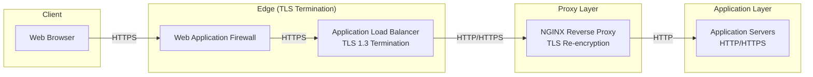

#### Certificate Distribution

```yaml
certificate_distribution:
  method: 'automated'
  tools:
    - cert-manager
    - acme.sh
    - aws-acm

  acme_configuration:
    ca_server: 'https://acme-v02.api.letsencrypt.org/directory'
    challenge_type: 'dns-01'
    dns_provider: 'route53'

  internal_ca:
    issuer: 'cleanroom-ca'
    validity: '365d'
    key_algorithm: 'rsa'
    key_size: 2048

  deployment:
    target_paths:
      certificate: '/etc/ssl/certs/'
      private_key: '/etc/ssl/private/'
      ca_bundle: '/etc/ssl/certs/ca-certificates.crt'
    permissions:
      certificate: '644'
      private_key: '600'
    owner: 'root:ssl-cert'
```

## 4. API Security

### 4.1 Authentication and Authorization

#### OAuth 2.0 / OpenID Connect Flow

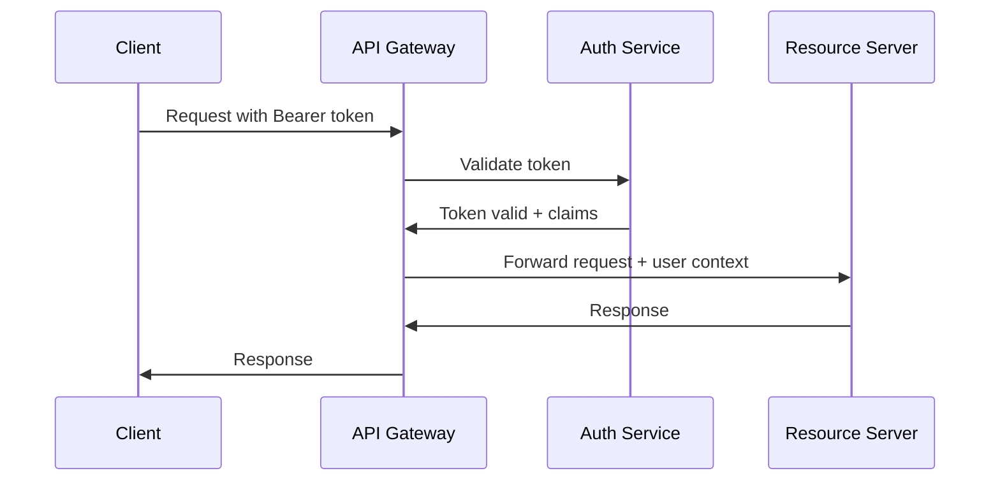

#### JWT Token Structure

```yaml
jwt_configuration:
  issuer: 'https://auth.cleanroom.io'
  audience: 'cleanroom-api'
  algorithm: 'RS256'

  token_claims:
    standard:
      - iss # Issuer
      - sub # Subject (user ID)
      - aud # Audience
      - exp # Expiration
      - iat # Issued at
      - jti # JWT ID

    custom:
      - roles: [string]
      - permissions: [string]
      - vm_access: [string]
      - tenant_id: string

  token_lifetime:
    access_token: 900 # 15 minutes
    refresh_token: 604800 # 7 days
    id_token: 3600 # 1 hour
```

#### Role-Based Access Control (RBAC)

```yaml
rbac_policies:
  roles:
    admin:
      permissions:
        - vm:*
        - network:*
        - security:*
        - monitoring:read

    developer:
      permissions:
        - vm:read
        - vm:start
        - vm:stop
        - vm:ssh
        - logs:read

    viewer:
      permissions:
        - vm:read
        - logs:read
        - monitoring:read

  resource_policies:
    vm_access:
      conditions:
        - resource.tenant_id == user.tenant_id
        - resource.tags.environment IN user.allowed_environments

    network_access:
      conditions:
        - user.role == "admin"
        - resource.vpc_id IN user.allowed_vpcs
```

### 4.2 Rate Limiting and DDoS Protection

#### Multi-Layer Rate Limiting

```yaml
rate_limiting:
  cloudflare:
    requests_per_minute: 1000
    burst: 100
    challenge_on_exceed: true

  alb:
    requests_per_second: 100
    burst: 200

  api_gateway:
    per_user:
      requests_per_minute: 60
      burst: 10
    per_ip:
      requests_per_minute: 100
      burst: 20
    per_endpoint:
      '/api/v1/vms': 10 # requests per minute
      '/api/v1/logs': 30
      '/api/v1/health': 1000
```

#### DDoS Protection Strategy

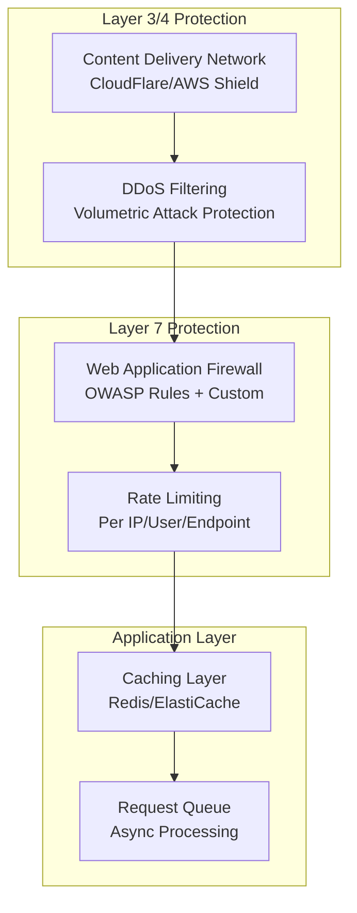

### 4.3 Input Validation and Sanitization

#### Validation Framework

```yaml
input_validation:
  framework: "joi" # or "yup", "ajv"

  common_patterns:
    vm_id: "^vm-[a-zA-Z0-9]{8,17}$"
    port_number: "^(102[4-9]|10[3-9][0-9]|1[1-9][0-9]{2}|[2-9][0-9]{3}|[1-3][0-9]{4}|400[0-9])$"
    ip_address: "^(?:[0-9]{1,3}\\.){3}[0-9]{1,3}$"
    domain_name: "^[a-zA-Z0-9]([a-zA-Z0-9\\-]{0,61}[a-zA-Z0-9])?$"

  sanitization:
    html: "strip_tags"
    sql: "parameterized_queries"
    shell: "escape_shell_args"
    path: "path.normalize + path.resolve"

  content_type_validation:
    "application/json": max_size: 1MB
    "multipart/form-data": max_size: 10MB
    "text/plain": max_size: 100KB
```

#### API Schema Validation

```json
{
  "openapi": "3.0.0",
  "paths": {
    "/api/v1/vms": {
      "post": {
        "requestBody": {
          "required": true,
          "content": {
            "application/json": {
              "schema": {
                "type": "object",
                "required": ["name", "image_id", "instance_type"],
                "properties": {
                  "name": {
                    "type": "string",
                    "pattern": "^[a-zA-Z0-9-_]{1,64}$"
                  },
                  "image_id": {
                    "type": "string",
                    "pattern": "^ami-[a-zA-Z0-9]{8,17}$"
                  },
                  "instance_type": {
                    "type": "string",
                    "enum": ["t3.micro", "t3.small", "t3.medium"]
                  },
                  "ports": {
                    "type": "array",
                    "items": {
                      "type": "integer",
                      "minimum": 3000,
                      "maximum": 3999
                    },
                    "maxItems": 10
                  }
                }
              }
            }
          }
        }
      }
    }
  }
}
```

### 4.4 Audit Logging and Monitoring

#### Comprehensive Audit Framework

```yaml
audit_logging:
  destinations:
    - cloudwatch_logs
    - s3_bucket
    - elasticsearch
    - syslog

  log_levels:
    security: 'INFO'
    access: 'INFO'
    admin: 'WARN'
    error: 'ERROR'

  log_format: 'json'

  events_to_log:
    authentication:
      - login_success
      - login_failure
      - token_issued
      - token_expired
      - mfa_required
      - mfa_success
      - mfa_failure

    authorization:
      - access_granted
      - access_denied
      - role_changed
      - permission_escalation

    resource_access:
      - vm_created
      - vm_deleted
      - vm_started
      - vm_stopped
      - ssh_session_started
      - ssh_session_ended

    network:
      - security_group_modified
      - route_table_changed
      - vpc_created
      - subnet_created

    admin:
      - config_changed
      - user_created
      - user_deleted
      - role_assigned
```

#### Security Event Correlation

```yaml
security_monitoring:
  correlation_rules:
    brute_force_detection:
      condition: 'failed_logins > 5 within 5 minutes'
      action: 'block_ip_temporary'
      duration: '1 hour'

    privilege_escalation:
      condition: 'role_change AND high_privilege_access within 1 minute'
      action: 'alert_security_team'

    suspicious_network_activity:
      condition: 'outbound_connections > 100 within 1 minute'
      action: 'quarantine_instance'

    data_exfiltration:
      condition: 'data_transfer > 1GB within 5 minutes'
      action: 'alert_and_throttle'

  alerting:
    channels:
      - email: 'security@cleanroom.io'
      - slack: '#security-alerts'
      - pagerduty: 'high-severity'

    severity_levels:
      critical: 'immediate_response_required'
      high: 'response_within_15_minutes'
      medium: 'response_within_1_hour'
      low: 'response_within_24_hours'
```

## 5. Compliance and Governance

### 5.1 Security Policies and Procedures

#### Information Security Policy Framework

```yaml
security_policies:
  access_control:
    principle: 'least_privilege'
    review_frequency: 'quarterly'
    access_request_process:
      - manager_approval
      - security_review
      - technical_approval
      - access_granted
      - periodic_review

  password_policy:
    minimum_length: 12
    complexity_requirements:
      - uppercase_letters
      - lowercase_letters
      - numbers
      - special_characters
    expiration: 90_days
    history: 12_passwords

  encryption_policy:
    data_at_rest: 'required'
    data_in_transit: 'required'
    key_management: 'hsm_or_kms'
    algorithm_standards:
      - AES-256
      - RSA-2048
      - ECDSA-P256

  incident_response:
    classification:
      critical: 'system_compromise'
      high: 'data_breach'
      medium: 'service_disruption'
      low: 'policy_violation'
    response_times:
      critical: '15_minutes'
      high: '1_hour'
      medium: '4_hours'
      low: '24_hours'
```

#### Change Management Process

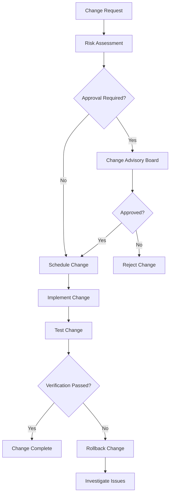

### 5.2 Vulnerability Scanning and Remediation

#### Vulnerability Management Program

```yaml
vulnerability_management:
  scanning_frequency:
    infrastructure: 'weekly'
    applications: 'daily'
    containers: 'on_build'
    dependencies: 'daily'

  scanning_tools:
    infrastructure:
      - nessus
      - openvas
      - qualys
    applications:
      - owasp_zap
      - burp_suite
      - veracode
    containers:
      - clair
      - twistlock
      - snyk
    dependencies:
      - snyk
      - dependabot
      - npm_audit

  remediation_sla:
    critical: '24_hours'
    high: '7_days'
    medium: '30_days'
    low: '90_days'

  risk_scoring:
    base_score: 'cvss_v3'
    environmental_factors:
      - internet_facing: +2.0
      - contains_pii: +1.5
      - admin_access: +1.0
      - business_critical: +0.5
```

#### Patch Management

```yaml
patch_management:
  patch_groups:
    critical_systems:
      maintenance_window: 'sunday_2am_4am'
      testing_duration: '48_hours'
      rollback_time: '2_hours'

    development_systems:
      maintenance_window: 'daily_during_business_hours'
      testing_duration: '4_hours'
      rollback_time: '30_minutes'

  patch_testing:
    stages:
      - unit_testing
      - integration_testing
      - security_testing
      - performance_testing
      - user_acceptance_testing

  automated_patching:
    enabled: true
    patch_types:
      - security_updates: 'automatic'
      - critical_updates: 'automatic'
      - feature_updates: 'manual_approval'
```

### 5.3 Compliance Reporting and Auditing

#### Compliance Frameworks

```yaml
compliance_frameworks:
  soc2_type2:
    controls:
      - CC6.1 # Logical access security
      - CC6.2 # Prior to system access
      - CC6.3 # Network access restrictions
      - CC7.1 # System monitoring
      - CC7.4 # System recovery procedures

  pci_dss:
    applicable: false # No card data processing

  gdpr:
    data_protection_measures:
      - encryption_at_rest
      - encryption_in_transit
      - access_logging
      - data_minimization
      - right_to_erasure

  iso27001:
    control_families:
      - A.9 # Access control
      - A.10 # Cryptography
      - A.12 # Operations security
      - A.13 # Communications security
      - A.14 # System acquisition
```

#### Audit Trail Requirements

```yaml
audit_requirements:
  retention_period: '7_years'
  log_integrity: 'cryptographic_hashing'

  audit_events:
    user_management:
      - user_creation
      - user_deletion
      - role_assignment
      - privilege_escalation

    system_access:
      - successful_login
      - failed_login
      - session_termination
      - privileged_access

    data_access:
      - file_access
      - database_query
      - api_request
      - data_export

    system_changes:
      - configuration_change
      - software_installation
      - security_policy_change
      - network_configuration

  compliance_reporting:
    frequency: 'monthly'
    recipients:
      - compliance_officer
      - security_team
      - management
    format: 'automated_dashboard + pdf_report'
```

### 5.4 Incident Response and Forensics

#### Incident Response Plan

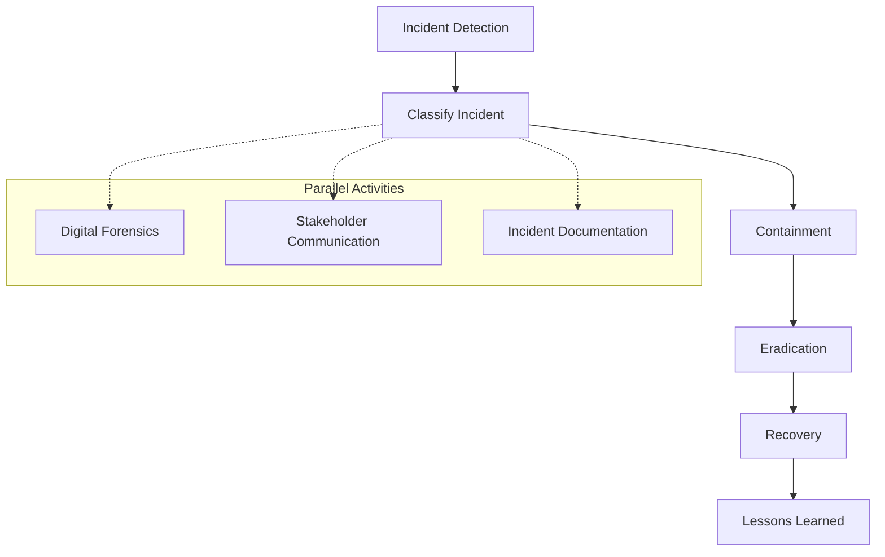

#### Forensics Procedures

```yaml
digital_forensics:
  evidence_collection:
    vm_snapshots:
      tool: 'aws_ec2_snapshot'
      retention: '90_days'
      chain_of_custody: 'required'

    memory_dumps:
      tool: 'volatility'
      format: 'raw'
      compression: 'gzip'

    network_traffic:
      tool: 'tcpdump'
      filter: 'incident_related_traffic'
      duration: '24_hours_pre_post_incident'

    log_files:
      sources:
        - application_logs
        - system_logs
        - security_logs
        - network_logs
      format: 'json'
      integrity_check: 'sha256_hash'

  analysis_tools:
    - volatility # Memory analysis
    - autopsy # Disk analysis
    - wireshark # Network analysis
    - splunk # Log analysis
    - yara # Malware detection

  reporting:
    timeline_analysis: 'required'
    indicators_of_compromise: 'required'
    recommendations: 'required'
    legal_hold_compliance: 'if_applicable'
```

## 6. Network Monitoring

### 6.1 Traffic Analysis and Monitoring

#### Network Monitoring Architecture

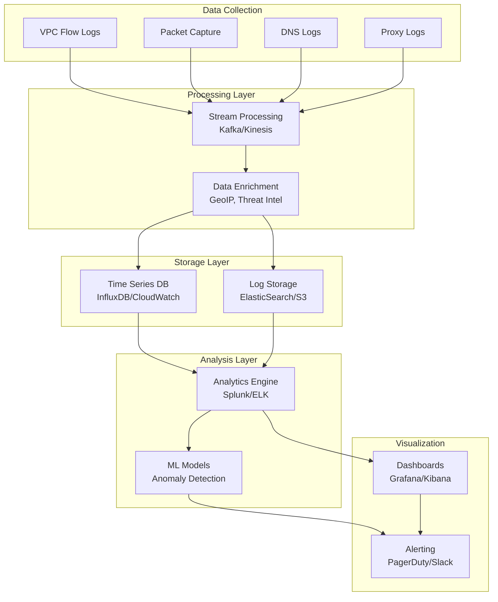

#### Traffic Analysis Metrics

```yaml
network_metrics:
  flow_metrics:
    - bytes_transferred
    - packets_transferred
    - connection_duration
    - connection_state
    - protocol_distribution

  performance_metrics:
    - latency
    - throughput
    - packet_loss
    - jitter
    - error_rate

  security_metrics:
    - failed_connections
    - port_scans
    - ddos_indicators
    - malware_indicators
    - data_exfiltration_patterns

  application_metrics:
    - http_response_codes
    - api_response_times
    - websocket_connections
    - ssl_handshake_times
    - dns_resolution_times
```

### 6.2 Intrusion Detection and Prevention

#### IDS/IPS Deployment Strategy

```yaml
ids_ips_deployment:
  network_based:
    tool: 'suricata'
    deployment: 'inline_tap'
    locations:
      - internet_gateway
      - inter_subnet_routing
      - database_tier_access

  host_based:
    tool: 'ossec'
    deployment: 'agent_based'
    monitoring:
      - file_integrity
      - log_analysis
      - rootkit_detection
      - system_calls

  cloud_native:
    tool: 'aws_guardduty'
    features:
      - threat_intelligence
      - machine_learning
      - anomaly_detection
      - dns_monitoring
```

#### Signature and Rule Management

```yaml
ids_rules:
  signature_sources:
    - emerging_threats
    - snort_community
    - custom_signatures
    - threat_intelligence_feeds

  rule_categories:
    malware:
      priority: 'critical'
      action: 'block_and_alert'

    exploit_attempts:
      priority: 'high'
      action: 'alert_and_log'

    policy_violations:
      priority: 'medium'
      action: 'log_only'

    reconnaissance:
      priority: 'medium'
      action: 'alert_and_throttle'

  rule_tuning:
    false_positive_threshold: 5
    auto_disable_threshold: 10
    review_frequency: 'weekly'
```

### 6.3 Performance Monitoring and Optimization

#### Performance Monitoring Stack

```yaml
monitoring_stack:
  metrics_collection:
    infrastructure:
      - prometheus
      - node_exporter
      - cloudwatch_agent

    applications:
      - application_metrics
      - custom_metrics
      - business_metrics

    network:
      - snmp_monitoring
      - flow_monitoring
      - synthetic_monitoring

  visualization:
    dashboards:
      - grafana
      - cloudwatch_dashboards
      - custom_dashboards

    reports:
      - performance_reports
      - capacity_reports
      - sla_reports

  alerting:
    thresholds:
      cpu_utilization: '>80%'
      memory_utilization: '>85%'
      disk_utilization: '>90%'
      network_latency: '>100ms'
      error_rate: '>1%'
```

#### Performance Optimization

```yaml
optimization_strategies:
  network_optimization:
    tcp_tuning:
      tcp_window_scaling: 'enabled'
      tcp_congestion_control: 'bbr'
      tcp_fast_open: 'enabled'

    dns_optimization:
      dns_caching: 'enabled'
      dns_prefetching: 'enabled'
      local_dns_resolver: 'enabled'

    cdn_optimization:
      static_content_caching: 'enabled'
      gzip_compression: 'enabled'
      http2_push: 'enabled'

  application_optimization:
    connection_pooling: 'enabled'
    keepalive_connections: 'enabled'
    request_batching: 'enabled'
    response_caching: 'enabled'

  infrastructure_optimization:
    instance_rightsizing: 'automated'
    auto_scaling: 'enabled'
    spot_instances: 'development_workloads'
    reserved_instances: 'production_workloads'
```

### 6.4 Capacity Planning and Scaling

#### Capacity Planning Framework

```yaml
capacity_planning:
  forecasting_models:
    time_series:
      algorithm: 'arima'
      seasonality: 'weekly'
      trend_analysis: 'enabled'

    machine_learning:
      algorithm: 'lstm'
      features:
        - historical_usage
        - business_metrics
        - external_factors

  growth_projections:
    user_growth: '15%_monthly'
    data_growth: '25%_monthly'
    transaction_growth: '20%_monthly'

  resource_planning:
    cpu:
      target_utilization: '70%'
      scaling_threshold: '80%'
      scaling_factor: '1.5x'

    memory:
      target_utilization: '75%'
      scaling_threshold: '85%'
      scaling_factor: '1.3x'

    storage:
      target_utilization: '80%'
      scaling_threshold: '90%'
      scaling_factor: '2x'

    network:
      target_utilization: '60%'
      scaling_threshold: '70%'
      scaling_factor: '2x'
```

#### Auto-Scaling Configuration

```yaml
auto_scaling:
  horizontal_scaling:
    min_instances: 2
    max_instances: 20
    target_cpu_utilization: '70%'
    target_memory_utilization: '75%'

    scaling_policies:
      scale_out:
        threshold: '80%'
        evaluation_periods: 2
        cooldown: '300s'
        scaling_adjustment: '+2_instances'

      scale_in:
        threshold: '40%'
        evaluation_periods: 5
        cooldown: '600s'
        scaling_adjustment: '-1_instance'

  vertical_scaling:
    enabled: false # Manual approval required
    max_cpu_increase: '2x'
    max_memory_increase: '2x'
    downtime_required: true

  predictive_scaling:
    enabled: true
    forecast_horizon: '24_hours'
    pre_scaling_buffer: '15_minutes'
    confidence_threshold: '80%'
```

## Implementation Guidelines

### Phase 1: Foundation (Weeks 1-4)

1. **VPC and Network Setup**

   - Create VPC with multi-AZ subnets
   - Configure routing tables and NAT gateways
   - Set up DNS zones and service discovery

2. **Security Group Configuration**

   - Implement tiered security groups
   - Configure default deny rules
   - Set up bastion host access

3. **Basic Monitoring**
   - Enable VPC Flow Logs
   - Set up CloudWatch monitoring
   - Configure basic alerting

### Phase 2: Security Hardening (Weeks 5-8)

1. **Certificate Management**

   - Deploy internal CA infrastructure
   - Implement certificate automation
   - Configure TLS termination

2. **Access Control**

   - Implement IAM roles and policies
   - Set up MFA requirements
   - Configure RBAC system

3. **Audit Logging**
   - Deploy centralized logging
   - Implement log correlation
   - Set up compliance reporting

### Phase 3: Advanced Features (Weeks 9-12)

1. **Port Management System**

   - Deploy port allocation service
   - Implement dynamic discovery
   - Configure reverse proxy automation

2. **API Security**

   - Implement OAuth 2.0/OIDC
   - Deploy rate limiting
   - Set up input validation

3. **Advanced Monitoring**
   - Deploy IDS/IPS systems
   - Implement anomaly detection
   - Set up performance optimization

### Phase 4: Compliance and Operations (Weeks 13-16)

1. **Vulnerability Management**

   - Deploy scanning tools
   - Implement patch management
   - Set up remediation workflows

2. **Incident Response**

   - Deploy forensics tools
   - Implement response procedures
   - Set up communication workflows

3. **Capacity Planning**
   - Implement forecasting models
   - Configure auto-scaling
   - Set up optimization automation

## Conclusion

This CLEANROOM VM Networking and Security specification provides a comprehensive framework for secure, scalable, and compliant virtual machine infrastructure. The implementation follows defense-in-depth principles with multiple layers of security controls, automated monitoring, and proactive threat detection.

Key success factors:

- **Zero Trust Architecture**: Never trust, always verify
- **Defense in Depth**: Multiple security layers
- **Automation First**: Reduce human error through automation
- **Continuous Monitoring**: Real-time visibility and alerting
- **Compliance by Design**: Built-in compliance controls

Regular reviews and updates of this specification are required to address evolving threats and compliance requirements.
